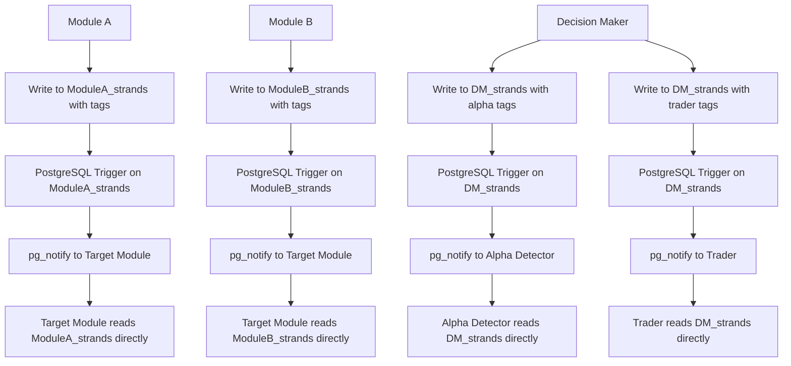

# Communication Protocol - Build Plan

*General communication protocol for any module in the Trading Intelligence System*

## Executive Summary

This build plan provides a **general communication protocol** that any new module can follow to integrate with the Trading Intelligence System. The protocol uses **direct table writes** with **tags** and **PostgreSQL triggers** for simple, reliable, and auditable inter-module communication.

## Core Philosophy

### **Direct Table Communication**
- **No central tables** - Each module owns its data
- **No message buses** - Direct table-to-table communication
- **Tags trigger notifications** - PostgreSQL triggers on source tables
- **Simple and reliable** - Database ACID properties

### **Communication Flow**


## Module Table Template

### **Required Fields (Mandatory for All Modules)**
Every module MUST have these fields in their strands table:

```sql
CREATE TABLE {MODULE_PREFIX}_strands (
    -- REQUIRED FIELDS (DO NOT MODIFY)
    id TEXT PRIMARY KEY,                    -- Unique identifier
    module TEXT DEFAULT '{module_name}',    -- Module identifier
    kind TEXT,                              -- Type of strand (signal, decision, execution, etc.)
    symbol TEXT,                            -- Trading symbol
    timeframe TEXT,                         -- Timeframe
    session_bucket TEXT,                    -- Session identifier
    regime TEXT,                            -- Market regime
    tags JSONB,                             -- Communication tags (REQUIRED)
    created_at TIMESTAMPTZ DEFAULT NOW(),   -- Creation timestamp
    updated_at TIMESTAMPTZ DEFAULT NOW(),   -- Update timestamp
    
    -- MODULE-SPECIFIC FIELDS (ADD AS NEEDED)
    {module_specific_columns}               -- Your module's specific data
    
    -- EXAMPLES OF MODULE-SPECIFIC FIELDS:
    -- signal_strength FLOAT8,              -- Alpha Detector specific
    -- confidence_score FLOAT8,             -- Alpha Detector specific
    -- decision_data JSONB,                 -- Decision Maker specific
    -- execution_metrics JSONB,             -- Trader specific
    -- risk_assessment JSONB,               -- Risk Manager specific
    -- portfolio_data JSONB,                -- Portfolio Manager specific
    -- market_data JSONB,                   -- Market Data specific
    -- etc...
);
```

### **Module-Specific Field Guidelines**

#### **Naming Convention**
- Use `{module_prefix}_{field_name}` for module-specific fields
- Examples: `ad_signal_strength`, `dm_decision_data`, `tr_execution_metrics`

#### **Data Types**
- **FLOAT8**: For numeric scores, metrics, percentages
- **TEXT**: For categorical data, identifiers, descriptions
- **JSONB**: For complex structured data, arrays, objects
- **TIMESTAMPTZ**: For timestamps (use `created_at`/`updated_at` for standard timestamps)

#### **Common Module-Specific Fields**
```sql
-- Signal/Detection Modules
signal_strength FLOAT8,
confidence_score FLOAT8,
signal_direction TEXT,
detection_metadata JSONB,

-- Decision Modules
decision_data JSONB,
risk_metrics JSONB,
portfolio_impact JSONB,
decision_confidence FLOAT8,

-- Execution Modules
execution_metrics JSONB,
slippage_data JSONB,
latency_metrics JSONB,
venue_performance JSONB,

-- Data Modules
market_data JSONB,
indicator_values JSONB,
regime_analysis JSONB,
event_data JSONB,

-- Learning Modules
learning_data JSONB,
performance_metrics JSONB,
adaptation_data JSONB,
lesson_data JSONB
```

## Communication Setup for New Modules

### **Step 1: Create Your Module Table**
```sql
-- Example: Creating a new "Risk Manager" module
CREATE TABLE RM_strands (
    -- REQUIRED FIELDS (DO NOT MODIFY)
    id TEXT PRIMARY KEY,
    module TEXT DEFAULT 'risk_manager',
    kind TEXT,
    symbol TEXT,
    timeframe TEXT,
    session_bucket TEXT,
    regime TEXT,
    tags JSONB,
    created_at TIMESTAMPTZ DEFAULT NOW(),
    updated_at TIMESTAMPTZ DEFAULT NOW(),
    
    -- RISK MANAGER SPECIFIC FIELDS
    rm_risk_assessment JSONB,
    rm_portfolio_risk FLOAT8,
    rm_var_calculation JSONB,
    rm_stress_test JSONB,
    rm_risk_limits JSONB,
    rm_alert_data JSONB
);
```

### **Step 2: Create PostgreSQL Trigger**
```sql
-- Create trigger function for your module
CREATE OR REPLACE FUNCTION notify_from_{module_prefix}_strands()
RETURNS TRIGGER AS $$
BEGIN
    -- Add notification logic for each target module
    IF NEW.tags @> '["target_module:action"]' THEN
        PERFORM pg_notify('target_module_action', NEW.id::text);
    END IF;
    
    -- Add more target modules as needed
    -- IF NEW.tags @> '["other_module:other_action"]' THEN
    --     PERFORM pg_notify('other_module_other_action', NEW.id::text);
    -- END IF;
    
    RETURN NEW;
END;
$$ LANGUAGE plpgsql;

-- Create the trigger
CREATE TRIGGER {module_prefix}_strands_notify
    AFTER INSERT ON {MODULE_PREFIX}_strands
    FOR EACH ROW
    EXECUTE FUNCTION notify_from_{module_prefix}_strands();
```

### **Step 3: Create Database Indexes**
```sql
-- Required indexes for performance
CREATE INDEX idx_{MODULE_PREFIX}_strands_tags ON {MODULE_PREFIX}_strands USING GIN(tags);
CREATE INDEX idx_{MODULE_PREFIX}_strands_created_at ON {MODULE_PREFIX}_strands(created_at DESC);
CREATE INDEX idx_{MODULE_PREFIX}_strands_module ON {MODULE_PREFIX}_strands(module);
CREATE INDEX idx_{MODULE_PREFIX}_strands_symbol ON {MODULE_PREFIX}_strands(symbol);
```

### **Step 4: Implement Communication Classes**
```python
# File: {module_name}/communication.py
import json
import uuid
from datetime import datetime, timezone

class ModuleCommunicator:
    """Communication class for {module_name} module"""
    
    def __init__(self, db_connection, module_name):
        self.db = db_connection
        self.module_name = module_name
        self.table_name = f"{module_name.upper()}_strands"
    
    def write_with_tags(self, data, tags):
        """Write data to module table with communication tags"""
        # Ensure required fields are present
        if 'id' not in data:
            data['id'] = f"{self.module_name.upper()}_{uuid.uuid4().hex[:12]}"
        
        if 'module' not in data:
            data['module'] = self.module_name
        
        if 'created_at' not in data:
            data['created_at'] = datetime.now(timezone.utc)
        
        # Add tags
        data['tags'] = json.dumps(tags)
        
        # Build INSERT query
        columns = list(data.keys())
        values = list(data.values())
        placeholders = ', '.join(['%s'] * len(values))
        
        query = f"""
            INSERT INTO {self.table_name} ({', '.join(columns)})
            VALUES ({placeholders})
        """
        
        self.db.execute(query, values)
        return data['id']
    
    def read_by_id(self, record_id):
        """Read data from module table by ID"""
        return self.db.execute(f"""
            SELECT * FROM {self.table_name} WHERE id = %s
        """, (record_id,)).fetchone()
    
    def read_recent_by_tags(self, tags, limit=10):
        """Read recent records by tags"""
        return self.db.execute(f"""
            SELECT * FROM {self.table_name} 
            WHERE tags @> %s 
            ORDER BY created_at DESC 
            LIMIT %s
        """, (json.dumps(tags), limit)).fetchall()
    
    def read_from_other_module(self, other_module_name, record_id):
        """Read data from another module's table"""
        other_table = f"{other_module_name.upper()}_strands"
        return self.db.execute(f"""
            SELECT * FROM {other_table} WHERE id = %s
        """, (record_id,)).fetchone()
```

### **Step 5: Implement Module Listener**
```python
# File: {module_name}/listener.py
import psycopg2
from psycopg2.extensions import ISOLATION_LEVEL_AUTOCOMMIT

class ModuleListener:
    """Listen for database notifications from other modules"""
    
    def __init__(self, db_connection, module_name):
        self.db = db_connection
        self.module_name = module_name
        self.communicator = ModuleCommunicator(db_connection, module_name)
        
        # Define what this module listens for
        self.listeners = {
            'alpha': ['alpha:signal', 'alpha:feedback'],
            'dm': ['dm:decision', 'dm:feedback'],
            'trader': ['trader:execution', 'trader:feedback'],
            'risk_manager': ['rm:risk_alert', 'rm:risk_update'],
            # Add your module's listeners here
        }
    
    def start_listening(self):
        """Start listening for database notifications"""
        conn = psycopg2.connect(self.db.get_dsn())
        conn.set_isolation_level(ISOLATION_LEVEL_AUTOCOMMIT)
        cursor = conn.cursor()
        
        # Listen for module-specific notifications
        for tag in self.listeners.get(self.module_name, []):
            channel = tag.replace(':', '_')
            cursor.execute(f"LISTEN {channel}")
            print(f"{self.module_name} listening for {channel}")
        
        # Process notifications
        while True:
            if conn.poll():
                notification = conn.notifies.pop(0)
                self.process_notification(notification)
    
    def process_notification(self, notification):
        """Process incoming notification"""
        record_id = notification.payload
        channel = notification.channel
        
        # Route to appropriate handler
        if channel == 'alpha_signal':
            self.handle_alpha_signal(record_id)
        elif channel == 'dm_decision':
            self.handle_dm_decision(record_id)
        elif channel == 'trader_execution':
            self.handle_trader_execution(record_id)
        # Add more handlers as needed
    
    def handle_alpha_signal(self, record_id):
        """Handle signal from Alpha Detector"""
        # Read the signal data
        signal_data = self.communicator.read_from_other_module('alpha', record_id)
        if signal_data:
            # Process the signal
            self.process_signal(signal_data)
    
    def handle_dm_decision(self, record_id):
        """Handle decision from Decision Maker"""
        # Read the decision data
        decision_data = self.communicator.read_from_other_module('dm', record_id)
        if decision_data:
            # Process the decision
            self.process_decision(decision_data)
    
    def handle_trader_execution(self, record_id):
        """Handle execution from Trader"""
        # Read the execution data
        execution_data = self.communicator.read_from_other_module('trader', record_id)
        if execution_data:
            # Process the execution
            self.process_execution(execution_data)
    
    # Implement your module-specific processing methods
    def process_signal(self, signal_data):
        """Process signal data - implement your logic here"""
        pass
    
    def process_decision(self, decision_data):
        """Process decision data - implement your logic here"""
        pass
    
    def process_execution(self, execution_data):
        """Process execution data - implement your logic here"""
        pass
```

## Communication Tags Reference

### **Tagging Hierarchy - Who Tags Whom**

#### **Pipeline Modules → Decision Maker Only**
All pipeline modules (Alpha Detector, Risk Manager, Market Data, etc.) **ONLY** tag Decision Maker:

```python
# Alpha Detector sends to Decision Maker
alpha_communicator.write_with_tags(
    'AD_strands', signal_data, ['dm:evaluate_plan']
)

# Risk Manager sends to Decision Maker  
risk_communicator.write_with_tags(
    'RM_strands', risk_data, ['dm:risk_alert']
)

# Market Data sends to Decision Maker
market_communicator.write_with_tags(
    'MD_strands', market_data, ['dm:market_update']
)
```

#### **Decision Maker → All Other Modules**
Decision Maker is the **central hub** and tags **all other modules**:

```python
# Decision Maker sends to Alpha Detector (feedback)
dm_communicator.write_with_tags(
    'DM_strands', decision_data, ['alpha:decision_feedback']
)

# Decision Maker sends to Trader (execution)
dm_communicator.write_with_tags(
    'DM_strands', execution_data, ['trader:execute_plan']
)

# Decision Maker sends to Risk Manager (risk updates)
dm_communicator.write_with_tags(
    'DM_strands', risk_data, ['rm:risk_update']
)
```

### **Standard Communication Tags**
- `{target_module}:{action}` - Send to target module
- `priority:high` - High priority message
- `timeout:300` - Message timeout in seconds
- `original_strand:{strand_id}` - Reference to original strand

### **Module-Specific Tags**

#### **Pipeline Modules → Decision Maker**
- `dm:evaluate_plan` - Send trading plan for evaluation
- `dm:risk_alert` - Send risk alert
- `dm:market_update` - Send market data update
- `dm:signal_update` - Send signal update

#### **Decision Maker → Pipeline Modules**
- `alpha:decision_feedback` - Send decision feedback to Alpha Detector
- `rm:risk_update` - Send risk update to Risk Manager
- `md:data_request` - Send data request to Market Data

#### **Decision Maker → Execution Modules**
- `trader:execute_plan` - Send execution plan to Trader
- `trader:modify_order` - Send order modification to Trader
- `trader:cancel_order` - Send order cancellation to Trader

#### **Execution Modules → Decision Maker**
- `dm:execution_feedback` - Send execution feedback to Decision Maker
- `dm:order_status` - Send order status to Decision Maker
- `dm:fill_report` - Send fill report to Decision Maker

### **Custom Tags for Your Module**
```python
# Example: Risk Manager module tags
def send_risk_alert(self, risk_data, target_modules):
    tags = ['priority:high']
    for module in target_modules:
        tags.append(f"{module}:risk_alert")
    
    self.communicator.write_with_tags(risk_data, tags)

def send_risk_update(self, update_data, target_modules):
    tags = []
    for module in target_modules:
        tags.append(f"{module}:risk_update")
    
    self.communicator.write_with_tags(update_data, tags)
```

## Module Integration Checklist

### **Database Setup** ✅
- [ ] Create `{MODULE_PREFIX}_strands` table with required fields
- [ ] Add module-specific fields as needed
- [ ] Create PostgreSQL trigger for notifications
- [ ] Create database indexes for performance

### **Communication Classes** ✅
- [ ] Implement `ModuleCommunicator` class
- [ ] Implement `ModuleListener` class
- [ ] Test basic communication functionality

### **Module-Specific Logic** ✅
- [ ] Implement signal processing methods
- [ ] Implement decision processing methods
- [ ] Implement execution processing methods
- [ ] Test end-to-end communication

### **Configuration** ✅
- [ ] Add module to communication config
- [ ] Define module-specific tags
- [ ] Test notification channels

## Example: Complete Module Setup

### **Risk Manager Module Example**
```sql
-- 1. Create table
CREATE TABLE RM_strands (
    -- Required fields
    id TEXT PRIMARY KEY,
    module TEXT DEFAULT 'risk_manager',
    kind TEXT,
    symbol TEXT,
    timeframe TEXT,
    session_bucket TEXT,
    regime TEXT,
    tags JSONB,
    created_at TIMESTAMPTZ DEFAULT NOW(),
    updated_at TIMESTAMPTZ DEFAULT NOW(),
    
    -- Risk Manager specific fields
    rm_risk_assessment JSONB,
    rm_portfolio_risk FLOAT8,
    rm_var_calculation JSONB,
    rm_stress_test JSONB,
    rm_risk_limits JSONB,
    rm_alert_data JSONB
);

-- 2. Create trigger
CREATE OR REPLACE FUNCTION notify_from_rm_strands()
RETURNS TRIGGER AS $$
BEGIN
    IF NEW.tags @> '["alpha:risk_alert"]' THEN
        PERFORM pg_notify('alpha_risk_alert', NEW.id::text);
    END IF;
    IF NEW.tags @> '["dm:risk_alert"]' THEN
        PERFORM pg_notify('dm_risk_alert', NEW.id::text);
    END IF;
    RETURN NEW;
END;
$$ LANGUAGE plpgsql;

CREATE TRIGGER rm_strands_notify
    AFTER INSERT ON RM_strands
    FOR EACH ROW
    EXECUTE FUNCTION notify_from_rm_strands();

-- 3. Create indexes
CREATE INDEX idx_RM_strands_tags ON RM_strands USING GIN(tags);
CREATE INDEX idx_RM_strands_created_at ON RM_strands(created_at DESC);
```

```python
# 4. Implement communication
class RiskManagerCommunicator(ModuleCommunicator):
    def __init__(self, db_connection):
        super().__init__(db_connection, 'risk_manager')
    
    def send_risk_alert(self, risk_data, target_modules):
        tags = ['priority:high']
        for module in target_modules:
            tags.append(f"{module}:risk_alert")
        
        return self.write_with_tags(risk_data, tags)
    
    def send_risk_update(self, update_data, target_modules):
        tags = []
        for module in target_modules:
            tags.append(f"{module}:risk_update")
        
        return self.write_with_tags(update_data, tags)
```

## Success Metrics

### **Performance Metrics**
- **Message Latency**: < 10ms for direct table writes
- **Notification Latency**: < 50ms for pg_notify
- **Database Throughput**: > 1000 messages/second
- **Memory Usage**: < 100MB per module

### **Reliability Metrics**
- **Message Delivery**: 99.9% success rate
- **Error Recovery**: < 1 second recovery time
- **Data Consistency**: 100% ACID compliance
- **Uptime**: 99.9% availability

### **Scalability Metrics**
- **Concurrent Modules**: Support 10+ modules
- **Message Volume**: Handle 10,000+ messages/hour
- **Database Growth**: Efficient cleanup and archiving
- **Resource Usage**: Linear scaling with message volume

---

*This build plan provides a complete template for any new module to integrate with the Trading Intelligence System communication protocol.*