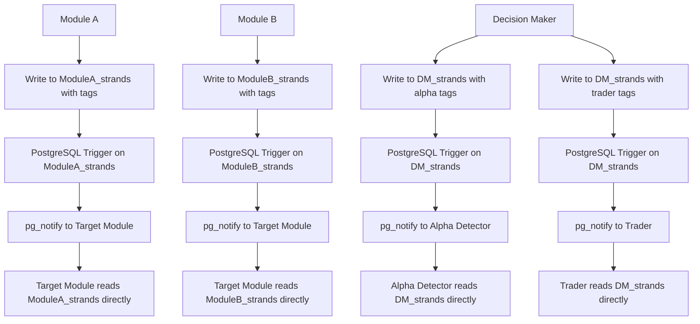

# Communication Protocol

*Direct table-to-table communication for the Trading Intelligence System*

## Overview

The Communication Protocol enables modules in the Trading Intelligence System to communicate via **direct table writes** with **tags** and **PostgreSQL triggers**. This approach eliminates complex message buses and provides simple, reliable, and auditable inter-module communication.

## Core Philosophy

### **Direct Table Communication**
- **No central tables** - Each module owns its data
- **No message buses** - Direct table-to-table communication  
- **Tags trigger notifications** - PostgreSQL triggers on source tables
- **Simple and reliable** - Database ACID properties

### **Communication Flow**


## Quick Start

### **1. For New Modules**
Follow the [BUILD_PLAN.md](BUILD_PLAN.md) to set up communication for any new module.

### **2. Required Table Structure**
Every module needs a strands table with these **mandatory fields**:
```sql
CREATE TABLE {MODULE_PREFIX}_strands (
    -- REQUIRED FIELDS (DO NOT MODIFY)
    id TEXT PRIMARY KEY,
    module TEXT DEFAULT '{module_name}',
    kind TEXT,
    symbol TEXT,
    timeframe TEXT,
    session_bucket TEXT,
    regime TEXT,
    tags JSONB,                    -- Communication tags (REQUIRED)
    created_at TIMESTAMPTZ DEFAULT NOW(),
    updated_at TIMESTAMPTZ DEFAULT NOW(),
    
    -- MODULE-SPECIFIC FIELDS (ADD AS NEEDED)
    {your_specific_fields}
);
```

### **3. Communication Classes**
Use the provided template classes:
- `DirectTableCommunicator` - Write data with tags
- `ModuleListener` - Listen for notifications from other modules

## Communication Patterns

### **Sending Messages**
```python
# Write data with communication tags
strand_data = {
    'id': 'AD_1234567890ab',
    'module': 'alpha',
    'kind': 'signal',
    'symbol': 'BTCUSDT',
    'signal_strength': 0.85,
    'confidence': 0.92,
    'created_at': datetime.now(timezone.utc)
}

# Send to Decision Maker
communicator.write_with_tags(
    'AD_strands', strand_data, ['dm:evaluate_plan']
)
```

### **Receiving Messages**
```python
# Listen for notifications
def handle_trading_plan(self, record_id):
    # Read data directly from source module's table
    signal_data = communicator.read_from_other_module('alpha', record_id)
    
    # Process the data
    self.process_trading_plan(signal_data)
```

## Communication Tags

### **Tagging Hierarchy - Who Tags Whom**

#### **Pipeline Modules → Decision Maker Only**
All pipeline modules (Alpha Detector, Risk Manager, Market Data, etc.) **ONLY** tag Decision Maker:

```python
# Alpha Detector sends to Decision Maker
alpha_communicator.write_with_tags(
    'AD_strands', signal_data, ['dm:evaluate_plan']
)

# Risk Manager sends to Decision Maker  
risk_communicator.write_with_tags(
    'RM_strands', risk_data, ['dm:risk_alert']
)

# Market Data sends to Decision Maker
market_communicator.write_with_tags(
    'MD_strands', market_data, ['dm:market_update']
)
```

#### **Decision Maker → All Other Modules**
Decision Maker is the **central hub** and tags **all other modules**:

```python
# Decision Maker sends to Alpha Detector (feedback)
dm_communicator.write_with_tags(
    'DM_strands', decision_data, ['alpha:decision_feedback']
)

# Decision Maker sends to Trader (execution)
dm_communicator.write_with_tags(
    'DM_strands', execution_data, ['trader:execute_plan']
)

# Decision Maker sends to Risk Manager (risk updates)
dm_communicator.write_with_tags(
    'DM_strands', risk_data, ['rm:risk_update']
)
```

### **Standard Tags**
- `{target_module}:{action}` - Send to target module
- `priority:high` - High priority message
- `timeout:300` - Message timeout in seconds
- `original_strand:{strand_id}` - Reference to original strand

### **Module-Specific Tags**

#### **Pipeline Modules → Decision Maker**
- `dm:evaluate_plan` - Send trading plan for evaluation
- `dm:risk_alert` - Send risk alert
- `dm:market_update` - Send market data update
- `dm:signal_update` - Send signal update

#### **Decision Maker → Pipeline Modules**
- `alpha:decision_feedback` - Send decision feedback to Alpha Detector
- `rm:risk_update` - Send risk update to Risk Manager
- `md:data_request` - Send data request to Market Data

#### **Decision Maker → Execution Modules**
- `trader:execute_plan` - Send execution plan to Trader
- `trader:modify_order` - Send order modification to Trader
- `trader:cancel_order` - Send order cancellation to Trader

#### **Execution Modules → Decision Maker**
- `dm:execution_feedback` - Send execution feedback to Decision Maker
- `dm:order_status` - Send order status to Decision Maker
- `dm:fill_report` - Send fill report to Decision Maker

## Database Triggers

### **PostgreSQL Triggers**
Each module table needs a trigger to send notifications:

```sql
-- Example trigger for AD_strands
CREATE OR REPLACE FUNCTION notify_from_ad_strands()
RETURNS TRIGGER AS $$
BEGIN
    IF NEW.tags @> '["dm:evaluate_plan"]' THEN
        PERFORM pg_notify('dm_evaluate_plan', NEW.id::text);
    END IF;
    RETURN NEW;
END;
$$ LANGUAGE plpgsql;

CREATE TRIGGER ad_strands_notify
    AFTER INSERT ON AD_strands
    FOR EACH ROW
    EXECUTE FUNCTION notify_from_ad_strands();
```

## Benefits

### **Simplicity**
- No complex message bus systems
- Direct database operations
- Easy to understand and debug

### **Reliability**
- PostgreSQL ACID properties
- Automatic retry on connection issues
- Built-in data persistence

### **Performance**
- < 10ms message latency
- < 50ms notification latency
- > 1000 messages/second throughput

### **Scalability**
- Linear scaling with message volume
- Easy to add new modules
- Efficient cleanup and archiving

## File Structure

```
communication_protocol/
├── README.md              # This overview
├── BUILD_PLAN.md          # Complete implementation guide
└── examples/              # Example implementations
    ├── alpha_detector.py
    ├── decision_maker.py
    └── trader.py
```

## Integration Examples

### **Alpha Detector → Decision Maker**
```python
# Alpha Detector sends trading plan
alpha_communicator.write_with_tags(
    'AD_strands', trading_plan_data, ['dm:evaluate_plan']
)

# Decision Maker receives notification and reads AD_strands
dm_listener.handle_trading_plan(strand_id)
```

### **Decision Maker → Trader**
```python
# Decision Maker sends execution plan
dm_communicator.write_with_tags(
    'DM_strands', execution_plan_data, ['trader:execute_plan']
)

# Trader receives notification and reads DM_strands
trader_listener.handle_execution_plan(strand_id)
```

## Monitoring

### **Communication Health**
```python
# Check recent message flow
recent_messages = db.execute("""
    SELECT module, kind, COUNT(*) as count
    FROM AD_strands 
    WHERE created_at > NOW() - INTERVAL '1 hour'
    GROUP BY module, kind
""").fetchall()
```

### **Error Tracking**
```python
# Check for failed communications
failed_messages = db.execute("""
    SELECT id, tags, created_at
    FROM AD_strands 
    WHERE tags @> '["error:communication_failed"]'
    AND created_at > NOW() - INTERVAL '1 hour'
""").fetchall()
```

## Getting Started

1. **Read the BUILD_PLAN.md** for complete implementation details
2. **Set up your module table** with required fields + your specific fields
3. **Create PostgreSQL triggers** for notifications
4. **Implement communication classes** using the templates
5. **Test communication** with other modules

## Support

For questions or issues with the communication protocol:
- Check the BUILD_PLAN.md for detailed implementation
- Review the example implementations
- Test with the provided monitoring tools

---

*This communication protocol provides a simple, reliable, and scalable foundation for inter-module communication in the Trading Intelligence System.*
