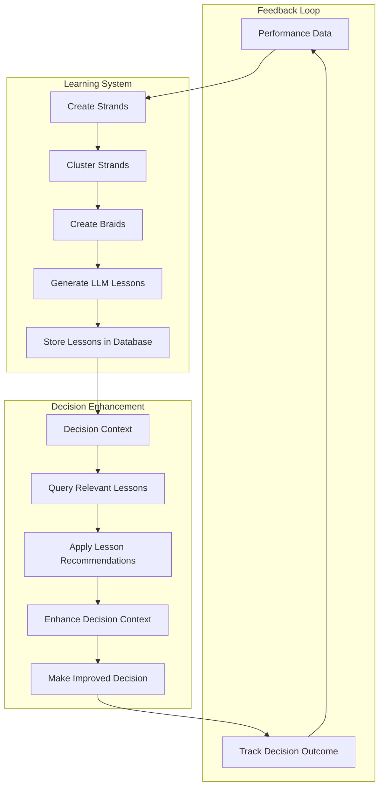

# Learning & Calibration Loops

*Source: [organic_intelligence_overview.md](../organic_intelligence_overview.md) + [intelligence_commincation_roughplan.md](../build_docs/intelligence_commincation_roughplan.md)*

## Goal
Create continuous learning and improvement across modules, enabling each module to self-learn and self-correct based on its own performance and outcomes.

## Core Philosophy

### Self-Learning at Module Level
- **Each module learns from its own performance** - not from other modules
- **Module-specific intelligence** - each module has its own learning algorithms
- **Continuous improvement** - learning happens in real-time
- **Performance-driven adaptation** - modules adapt based on success/failure

### Learning Mechanisms
- **Performance Feedback**: Track plan success/failure rates
- **Curator Learning**: Curators learn from their decisions
- **Parameter Optimization**: Continuous tuning of module parameters
- **Pattern Recognition**: Learn new patterns and market behaviors
- **Adaptive Thresholds**: Adjust detection thresholds based on performance

### **Strand-Braid Learning System** (NEW)
- **Hierarchical Learning**: Individual strands → braids → meta-braids → meta2-braids
- **Automatic Clustering**: Group similar performance records by top-level columns
- **LLM Lesson Generation**: Send clustered strands to LLM for natural language lessons
- **Single Table Architecture**: All learning data stored in module-specific strands table
- **Cross-Module Learning**: Eventually learn from patterns across all modules

## Strand-Braid Learning System (General Template)

### **Core Philosophy**
The strand-braid learning system provides **hierarchical learning** where individual performance records (strands) are automatically clustered by similarity and evolved into higher-level learning patterns (braids) that generate natural language lessons.

### **Learning Hierarchy**
```
Individual Strands (Performance Records)
    ↓ (Cluster by similarity, threshold = 3)
Braids (Clustered Lessons)
    ↓ (Cluster braids, threshold = 9)
Meta-Braids (Advanced Lessons)
    ↓ (Cluster meta-braids, threshold = 27)
Meta2-Braids (Master Lessons)
```

### **General Implementation Template**

#### **1. Strand Scoring (Module-Specific)**
```python
class ModuleStrandScoring:
    """Module-specific strand scoring - implement for each module"""
    
    def __init__(self, module_type):
        self.module_type = module_type
        self.scoring_weights = self._get_module_scoring_weights()
    
    def _get_module_scoring_weights(self):
        """Define scoring weights for this module type"""
        if self.module_type == 'alpha_detector':
            return {
                'sig_sigma': 0.4,      # Signal strength
                'sig_confidence': 0.3,  # Signal confidence
                'outcome_score': 0.3    # Performance outcome
            }
        elif self.module_type == 'decision_maker':
            return {
                'decision_quality': 0.4,  # Decision quality
                'risk_assessment': 0.3,   # Risk assessment
                'outcome_score': 0.3      # Performance outcome
            }
        elif self.module_type == 'trader':
            return {
                'execution_quality': 0.4,  # Execution quality
                'slippage_control': 0.3,   # Slippage control
                'outcome_score': 0.3       # Performance outcome
            }
        else:
            # Default scoring for new modules
            return {
                'primary_metric': 0.4,
                'secondary_metric': 0.3,
                'outcome_score': 0.3
            }
    
    def calculate_strand_score(self, strand):
        """Calculate strand score using module-specific weights"""
        score = 0.0
        
        for metric, weight in self.scoring_weights.items():
            metric_value = strand.get(metric, 0.0)
            score += metric_value * weight
        
        return min(max(score, 0.0), 1.0)  # Clamp to [0, 1]
```

#### **2. Strand Clustering (Automatic)**
```python
class StrandClustering:
    """Automatic clustering of strands by similarity"""
    
    def __init__(self, module_type):
        self.module_type = module_type
        self.clustering_columns = self._get_clustering_columns()
        self.braid_threshold = 3.0  # Configurable threshold
    
    def _get_clustering_columns(self):
        """Define clustering columns for this module type"""
        # Common clustering columns across all modules
        common_columns = ['symbol', 'timeframe', 'regime', 'session_bucket']
        
        # Module-specific clustering columns
        if self.module_type == 'alpha_detector':
            return common_columns + ['signal_type', 'pattern_detected']
        elif self.module_type == 'decision_maker':
            return common_columns + ['decision_type', 'risk_level']
        elif self.module_type == 'trader':
            return common_columns + ['venue', 'order_type']
        else:
            return common_columns
    
    def cluster_strands(self, strands):
        """Cluster strands by similarity using top-level columns"""
        clusters = {}
        
        for strand in strands:
            # Create clustering key from top-level columns
            clustering_key = self._create_clustering_key(strand)
            
            if clustering_key not in clusters:
                clusters[clustering_key] = {
                    'strands': [],
                    'accumulated_score': 0.0,
                    'clustering_columns': clustering_key
                }
            
            clusters[clustering_key]['strands'].append(strand)
            # Accumulate scores for threshold checking
            clusters[clustering_key]['accumulated_score'] += self._calculate_strand_score(strand)
        
        return clusters
    
    def _create_clustering_key(self, strand):
        """Create clustering key from top-level columns"""
        key_values = []
        for column in self.clustering_columns:
            key_values.append(str(strand.get(column, 'UNKNOWN')))
        return tuple(key_values)
    
    def _calculate_strand_score(self, strand):
        """Calculate strand score - delegate to module-specific scoring"""
        scorer = ModuleStrandScoring(self.module_type)
        return scorer.calculate_strand_score(strand)
```

#### **3. Braid Creation (Threshold-Based)**
```python
class BraidCreation:
    """Create braids from clustered strands when threshold is reached"""
    
    def __init__(self, module_type):
        self.module_type = module_type
        self.llm_generator = LLMLessonGenerator()
        self.braid_threshold = 3.0
    
    def create_braids_from_clusters(self, clusters):
        """Create braids for clusters above threshold"""
        braids = []
        
        for cluster_key, cluster_data in clusters.items():
            if cluster_data['accumulated_score'] >= self.braid_threshold:
                braid = self._create_braid_strand(cluster_data)
                braids.append(braid)
        
        return braids
    
    def _create_braid_strand(self, cluster_data):
        """Create a braid strand from clustered strands"""
        # Generate LLM lesson from clustered strands
        lesson = self.llm_generator.generate_lesson(
            cluster_data['strands'], 
            self.module_type,
            cluster_data['clustering_columns']
        )
        
        # Create braid strand entry
        braid_strand = {
            'id': f"{self.module_type.upper()}_{uuid.uuid4().hex[:12]}",
            'module': self.module_type,
            'kind': 'braid',
            'braid_level': 'braid',
            'accumulated_score': cluster_data['accumulated_score'],
            'source_strands': [s['id'] for s in cluster_data['strands']],
            'clustering_columns': cluster_data['clustering_columns'],
            'lesson': lesson,
            'created_at': datetime.now(timezone.utc)
        }
        
        return braid_strand
```

#### **4. LLM Lesson Generation**
```python
class LLMLessonGenerator:
    """Generate natural language lessons from clustered strands"""
    
    def generate_lesson(self, strands, module_type, clustering_columns):
        """Generate lesson from clustered strands"""
        # Prepare context for LLM
        context = self._prepare_llm_context(strands, module_type, clustering_columns)
        
        # Generate lesson using LLM
        lesson_prompt = self._create_lesson_prompt(context)
        lesson = self._call_llm(lesson_prompt)
        
        return lesson
    
    def _prepare_llm_context(self, strands, module_type, clustering_columns):
        """Prepare context for LLM lesson generation"""
        context = {
            'module_type': module_type,
            'strand_count': len(strands),
            'clustering_columns': clustering_columns,
            'strands_summary': self._summarize_strands(strands),
            'performance_patterns': self._extract_performance_patterns(strands),
            'common_characteristics': self._extract_common_characteristics(strands)
        }
        return context
    
    def _create_lesson_prompt(self, context):
        """Create LLM prompt for lesson generation"""
        prompt = f"""
        Generate a trading lesson from these {context['strand_count']} similar performance records:
        
        Module: {context['module_type']}
        Clustering: {context['clustering_columns']}
        Performance Patterns: {context['performance_patterns']}
        Common Characteristics: {context['common_characteristics']}
        
        Create a concise, actionable lesson that explains:
        1. What conditions led to success/failure
        2. Key patterns to recognize
        3. Recommended actions
        4. Confidence level
        
        Format as JSON with: title, description, conditions, recommendations, confidence
        """
        return prompt
```

#### **5. Hierarchical Progression**
```python
class HierarchicalLearning:
    """Manage hierarchical learning progression"""
    
    def __init__(self, module_type):
        self.module_type = module_type
        self.progression_thresholds = {
            'strand': 3,      # 3 strands → braid
            'braid': 9,       # 9 braids → meta-braid
            'meta_braid': 27  # 27 meta-braids → meta2-braid
        }
    
    def check_progression_opportunities(self, strands):
        """Check for progression to next learning level"""
        opportunities = []
        
        # Check for braid → meta-braid progression
        braids = [s for s in strands if s.get('kind') == 'braid']
        if len(braids) >= self.progression_thresholds['braid']:
            opportunities.append({
                'level': 'meta_braid',
                'source_strands': braids,
                'threshold': self.progression_thresholds['braid']
            })
        
        # Check for meta-braid → meta2-braid progression
        meta_braids = [s for s in strands if s.get('kind') == 'meta_braid']
        if len(meta_braids) >= self.progression_thresholds['meta_braid']:
            opportunities.append({
                'level': 'meta2_braid',
                'source_strands': meta_braids,
                'threshold': self.progression_thresholds['meta_braid']
            })
        
        return opportunities
```

### **Database Schema (Module-Specific)**
```sql
-- Each module has its own strands table with learning capabilities
CREATE TABLE {MODULE_PREFIX}_strands (
    -- REQUIRED FIELDS (DO NOT MODIFY)
    id TEXT PRIMARY KEY,
    module TEXT DEFAULT '{module_name}',
    kind TEXT,  -- 'strand', 'braid', 'meta_braid', 'meta2_braid'
    symbol TEXT,
    timeframe TEXT,
    session_bucket TEXT,
    regime TEXT,
    tags JSONB,
    created_at TIMESTAMPTZ DEFAULT NOW(),
    updated_at TIMESTAMPTZ DEFAULT NOW(),
    
    -- LEARNING FIELDS (ADD AS NEEDED)
    accumulated_score FLOAT8,           -- For braid creation
    source_strands TEXT[],              -- References to source strands
    clustering_columns JSONB,           -- Clustering metadata
    lesson JSONB,                       -- LLM-generated lesson
    braid_level TEXT,                   -- 'strand', 'braid', 'meta_braid', 'meta2_braid'
    
    -- MODULE-SPECIFIC FIELDS (ADD AS NEEDED)
    {module_specific_fields}
);
```

### **Integration with Existing Learning**
```python
class EnhancedModuleLearning:
    """Enhanced learning with strand-braid system"""
    
    def __init__(self, module_type):
        self.module_type = module_type
        # Existing learning components
        self.performance_tracker = PerformanceTracker()
        self.parameter_adapter = ParameterAdapter()
        self.pattern_recognizer = PatternRecognizer()
        
        # New strand-braid components
        self.strand_scorer = ModuleStrandScoring(module_type)
        self.strand_clusterer = StrandClustering(module_type)
        self.braid_creator = BraidCreation(module_type)
        self.hierarchical_learner = HierarchicalLearning(module_type)
    
    def update_performance(self, strand_data, outcome):
        """Enhanced performance update with strand-braid learning"""
        # 1. Update existing learning
        self.performance_tracker.update(strand_data, outcome)
        
        # 2. Add strand-braid learning
        strand_score = self.strand_scorer.calculate_strand_score(strand_data)
        strand_data['strand_score'] = strand_score
        
        # 3. Store in module strands table
        self._store_strand(strand_data)
        
        # 4. Check for braid creation opportunities
        self._check_braid_creation()
    
    def _check_braid_creation(self):
        """Check for braid creation opportunities"""
        # Get recent strands
        recent_strands = self._get_recent_strands(days=30)
        
        # Cluster strands
        clusters = self.strand_clusterer.cluster_strands(recent_strands)
        
        # Create braids for clusters above threshold
        braids = self.braid_creator.create_braids_from_clusters(clusters)
        
        # Store braids
        for braid in braids:
            self._store_strand(braid)
        
        # Check for hierarchical progression
        self._check_hierarchical_progression()
```

## Implementation Examples

### **Alpha Detector Implementation**
The Alpha Detector module implements the strand-braid learning system as follows:

```python
# Alpha Detector specific implementation
class AlphaDetectorStrandScoring(ModuleStrandScoring):
    def _get_module_scoring_weights(self):
        return {
            'sig_sigma': 0.4,      # Signal strength
            'sig_confidence': 0.3,  # Signal confidence  
            'outcome_score': 0.3    # Performance outcome
        }

class AlphaDetectorStrandClustering(StrandClustering):
    def _get_clustering_columns(self):
        return ['symbol', 'timeframe', 'regime', 'session_bucket', 'signal_type', 'pattern_detected']

# Integration with existing Alpha Detector learning
class EnhancedAlphaDetectorLearning(AlphaDetectorLearning):
    def __init__(self):
        super().__init__()
        # Add strand-braid components
        self.strand_scorer = AlphaDetectorStrandScoring('alpha_detector')
        self.strand_clusterer = AlphaDetectorStrandClustering('alpha_detector')
        self.braid_creator = BraidCreation('alpha_detector')
        self.hierarchical_learner = HierarchicalLearning('alpha_detector')
```

### **Decision Maker Implementation**
The Decision Maker module would implement:

```python
class DecisionMakerStrandScoring(ModuleStrandScoring):
    def _get_module_scoring_weights(self):
        return {
            'decision_quality': 0.4,  # Decision quality
            'risk_assessment': 0.3,   # Risk assessment
            'outcome_score': 0.3      # Performance outcome
        }

class DecisionMakerStrandClustering(StrandClustering):
    def _get_clustering_columns(self):
        return ['symbol', 'timeframe', 'regime', 'session_bucket', 'decision_type', 'risk_level']
```

### **Trader Implementation**
The Trader module would implement:

```python
class TraderStrandScoring(ModuleStrandScoring):
    def _get_module_scoring_weights(self):
        return {
            'execution_quality': 0.4,  # Execution quality
            'slippage_control': 0.3,   # Slippage control
            'outcome_score': 0.3       # Performance outcome
        }

class TraderStrandClustering(StrandClustering):
    def _get_clustering_columns(self):
        return ['symbol', 'timeframe', 'regime', 'session_bucket', 'venue', 'order_type']
```

## Module-Level Learning Architecture

### 1. Alpha Detector Learning
**Purpose**: Improve signal detection and trading plan generation

```python
class AlphaDetectorLearning:
    def __init__(self):
        self.performance_history = []
        self.learning_rate = 0.01
        self.adaptation_threshold = 0.1
    
    def update_performance(self, plan_id, outcome):
        """Update performance based on trading outcome"""
        self.performance_history.append({
            'plan_id': plan_id,
            'outcome': outcome,
            'timestamp': datetime.now()
        })
        
        # Trigger learning if performance degrades
        if self.performance_degraded():
            self.adapt_parameters()
    
    def adapt_parameters(self):
        """Adapt detector parameters based on performance"""
        # Analyze performance patterns
        patterns = self.analyze_performance_patterns()
        
        # Update parameters
        for pattern in patterns:
            if pattern['type'] == 'threshold_adjustment':
                self.adjust_detection_thresholds(pattern['adjustment'])
            elif pattern['type'] == 'curator_weight_update':
                self.update_curator_weights(pattern['weights'])
            elif pattern['type'] == 'new_pattern_detection':
                self.add_new_pattern(pattern['pattern'])
            elif pattern['type'] == 'dsi_weight_update':
                self.update_dsi_weights(pattern['weights'])
    
    def analyze_performance_patterns(self):
        """Analyze performance to identify improvement patterns"""
        recent_performance = self.get_recent_performance(days=30)
        
        patterns = []
        
        # Analyze signal quality patterns
        signal_quality_pattern = self.analyze_signal_quality(recent_performance)
        if signal_quality_pattern:
            patterns.append(signal_quality_pattern)
        
        # Analyze curator performance patterns
        curator_performance_pattern = self.analyze_curator_performance(recent_performance)
        if curator_performance_pattern:
            patterns.append(curator_performance_pattern)
        
        # Analyze DSI performance patterns
        dsi_performance_pattern = self.analyze_dsi_performance(recent_performance)
        if dsi_performance_pattern:
            patterns.append(dsi_performance_pattern)
        
        return patterns
```

### 2. Decision Maker Learning
**Purpose**: Improve decision quality and risk management

```python
class DecisionMakerLearning:
    def __init__(self):
        self.decision_history = []
        self.learning_rate = 0.01
        self.adaptation_threshold = 0.1
    
    def update_performance(self, decision_id, outcome):
        """Update performance based on decision outcome"""
        self.decision_history.append({
            'decision_id': decision_id,
            'outcome': outcome,
            'timestamp': datetime.now()
        })
        
        # Trigger learning if performance degrades
        if self.performance_degraded():
            self.adapt_parameters()
    
    def adapt_parameters(self):
        """Adapt decision maker parameters based on performance"""
        # Analyze performance patterns
        patterns = self.analyze_performance_patterns()
        
        # Update parameters
        for pattern in patterns:
            if pattern['type'] == 'risk_threshold_adjustment':
                self.adjust_risk_thresholds(pattern['adjustment'])
            elif pattern['type'] == 'curator_weight_update':
                self.update_curator_weights(pattern['weights'])
            elif pattern['type'] == 'allocation_strategy_update':
                self.update_allocation_strategy(pattern['strategy'])
            elif pattern['type'] == 'crypto_asymmetry_update':
                self.update_crypto_asymmetry_parameters(pattern['parameters'])
```

### 3. Trader Learning
**Purpose**: Improve execution quality and venue selection

```python
class TraderLearning:
    def __init__(self):
        self.execution_history = []
        self.learning_rate = 0.01
        self.adaptation_threshold = 0.1
    
    def update_performance(self, order_id, execution_data):
        """Update performance based on execution outcome"""
        self.execution_history.append({
            'order_id': order_id,
            'execution_data': execution_data,
            'timestamp': datetime.now()
        })
        
        # Trigger learning if performance degrades
        if self.performance_degraded():
            self.adapt_parameters()
    
    def adapt_parameters(self):
        """Adapt trader parameters based on performance"""
        # Analyze performance patterns
        patterns = self.analyze_performance_patterns()
        
        # Update parameters
        for pattern in patterns:
            if pattern['type'] == 'venue_weight_update':
                self.update_venue_weights(pattern['weights'])
            elif pattern['type'] == 'execution_strategy_update':
                self.update_execution_strategies(pattern['strategies'])
            elif pattern['type'] == 'slippage_threshold_update':
                self.update_slippage_thresholds(pattern['thresholds'])
```

## Learning Algorithms

### 1. Performance Pattern Analysis
```python
class PerformancePatternAnalyzer:
    def analyze_signal_quality(self, performance_data):
        """Analyze signal quality patterns"""
        # Calculate signal success rate
        success_rate = self.calculate_success_rate(performance_data)
        
        # Identify quality degradation
        if success_rate < self.quality_threshold:
            return {
                'type': 'threshold_adjustment',
                'adjustment': self.calculate_threshold_adjustment(success_rate),
                'confidence': self.calculate_confidence(performance_data)
            }
        
        return None
    
    def analyze_curator_performance(self, performance_data):
        """Analyze curator performance patterns"""
        curator_scores = self.calculate_curator_scores(performance_data)
        
        # Identify underperforming curators
        underperforming_curators = self.identify_underperforming_curators(curator_scores)
        
        if underperforming_curators:
            return {
                'type': 'curator_weight_update',
                'weights': self.calculate_new_weights(curator_scores),
                'confidence': self.calculate_confidence(performance_data)
            }
        
        return None
    
    def analyze_dsi_performance(self, performance_data):
        """Analyze DSI performance patterns"""
        dsi_scores = self.calculate_dsi_scores(performance_data)
        
        # Identify DSI contribution patterns
        dsi_contribution = self.calculate_dsi_contribution(dsi_scores)
        
        if dsi_contribution < self.dsi_threshold:
            return {
                'type': 'dsi_weight_update',
                'weights': self.calculate_new_dsi_weights(dsi_scores),
                'confidence': self.calculate_confidence(performance_data)
            }
        
        return None
```

### 2. Parameter Adaptation
```python
class ParameterAdapter:
    def adjust_detection_thresholds(self, adjustment):
        """Adjust detection thresholds based on performance"""
        current_thresholds = self.get_current_thresholds()
        
        # Apply adjustment
        new_thresholds = {}
        for detector_type, threshold in current_thresholds.items():
            new_thresholds[detector_type] = threshold * (1 + adjustment)
        
        # Update thresholds
        self.update_thresholds(new_thresholds)
    
    def update_curator_weights(self, new_weights):
        """Update curator weights based on performance"""
        current_weights = self.get_current_curator_weights()
        
        # Apply weighted update
        updated_weights = {}
        for curator_type, current_weight in current_weights.items():
            new_weight = new_weights.get(curator_type, current_weight)
            updated_weights[curator_type] = self.learning_rate * new_weight + (1 - self.learning_rate) * current_weight
        
        # Update weights
        self.update_curator_weights(updated_weights)
    
    def update_dsi_weights(self, new_weights):
        """Update DSI weights based on performance"""
        current_weights = self.get_current_dsi_weights()
        
        # Apply weighted update
        updated_weights = {}
        for expert_type, current_weight in current_weights.items():
            new_weight = new_weights.get(expert_type, current_weight)
            updated_weights[expert_type] = self.learning_rate * new_weight + (1 - self.learning_rate) * current_weight
        
        # Update weights
        self.update_dsi_weights(updated_weights)
```

### 3. Pattern Recognition
```python
class PatternRecognizer:
    def detect_new_patterns(self, market_data, performance_data):
        """Detect new patterns in market data"""
        # Analyze market data for new patterns
        new_patterns = self.analyze_market_patterns(market_data)
        
        # Correlate with performance data
        correlated_patterns = self.correlate_with_performance(new_patterns, performance_data)
        
        # Return significant patterns
        return [pattern for pattern in correlated_patterns if pattern['significance'] > self.pattern_threshold]
    
    def analyze_market_patterns(self, market_data):
        """Analyze market data for patterns"""
        patterns = []
        
        # Analyze price patterns
        price_patterns = self.analyze_price_patterns(market_data)
        patterns.extend(price_patterns)
        
        # Analyze volume patterns
        volume_patterns = self.analyze_volume_patterns(market_data)
        patterns.extend(volume_patterns)
        
        # Analyze microstructure patterns
        microstructure_patterns = self.analyze_microstructure_patterns(market_data)
        patterns.extend(microstructure_patterns)
        
        return patterns
    
    def correlate_with_performance(self, patterns, performance_data):
        """Correlate patterns with performance data"""
        correlated_patterns = []
        
        for pattern in patterns:
            # Calculate correlation with performance
            correlation = self.calculate_correlation(pattern, performance_data)
            
            if correlation > self.correlation_threshold:
                pattern['significance'] = correlation
                correlated_patterns.append(pattern)
        
        return correlated_patterns
```

## Learning Data Management

### 1. Performance Data Collection
```python
class PerformanceDataCollector:
    def __init__(self):
        self.performance_db = PerformanceDatabase()
        self.data_retention_days = 365
    
    def collect_performance_data(self, module_name, event_data):
        """Collect performance data from module events"""
        performance_record = {
            'module_name': module_name,
            'event_type': event_data['event_type'],
            'event_id': event_data['event_id'],
            'timestamp': event_data['timestamp'],
            'performance_metrics': self.extract_performance_metrics(event_data),
            'market_conditions': self.extract_market_conditions(event_data),
            'module_state': self.extract_module_state(event_data)
        }
        
        self.performance_db.store(performance_record)
    
    def extract_performance_metrics(self, event_data):
        """Extract performance metrics from event data"""
        metrics = {}
        
        if event_data['event_type'] == 'exec-report-1.0':
            metrics['slippage'] = event_data['payload']['data']['slippage']
            metrics['latency'] = event_data['payload']['data']['latency_ms']
            metrics['adherence'] = event_data['payload']['data']['adherence']
        
        elif event_data['event_type'] == 'dm-decision-1.0':
            metrics['decision_quality'] = event_data['payload']['data']['decision_quality']
            metrics['risk_assessment'] = event_data['payload']['data']['risk_assessment']
        
        elif event_data['event_type'] == 'det-alpha-1.0':
            metrics['signal_strength'] = event_data['payload']['data']['signal_strength']
            metrics['confidence_score'] = event_data['payload']['data']['confidence_score']
        
        return metrics
```

### 2. Learning Data Storage
```sql
-- Performance data table
CREATE TABLE learning_performance_data (
    id UUID PRIMARY KEY,
    module_name TEXT NOT NULL,
    event_type TEXT NOT NULL,
    event_id UUID NOT NULL,
    timestamp TIMESTAMP NOT NULL,
    performance_metrics JSONB NOT NULL,
    market_conditions JSONB NOT NULL,
    module_state JSONB NOT NULL,
    created_at TIMESTAMP DEFAULT NOW()
);

-- Learning patterns table
CREATE TABLE learning_patterns (
    id UUID PRIMARY KEY,
    module_name TEXT NOT NULL,
    pattern_type TEXT NOT NULL,
    pattern_data JSONB NOT NULL,
    significance FLOAT8 NOT NULL,
    discovered_at TIMESTAMP NOT NULL,
    last_used_at TIMESTAMP,
    usage_count INTEGER DEFAULT 0,
    created_at TIMESTAMP DEFAULT NOW()
);

-- Parameter updates table
CREATE TABLE learning_parameter_updates (
    id UUID PRIMARY KEY,
    module_name TEXT NOT NULL,
    parameter_type TEXT NOT NULL,
    old_value JSONB NOT NULL,
    new_value JSONB NOT NULL,
    update_reason TEXT NOT NULL,
    performance_impact FLOAT8,
    updated_at TIMESTAMP NOT NULL,
    created_at TIMESTAMP DEFAULT NOW()
);
```

## Learning Orchestration

### 1. Learning Scheduler
```python
class LearningScheduler:
    def __init__(self):
        self.learning_modules = {}
        self.schedule_interval = 300  # 5 minutes
    
    def register_learning_module(self, module_name, learning_module):
        """Register a learning module"""
        self.learning_modules[module_name] = learning_module
    
    def start_learning_loop(self):
        """Start the learning loop"""
        while True:
            for module_name, learning_module in self.learning_modules.items():
                try:
                    # Trigger learning for module
                    learning_module.trigger_learning()
                except Exception as e:
                    self.handle_learning_error(module_name, e)
            
            time.sleep(self.schedule_interval)
    
    def trigger_learning(self, module_name):
        """Trigger learning for specific module"""
        if module_name in self.learning_modules:
            self.learning_modules[module_name].trigger_learning()
```

### 2. Learning Coordinator
```python
class LearningCoordinator:
    def __init__(self):
        self.learning_scheduler = LearningScheduler()
        self.performance_collector = PerformanceDataCollector()
        self.pattern_recognizer = PatternRecognizer()
    
    def coordinate_learning(self):
        """Coordinate learning across all modules"""
        # Collect performance data
        performance_data = self.performance_collector.get_recent_performance()
        
        # Analyze patterns
        patterns = self.pattern_recognizer.detect_new_patterns(performance_data)
        
        # Distribute patterns to modules
        for pattern in patterns:
            target_module = pattern['target_module']
            if target_module in self.learning_scheduler.learning_modules:
                self.learning_scheduler.learning_modules[target_module].add_pattern(pattern)
```

## Learning Metrics and Monitoring

### 1. Learning Performance Metrics
```python
class LearningMetrics:
    def __init__(self):
        self.metrics_db = MetricsDatabase()
    
    def track_learning_performance(self, module_name, learning_data):
        """Track learning performance metrics"""
        metrics = {
            'module_name': module_name,
            'learning_rate': learning_data['learning_rate'],
            'adaptation_frequency': learning_data['adaptation_frequency'],
            'performance_improvement': learning_data['performance_improvement'],
            'pattern_discovery_rate': learning_data['pattern_discovery_rate'],
            'timestamp': datetime.now()
        }
        
        self.metrics_db.store(metrics)
    
    def calculate_learning_effectiveness(self, module_name, time_window_days=30):
        """Calculate learning effectiveness for module"""
        recent_metrics = self.metrics_db.get_recent_metrics(module_name, time_window_days)
        
        # Calculate effectiveness score
        effectiveness_score = self.calculate_effectiveness_score(recent_metrics)
        
        return effectiveness_score
```

### 2. Learning Health Monitoring
```python
class LearningHealthMonitor:
    def __init__(self):
        self.health_thresholds = {
            'learning_rate': 0.01,
            'adaptation_frequency': 0.1,
            'performance_improvement': 0.05
        }
    
    def check_learning_health(self, module_name):
        """Check learning health for module"""
        health_status = {
            'module_name': module_name,
            'overall_health': 'healthy',
            'issues': []
        }
        
        # Check learning rate
        learning_rate = self.get_learning_rate(module_name)
        if learning_rate < self.health_thresholds['learning_rate']:
            health_status['issues'].append('Low learning rate')
            health_status['overall_health'] = 'degraded'
        
        # Check adaptation frequency
        adaptation_frequency = self.get_adaptation_frequency(module_name)
        if adaptation_frequency < self.health_thresholds['adaptation_frequency']:
            health_status['issues'].append('Low adaptation frequency')
            health_status['overall_health'] = 'degraded'
        
        # Check performance improvement
        performance_improvement = self.get_performance_improvement(module_name)
        if performance_improvement < self.health_thresholds['performance_improvement']:
            health_status['issues'].append('Low performance improvement')
            health_status['overall_health'] = 'degraded'
        
        return health_status
```

## Configuration

### Learning Configuration
```yaml
learning_systems:
  global:
    learning_rate: 0.01
    adaptation_threshold: 0.1
    pattern_threshold: 0.7
    correlation_threshold: 0.5
    data_retention_days: 365
  
  modules:
    alpha_detector:
      learning_rate: 0.01
      adaptation_threshold: 0.1
      curator_learning_enabled: true
      dsi_learning_enabled: true
      pattern_recognition_enabled: true
    
    decision_maker:
      learning_rate: 0.01
      adaptation_threshold: 0.1
      risk_learning_enabled: true
      allocation_learning_enabled: true
      crypto_asymmetry_learning_enabled: true
    
    trader:
      learning_rate: 0.01
      adaptation_threshold: 0.1
      execution_learning_enabled: true
      venue_learning_enabled: true
      slippage_learning_enabled: true
  
  monitoring:
    metrics_enabled: true
    health_checks_enabled: true
    alerting_enabled: true
    performance_tracking_enabled: true
```

## Integration with Other Design Documents

### **Communication Protocol Integration**
The strand-braid learning system integrates with the communication protocol:

```python
# Learning data is stored in module-specific strands tables
# Communication happens via tags in the same tables
class LearningCommunicationIntegration:
    def __init__(self, module_type):
        self.communicator = DirectTableCommunicator(db_connection, module_type)
        self.learning_system = EnhancedModuleLearning(module_type)
    
    def update_performance_with_learning(self, strand_data, outcome):
        # Update learning
        self.learning_system.update_performance(strand_data, outcome)
        
        # Store in strands table with communication tags
        self.communicator.write_with_tags(
            f"{module_type.upper()}_strands", 
            strand_data, 
            ['learning:performance_update']
        )
```

### **Core Intelligence Architecture Integration**
The strand-braid learning system integrates deeply with the curator layer:

#### **Curator Performance Learning**
```python
# Learning from curator performance
class CuratorLearningIntegration:
    def __init__(self, module_type):
        self.curator_orchestrator = CuratorOrchestrator(module_type)
        self.learning_system = EnhancedModuleLearning(module_type)
        self.curator_learning = CuratorStrandBraidLearning(module_type)
    
    def update_curator_learning(self, curator_contributions, outcome):
        # Extract curator performance data
        curator_data = self._extract_curator_performance(curator_contributions)
        
        # Update learning with curator-specific data
        self.learning_system.update_performance(curator_data, outcome)
        
        # Generate curator-specific lessons
        self._generate_curator_lessons(curator_data)
    
    def _extract_curator_performance(self, curator_contributions):
        """Extract curator performance data for learning"""
        curator_data = []
        
        for contribution in curator_contributions:
            curator_data.append({
                'curator_type': contribution.curator_type,
                'action': contribution.action.value,
                'contribution': contribution.contribution,
                'confidence': contribution.confidence,
                'reason': contribution.reason,
                'evidence': contribution.evidence,
                'timestamp': contribution.timestamp
            })
        
        return curator_data
```

#### **Curator-Specific Strand-Braid Learning**
```python
class CuratorStrandBraidLearning:
    """Strand-braid learning specifically for curator performance"""
    
    def __init__(self, module_type):
        self.module_type = module_type
        self.curator_strand_scorer = CuratorStrandScoring()
        self.curator_strand_clusterer = CuratorStrandClustering()
        self.curator_braid_creator = CuratorBraidCreation()
    
    def learn_from_curator_performance(self, curator_contributions, outcome):
        """Learn from curator performance using strand-braid system"""
        
        # Convert curator contributions to strands
        curator_strands = self._convert_to_strands(curator_contributions, outcome)
        
        # Store in module strands table
        for strand in curator_strands:
            self._store_curator_strand(strand)
        
        # Check for curator braid creation
        self._check_curator_braid_creation()
    
    def _convert_to_strands(self, curator_contributions, outcome):
        """Convert curator contributions to learning strands"""
        strands = []
        
        for contribution in curator_contributions:
            strand = {
                'id': f"CURATOR_{uuid.uuid4().hex[:12]}",
                'module': self.module_type,
                'kind': 'curator_strand',
                'curator_type': contribution.curator_type,
                'action': contribution.action.value,
                'contribution': contribution.contribution,
                'confidence': contribution.confidence,
                'outcome_score': outcome.get('score', 0.0),
                'was_correct': outcome.get('was_correct', False),
                'market_regime': outcome.get('regime', 'unknown'),
                'signal_strength': outcome.get('signal_strength', 0.0),
                'created_at': datetime.now(timezone.utc)
            }
            
            # Calculate curator-specific strand score
            strand['strand_score'] = self.curator_strand_scorer.calculate_strand_score(strand)
            
            strands.append(strand)
        
        return strands
    
    def _check_curator_braid_creation(self):
        """Check for curator braid creation opportunities"""
        # Get recent curator strands
        recent_strands = self._get_recent_curator_strands(days=30)
        
        # Cluster by curator type and performance patterns
        clusters = self.curator_strand_clusterer.cluster_strands(recent_strands)
        
        # Create braids for high-performing clusters
        braids = self.curator_braid_creator.create_braids_from_clusters(clusters)
        
        # Store braids
        for braid in braids:
            self._store_curator_strand(braid)
```

#### **Curator Learning Metrics**
```python
class CuratorLearningMetrics:
    """Track curator learning performance"""
    
    def __init__(self, module_type):
        self.module_type = module_type
        self.curator_metrics = {}
    
    def track_curator_learning(self, curator_type, learning_data):
        """Track curator learning progress"""
        
        if curator_type not in self.curator_metrics:
            self.curator_metrics[curator_type] = {
                'total_strands': 0,
                'total_braids': 0,
                'learning_accuracy': 0.0,
                'lesson_generation_rate': 0.0,
                'confidence_calibration': 0.0
            }
        
        metrics = self.curator_metrics[curator_type]
        
        # Update metrics based on learning data
        metrics['total_strands'] += learning_data.get('strand_count', 0)
        metrics['total_braids'] += learning_data.get('braid_count', 0)
        
        # Calculate learning accuracy
        if learning_data.get('was_correct'):
            metrics['learning_accuracy'] = self._update_accuracy(
                metrics['learning_accuracy'], 
                learning_data.get('confidence', 0.0)
            )
        
        return metrics
    
    def _update_accuracy(self, current_accuracy, confidence):
        """Update accuracy with confidence weighting"""
        # Weighted average of accuracy and confidence
        return 0.7 * current_accuracy + 0.3 * confidence
```

#### **Lesson Feedback Loop - Critical Integration**
The most important part of the learning system is how lessons are fed back into the decision-making process:

```python
class LessonFeedbackSystem:
    """Feed lessons back into decision-making to improve performance"""
    
    def __init__(self, module_type):
        self.module_type = module_type
        self.lesson_applicator = LessonApplicator()
        self.curator_weight_updater = CuratorWeightUpdater()
        self.parameter_adapter = ParameterAdapter()
    
    def apply_lessons_to_decisions(self, context: Dict) -> Dict:
        """Apply learned lessons to current decision context"""
        
        # 1. Get relevant lessons for current context
        relevant_lessons = self._get_relevant_lessons(context)
        
        # 2. Apply lesson recommendations to context
        enhanced_context = self._apply_lesson_recommendations(context, relevant_lessons)
        
        # 3. Update curator weights based on lesson insights
        self._update_curator_weights_from_lessons(relevant_lessons)
        
        # 4. Adapt module parameters based on lessons
        self._adapt_parameters_from_lessons(relevant_lessons)
        
        return enhanced_context
    
    def _get_relevant_lessons(self, context: Dict) -> List[Dict]:
        """Get lessons relevant to current decision context"""
        
        # Query lessons based on context similarity
        query = {
            'module': self.module_type,
            'kind': 'braid',  # Get braided lessons
            'conditions': {
                'symbol': context.get('symbol'),
                'regime': context.get('regime'),
                'timeframe': context.get('timeframe')
            }
        }
        
        # Get lessons from database
        lessons = self._query_lessons(query)
        
        # Rank by relevance and confidence
        ranked_lessons = self._rank_lessons_by_relevance(lessons, context)
        
        return ranked_lessons[:5]  # Top 5 most relevant lessons
    
    def _apply_lesson_recommendations(self, context: Dict, lessons: List[Dict]) -> Dict:
        """Apply lesson recommendations to decision context"""
        
        enhanced_context = context.copy()
        
        for lesson in lessons:
            recommendations = lesson.get('recommendations', [])
            
            for recommendation in recommendations:
                if recommendation['type'] == 'curator_weight_adjustment':
                    # Adjust curator weights based on lesson
                    curator_type = recommendation['curator_type']
                    weight_adjustment = recommendation['adjustment']
                    enhanced_context[f'{curator_type}_weight'] = weight_adjustment
                
                elif recommendation['type'] == 'threshold_adjustment':
                    # Adjust detection thresholds
                    threshold_type = recommendation['threshold_type']
                    threshold_value = recommendation['threshold_value']
                    enhanced_context[f'{threshold_type}_threshold'] = threshold_value
                
                elif recommendation['type'] == 'confidence_boost':
                    # Boost confidence for specific conditions
                    condition = recommendation['condition']
                    boost_factor = recommendation['boost_factor']
                    if self._condition_matches(context, condition):
                        enhanced_context['confidence_boost'] = boost_factor
                
                elif recommendation['type'] == 'risk_adjustment':
                    # Adjust risk parameters
                    risk_type = recommendation['risk_type']
                    risk_value = recommendation['risk_value']
                    enhanced_context[f'{risk_type}_risk'] = risk_value
        
        return enhanced_context
    
    def _update_curator_weights_from_lessons(self, lessons: List[Dict]):
        """Update curator weights based on lesson insights"""
        
        for lesson in lessons:
            if lesson.get('type') == 'curator_performance_lesson':
                curator_type = lesson.get('curator_type')
                performance_insight = lesson.get('performance_insight')
                
                # Extract weight adjustment from lesson
                weight_adjustment = self._extract_weight_adjustment(performance_insight)
                
                # Update curator weight
                self.curator_weight_updater.update_curator_weight(
                    curator_type, 
                    weight_adjustment
                )
    
    def _adapt_parameters_from_lessons(self, lessons: List[Dict]):
        """Adapt module parameters based on lesson insights"""
        
        for lesson in lessons:
            if lesson.get('type') == 'parameter_optimization_lesson':
                parameter_insights = lesson.get('parameter_insights', [])
                
                for insight in parameter_insights:
                    parameter_name = insight['parameter']
                    new_value = insight['recommended_value']
                    confidence = insight['confidence']
                    
                    # Apply parameter change with confidence weighting
                    self.parameter_adapter.update_parameter(
                        parameter_name, 
                        new_value, 
                        confidence
                    )
```

#### **Decision Enhancement with Lessons**
```python
class LessonEnhancedDecisionMaker:
    """Decision maker that uses lessons to improve decisions"""
    
    def __init__(self, module_type):
        self.module_type = module_type
        self.lesson_feedback = LessonFeedbackSystem(module_type)
        self.base_decision_maker = BaseDecisionMaker(module_type)
    
    def make_decision(self, context: Dict) -> Dict:
        """Make decision enhanced with learned lessons"""
        
        # 1. Apply lessons to enhance context
        enhanced_context = self.lesson_feedback.apply_lessons_to_decisions(context)
        
        # 2. Make decision with enhanced context
        decision = self.base_decision_maker.make_decision(enhanced_context)
        
        # 3. Add lesson metadata to decision
        decision['lesson_enhanced'] = True
        decision['lessons_applied'] = enhanced_context.get('lessons_applied', [])
        decision['confidence_boost'] = enhanced_context.get('confidence_boost', 1.0)
        
        return decision
```

#### **Real-Time Lesson Application**
```python
class RealTimeLessonApplication:
    """Apply lessons in real-time during decision making"""
    
    def __init__(self, module_type):
        self.module_type = module_type
        self.lesson_cache = LessonCache()
        self.lesson_matcher = LessonMatcher()
    
    def enhance_decision_context(self, context: Dict) -> Dict:
        """Enhance decision context with real-time lesson application"""
        
        # 1. Get cached lessons for quick access
        cached_lessons = self.lesson_cache.get_relevant_lessons(context)
        
        # 2. Match lessons to current context
        matched_lessons = self.lesson_matcher.match_lessons(cached_lessons, context)
        
        # 3. Apply lesson insights to context
        enhanced_context = self._apply_lesson_insights(context, matched_lessons)
        
        return enhanced_context
    
    def _apply_lesson_insights(self, context: Dict, lessons: List[Dict]) -> Dict:
        """Apply lesson insights to decision context"""
        
        enhanced_context = context.copy()
        
        for lesson in lessons:
            # Apply confidence adjustments
            if lesson.get('confidence_adjustment'):
                enhanced_context['confidence'] *= lesson['confidence_adjustment']
            
            # Apply risk adjustments
            if lesson.get('risk_adjustment'):
                enhanced_context['risk_tolerance'] *= lesson['risk_adjustment']
            
            # Apply threshold adjustments
            if lesson.get('threshold_adjustment'):
                threshold_type = lesson['threshold_type']
                adjustment = lesson['threshold_adjustment']
                enhanced_context[f'{threshold_type}_threshold'] *= adjustment
        
        return enhanced_context
```

## Complete Lesson Feedback Loop

### **How Lessons Improve Decision Making**



### **Key Integration Points:**

1. **Lesson Generation**: Strands → Braids → LLM Lessons → Database
2. **Lesson Retrieval**: Query lessons based on decision context
3. **Lesson Application**: Apply recommendations to enhance decisions
4. **Performance Tracking**: Track outcomes to create new strands
5. **Continuous Improvement**: Lessons get better over time

## Design Document Alignment

### **✅ Communication Protocol** 
- **General Template**: `@communication_protocol/` - Direct table communication
- **Learning Integration**: Strand-braid data stored in same tables with communication tags
- **Status**: ✅ **PERFECT ALIGNMENT**

### **✅ Core Intelligence Architecture**
- **General Template**: `@core_intelligence_architecture/` - Curator layer design
- **Learning Integration**: 
  - **Curator Performance Learning**: Curators learn from their own decisions
  - **Curator Strand-Braid System**: Curator-specific clustering and lesson generation
  - **Curator Learning Metrics**: Track curator learning progress and accuracy
  - **Curator Weight Adaptation**: Adjust curator weights based on performance
- **Status**: ✅ **ENHANCED INTEGRATION**

### **✅ Learning Systems**
- **General Template**: `@learning_systems/` - Strand-braid learning system
- **Module Implementation**: Each module implements the general template
- **Status**: ✅ **PERFECT ALIGNMENT**

---

*This specification provides a comprehensive framework for learning and calibration loops, enabling each module to continuously improve itself based on its own performance while maintaining system-wide coherence and learning capabilities.*
