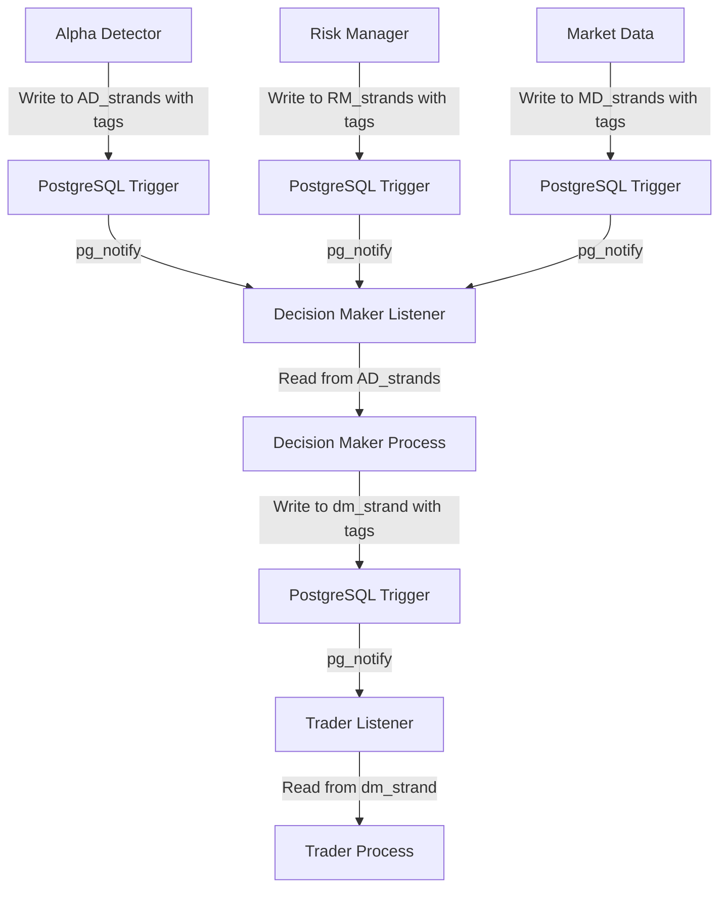

# Decision Maker Module - Database Schema & Communication

*Complete database schema and direct table communication protocol for the Decision Maker Module*

## Database Schema

### 1. Decision Maker Strands (dm_strand)

```sql
-- Decision Maker strands (following direct table communication)
CREATE TABLE dm_strand (
    id TEXT PRIMARY KEY,                    -- ULID
    lifecycle_id TEXT,                      -- Thread identifier
    parent_id TEXT,                         -- Linkage to parent strand
    module TEXT DEFAULT 'dm',               -- Module identifier
    kind TEXT,                              -- 'decision'|'evaluation'|'risk_assessment'|'budget_allocation'|'braid'|'meta_braid'
    symbol TEXT,                            -- Trading symbol
    timeframe TEXT,                         -- '1m'|'5m'|'15m'|'1h'|'4h'|'1d'
    session_bucket TEXT,                    -- Session identifier
    regime TEXT,                            -- Market regime
    alpha_bundle_ref TEXT,                  -- Reference to AD_strands
    dm_alpha JSONB,                         -- Fused alpha signal data
    dm_budget JSONB,                        -- Budget allocation data
    dm_decision JSONB,                      -- Decision result
    risk_metrics JSONB,                     -- Risk assessment metrics
    portfolio_impact JSONB,                 -- Portfolio impact analysis
    asymmetries JSONB,                      -- Crypto asymmetry data
    curator_decisions JSONB,                -- Curator evaluation results
    lesson_metadata JSONB,                  -- Lesson feedback integration
    created_at TIMESTAMPTZ DEFAULT now(),
    updated_at TIMESTAMPTZ DEFAULT now()
);

-- Indexes for fast queries
CREATE INDEX dm_strand_symbol_time ON dm_strand(symbol, created_at DESC);
CREATE INDEX dm_strand_lifecycle ON dm_strand(lifecycle_id);
CREATE INDEX dm_strand_alpha_ref ON dm_strand(alpha_bundle_ref);
CREATE INDEX dm_strand_decision_type ON dm_strand((dm_decision->>'decision_type'));
CREATE INDEX dm_strand_kind ON dm_strand(kind);
CREATE INDEX dm_strand_lesson_metadata ON dm_strand USING GIN(lesson_metadata);
```

### 2. Portfolio Management

```sql
-- Portfolio state tracking
CREATE TABLE dm_portfolio_state (
    id TEXT PRIMARY KEY,
    portfolio_value DECIMAL(20,8) NOT NULL,
    cash_balance DECIMAL(20,8) NOT NULL,
    total_risk DECIMAL(8,4) NOT NULL,
    var_95 DECIMAL(8,4) NOT NULL,
    max_drawdown DECIMAL(8,4) NOT NULL,
    sharpe_ratio DECIMAL(8,4) NOT NULL,
    created_at TIMESTAMPTZ DEFAULT now()
);

-- Position tracking
CREATE TABLE dm_positions (
    id TEXT PRIMARY KEY,
    symbol TEXT NOT NULL,
    side TEXT NOT NULL,                     -- 'long'|'short'
    size DECIMAL(20,8) NOT NULL,
    entry_price DECIMAL(20,8) NOT NULL,
    current_price DECIMAL(20,8) NOT NULL,
    unrealized_pnl DECIMAL(20,8) NOT NULL,
    created_at TIMESTAMPTZ DEFAULT now(),
    updated_at TIMESTAMPTZ DEFAULT now()
);
```

### 3. Curator Performance Tracking

```sql
-- Curator performance tracking
CREATE TABLE dm_curator_performance (
    id TEXT PRIMARY KEY,
    curator_type TEXT NOT NULL,             -- 'risk_curator'|'budget_curator'|'execution_curator'
    decision_id TEXT NOT NULL,
    contribution_score DECIMAL(8,4) NOT NULL,
    accuracy_score DECIMAL(8,4) NOT NULL,
    learning_metadata JSONB,                -- Lesson feedback integration
    created_at TIMESTAMPTZ DEFAULT now()
);

-- Curator weight tracking
CREATE TABLE dm_curator_weights (
    id TEXT PRIMARY KEY,
    curator_type TEXT NOT NULL,
    weight DECIMAL(8,4) NOT NULL,
    confidence DECIMAL(8,4) NOT NULL,
    lesson_adjustments JSONB,               -- Lesson-driven adjustments
    created_at TIMESTAMPTZ DEFAULT now(),
    updated_at TIMESTAMPTZ DEFAULT now()
);
```

## Direct Table Communication Protocol

### Communication Flow



### 1. Decision Maker Communication Interface

```python
class DecisionMakerCommunicator:
    """Direct table communication for Decision Maker"""
    
    def __init__(self, db_connection):
        self.db = db_connection
        self.module_name = 'dm'
        self.listener = ModuleListener('dm')
    
    def listen_for_alpha_signals(self):
        """Listen for alpha signals from Alpha Detector"""
        # Set up pg_notify listener for AD_strands
        self.listener.listen('ad_strand_notification', self._process_alpha_signal)
    
    def listen_for_risk_updates(self):
        """Listen for risk updates from Risk Manager"""
        # Set up pg_notify listener for RM_strands
        self.listener.listen('rm_strand_notification', self._process_risk_update)
    
    def listen_for_market_data(self):
        """Listen for market data updates"""
        # Set up pg_notify listener for MD_strands
        self.listener.listen('md_strand_notification', self._process_market_data)
    
    def send_decision_to_trader(self, decision_data: Dict, tags: List[str]):
        """Send decision to Trader via dm_strand table"""
        
        # Write decision to dm_strand table
        decision_strand = {
            'id': generate_ulid(),
            'lifecycle_id': decision_data.get('lifecycle_id'),
            'module': 'dm',
            'kind': 'decision',
            'symbol': decision_data.get('symbol'),
            'timeframe': decision_data.get('timeframe'),
            'dm_decision': decision_data.get('decision'),
            'risk_metrics': decision_data.get('risk_metrics'),
            'portfolio_impact': decision_data.get('portfolio_impact'),
            'lesson_metadata': decision_data.get('lesson_metadata', {}),
            'tags': tags  # ['trader:execute', 'priority:high']
        }
        
        # Insert into dm_strand table
        self.db.execute("""
            INSERT INTO dm_strand (
                id, lifecycle_id, module, kind, symbol, timeframe,
                dm_decision, risk_metrics, portfolio_impact, lesson_metadata, tags
            ) VALUES (
                %(id)s, %(lifecycle_id)s, %(module)s, %(kind)s, %(symbol)s, %(timeframe)s,
                %(dm_decision)s, %(risk_metrics)s, %(portfolio_impact)s, %(lesson_metadata)s, %(tags)s
            )
        """, decision_strand)
        
        # Trigger pg_notify for Trader
        self.db.execute("""
            NOTIFY trader_strand_notification, %s
        """, json.dumps({
            'strand_id': decision_strand['id'],
            'module': 'dm',
            'kind': 'decision',
            'tags': tags
        }))
    
    def send_feedback_to_alpha_detector(self, feedback_data: Dict, tags: List[str]):
        """Send feedback to Alpha Detector via dm_strand table"""
        
        # Write feedback to dm_strand table
        feedback_strand = {
            'id': generate_ulid(),
            'lifecycle_id': feedback_data.get('lifecycle_id'),
            'module': 'dm',
            'kind': 'feedback',
            'symbol': feedback_data.get('symbol'),
            'alpha_bundle_ref': feedback_data.get('alpha_bundle_ref'),
            'dm_decision': feedback_data.get('feedback'),
            'lesson_metadata': feedback_data.get('lesson_metadata', {}),
            'tags': tags  # ['alpha:feedback', 'learning:update']
        }
        
        # Insert into dm_strand table
        self.db.execute("""
            INSERT INTO dm_strand (
                id, lifecycle_id, module, kind, symbol, alpha_bundle_ref,
                dm_decision, lesson_metadata, tags
            ) VALUES (
                %(id)s, %(lifecycle_id)s, %(module)s, %(kind)s, %(symbol)s, %(alpha_bundle_ref)s,
                %(dm_decision)s, %(lesson_metadata)s, %(tags)s
            )
        """, feedback_strand)
        
        # Trigger pg_notify for Alpha Detector
        self.db.execute("""
            NOTIFY alpha_detector_strand_notification, %s
        """, json.dumps({
            'strand_id': feedback_strand['id'],
            'module': 'dm',
            'kind': 'feedback',
            'tags': tags
        }))
    
    def _process_alpha_signal(self, notification_data):
        """Process alpha signal from Alpha Detector"""
        strand_id = notification_data['strand_id']
        
        # Read alpha signal from AD_strands table
        alpha_signal = self.db.fetch_one("""
            SELECT * FROM AD_strands 
            WHERE id = %s AND tags @> %s
        """, strand_id, ['dm:evaluate'])
        
        if alpha_signal:
            # Process alpha signal with lesson feedback
            decision = self._evaluate_alpha_signal_with_lessons(alpha_signal)
            
            if decision:
                # Send decision to Trader
                self.send_decision_to_trader(decision, ['trader:execute'])
                
                # Send feedback to Alpha Detector
                self.send_feedback_to_alpha_detector(decision, ['alpha:feedback'])
    
    def _process_risk_update(self, notification_data):
        """Process risk update from Risk Manager"""
        strand_id = notification_data['strand_id']
        
        # Read risk update from RM_strands table
        risk_update = self.db.fetch_one("""
            SELECT * FROM RM_strands 
            WHERE id = %s AND tags @> %s
        """, strand_id, ['dm:risk_update'])
        
        if risk_update:
            # Update risk assessment with lesson feedback
            self._update_risk_assessment_with_lessons(risk_update)
    
    def _process_market_data(self, notification_data):
        """Process market data update"""
        strand_id = notification_data['strand_id']
        
        # Read market data from MD_strands table
        market_data = self.db.fetch_one("""
            SELECT * FROM MD_strands 
            WHERE id = %s AND tags @> %s
        """, strand_id, ['dm:market_update'])
        
        if market_data:
            # Update market context with lesson feedback
            self._update_market_context_with_lessons(market_data)
```

### 2. PostgreSQL Triggers

```sql
-- Trigger for AD_strands notifications
CREATE OR REPLACE FUNCTION notify_alpha_detector_strands()
RETURNS TRIGGER AS $$
BEGIN
    -- Check if tags contain dm:evaluate
    IF NEW.tags @> '["dm:evaluate"]'::jsonb THEN
        PERFORM pg_notify('alpha_detector_strand_notification', 
            json_build_object(
                'strand_id', NEW.id,
                'module', NEW.module,
                'kind', NEW.kind,
                'tags', NEW.tags
            )::text
        );
    END IF;
    RETURN NEW;
END;
$$ LANGUAGE plpgsql;

CREATE TRIGGER alpha_detector_strand_notify
    AFTER INSERT OR UPDATE ON AD_strands
    FOR EACH ROW
    EXECUTE FUNCTION notify_alpha_detector_strands();

-- Trigger for dm_strand notifications
CREATE OR REPLACE FUNCTION notify_decision_maker_strands()
RETURNS TRIGGER AS $$
BEGIN
    -- Check if tags contain trader:execute
    IF NEW.tags @> '["trader:execute"]'::jsonb THEN
        PERFORM pg_notify('trader_strand_notification', 
            json_build_object(
                'strand_id', NEW.id,
                'module', NEW.module,
                'kind', NEW.kind,
                'tags', NEW.tags
            )::text
        );
    END IF;
    
    -- Check if tags contain alpha:feedback
    IF NEW.tags @> '["alpha:feedback"]'::jsonb THEN
        PERFORM pg_notify('alpha_detector_strand_notification', 
            json_build_object(
                'strand_id', NEW.id,
                'module', NEW.module,
                'kind', NEW.kind,
                'tags', NEW.tags
            )::text
        );
    END IF;
    
    RETURN NEW;
END;
$$ LANGUAGE plpgsql;

CREATE TRIGGER decision_maker_strand_notify
    AFTER INSERT OR UPDATE ON dm_strand
    FOR EACH ROW
    EXECUTE FUNCTION notify_decision_maker_strands();
```

### 3. Tagging System

#### **Pipeline Modules → Decision Maker**
- **Alpha Detector**: `['dm:evaluate']` - Send trading plans for evaluation
- **Risk Manager**: `['dm:risk_update']` - Send risk assessments
- **Market Data**: `['dm:market_update']` - Send market data updates

#### **Decision Maker → Execution Modules**
- **Trader**: `['trader:execute']` - Send approved decisions for execution
- **Alpha Detector**: `['alpha:feedback']` - Send feedback for learning

### 4. Lesson Feedback Integration

```python
class LessonEnhancedDecisionMaker:
    """Decision Maker with integrated lesson feedback"""
    
    def __init__(self, db_connection):
        self.db = db_connection
        self.communicator = DecisionMakerCommunicator(db_connection)
        self.lesson_feedback = LessonFeedbackSystem('decision_maker')
        self.lesson_enhanced_curator = LessonEnhancedCuratorOrchestrator('decision_maker')
    
    def evaluate_alpha_signal_with_lessons(self, alpha_signal: Dict) -> Optional[Dict]:
        """Evaluate alpha signal with lesson-enhanced decision making"""
        
        # 1. Prepare context for lesson application
        context = self._prepare_decision_context(alpha_signal)
        
        # 2. Apply lesson feedback to enhance context
        enhanced_context = self.lesson_feedback.apply_lessons_to_decisions(context)
        
        # 3. Apply lesson-enhanced curator evaluation
        curated_decision, approved, contributions = self.lesson_enhanced_curator.curate_signal_with_lessons(
            alpha_signal.get('signal_strength', 0.0), enhanced_context
        )
        
        # 4. Generate decision if approved
        if approved:
            decision = self._generate_decision(alpha_signal, curated_decision, enhanced_context)
            
            # 5. Add lesson metadata to decision
            decision['lesson_enhanced'] = True
            decision['lessons_applied'] = enhanced_context.get('lessons_applied', [])
            decision['confidence_boost'] = enhanced_context.get('confidence_boost', 1.0)
            
            return decision
            
        return None
```

## Integration Benefits

### **1. Simplified Architecture** ✅
- **No complex message bus** - Direct database communication
- **No lotus_ledger** - Module-specific tables only
- **PostgreSQL native** - Uses built-in triggers and notifications

### **2. Lesson Feedback Integration** ✅
- **Real-time lesson application** - Lessons enhance decisions immediately
- **Curator learning** - Lessons improve curator weights and thresholds
- **Performance tracking** - Outcomes create new learning strands

### **3. Scalable Communication** ✅
- **Module independence** - Each module owns its data
- **Clear tagging system** - Explicit communication patterns
- **Easy debugging** - All communication visible in database

### **4. Learning Integration** ✅
- **Strand-braid learning** - Hierarchical learning progression
- **LLM lesson generation** - Natural language insights
- **Cross-module learning** - Lessons can influence other modules

---

*This specification provides a complete direct table communication protocol for the Decision Maker Module, ensuring perfect alignment with the enhanced design documents while maintaining the central hub role of the Decision Maker in the Trading Intelligence System.*