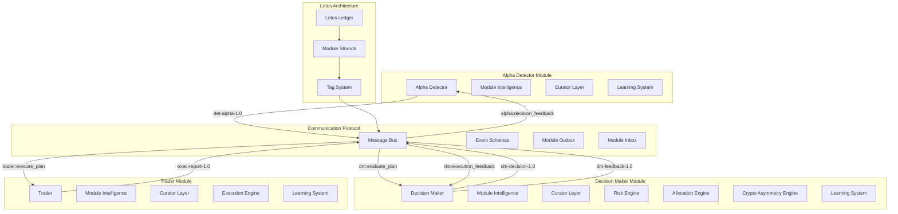

# Decision Maker Module - Integration Specification

*Complete integration specification for the Decision Maker Module within the Organic Intelligence Ecosystem*

## Executive Summary

This document provides the complete integration specification for the Decision Maker Module, detailing how it integrates with the Alpha Detector, Trader Module, and other system components through the Lotus architecture and communication protocols.

## 1. Module Integration Architecture

### 1.1 Integration Overview



### 1.2 Module Communication Flow

```python
class DecisionMakerIntegration:
    """Integration handler for Decision Maker Module"""
    
    def __init__(self, module_id: str, db_connection, message_bus):
        self.module_id = module_id
        self.db = db_connection
        self.message_bus = message_bus
        self.integration_handlers = {}
        
        # Initialize integration components
        self._initialize_alpha_detector_integration()
        self._initialize_trader_integration()
        self._initialize_learning_integration()
        self._initialize_lotus_integration()
    
    def _initialize_alpha_detector_integration(self):
        """Initialize integration with Alpha Detector Module"""
        self.integration_handlers['alpha_detector'] = {
            'incoming_events': ['det-alpha-1.0'],
            'outgoing_events': ['dm-feedback-1.0'],
            'handler': self._handle_alpha_detector_events
        }
    
    def _initialize_trader_integration(self):
        """Initialize integration with Trader Module"""
        self.integration_handlers['trader'] = {
            'incoming_events': ['exec-report-1.0'],
            'outgoing_events': ['dm-decision-1.0'],
            'handler': self._handle_trader_events
        }
    
    def _initialize_learning_integration(self):
        """Initialize integration with Learning Systems"""
        self.integration_handlers['learning'] = {
            'incoming_events': ['learning-update-1.0'],
            'outgoing_events': ['dm-learning-1.0'],
            'handler': self._handle_learning_events
        }
    
    def _initialize_lotus_integration(self):
        """Initialize integration with Lotus Architecture"""
        self.lotus_client = LotusClient(
            module_id=self.module_id,
            db_connection=self.db,
            strand_table='dm_strand'
        )
```

## 2. Alpha Detector Integration

### 2.1 Receiving Trading Plans

```python
class AlphaDetectorIntegration:
    """Integration with Alpha Detector Module"""
    
    def __init__(self, decision_maker):
        self.decision_maker = decision_maker
        self.plan_processor = TradingPlanProcessor()
        self.feedback_generator = FeedbackGenerator()
    
    def handle_trading_plan(self, alpha_event: Dict) -> Dict:
        """Handle trading plan from Alpha Detector"""
        
        # Extract trading plan from alpha event
        trading_plan = alpha_event.get('payload', {})
        signal_data = alpha_event.get('signal_data', {})
        
        # Validate trading plan structure
        validation_result = self._validate_trading_plan(trading_plan)
        if not validation_result['valid']:
            return self._create_validation_error_response(validation_result)
        
        # Process trading plan
        processed_plan = self.plan_processor.process_plan(trading_plan, signal_data)
        
        # Evaluate plan through decision maker
        decision_result = self.decision_maker.evaluate_trading_plan(
            processed_plan, 
            alpha_event.get('market_context', {})
        )
        
        # Generate feedback for alpha detector
        feedback = self.feedback_generator.generate_feedback(decision_result, signal_data)
        
        # Send feedback back to alpha detector
        self._send_feedback_to_alpha_detector(feedback)
        
        return decision_result
    
    def _validate_trading_plan(self, trading_plan: Dict) -> Dict:
        """Validate trading plan from Alpha Detector"""
        validation_result = {
            'valid': True,
            'issues': [],
            'warnings': []
        }
        
        # Check required fields
        required_fields = ['plan_id', 'symbol', 'direction', 'position_size', 'entry_conditions']
        for field in required_fields:
            if field not in trading_plan:
                validation_result['valid'] = False
                validation_result['issues'].append(f'Missing required field: {field}')
        
        # Check data types
        if 'position_size' in trading_plan:
            if not isinstance(trading_plan['position_size'], (int, float)):
                validation_result['valid'] = False
                validation_result['issues'].append('position_size must be numeric')
            elif trading_plan['position_size'] <= 0:
                validation_result['valid'] = False
                validation_result['issues'].append('position_size must be positive')
        
        # Check symbol format
        if 'symbol' in trading_plan:
            symbol = trading_plan['symbol']
            if not isinstance(symbol, str) or len(symbol) < 3:
                validation_result['valid'] = False
                validation_result['issues'].append('symbol must be a valid string')
        
        return validation_result
    
    def _send_feedback_to_alpha_detector(self, feedback: Dict):
        """Send feedback to Alpha Detector Module"""
        feedback_message = {
            'event_type': 'dm-feedback-1.0',
            'source_module': self.decision_maker.module_id,
            'target_modules': ['alpha_detector'],
            'payload': feedback,
            'timestamp': datetime.now(timezone.utc).timestamp()
        }
        
        self.decision_maker.message_bus.publish(feedback_message)
```

### 2.2 Feedback Generation

```python
class FeedbackGenerator:
    """Generate feedback for Alpha Detector Module"""
    
    def __init__(self):
        self.feedback_templates = self._initialize_feedback_templates()
    
    def generate_feedback(self, decision_result: Dict, signal_data: Dict) -> Dict:
        """Generate comprehensive feedback for Alpha Detector"""
        
        feedback = {
            'decision_id': decision_result['decision_id'],
            'plan_id': decision_result['plan_id'],
            'decision_type': decision_result['decision_type'],
            'decision_score': decision_result['decision_score'],
            'confidence': decision_result['confidence'],
            'feedback_type': self._determine_feedback_type(decision_result),
            'insights': self._generate_insights(decision_result, signal_data),
            'suggestions': self._generate_suggestions(decision_result),
            'learning_data': self._extract_learning_data(decision_result, signal_data),
            'created_at': datetime.now(timezone.utc).isoformat()
        }
        
        return feedback
    
    def _determine_feedback_type(self, decision_result: Dict) -> str:
        """Determine type of feedback based on decision"""
        decision_type = decision_result['decision_type']
        
        if decision_type == 'approve':
            return 'positive_reinforcement'
        elif decision_type == 'modify':
            return 'constructive_feedback'
        elif decision_type == 'reject':
            return 'learning_opportunity'
        else:
            return 'neutral_feedback'
    
    def _generate_insights(self, decision_result: Dict, signal_data: Dict) -> Dict:
        """Generate insights for Alpha Detector learning"""
        insights = {
            'risk_insights': self._extract_risk_insights(decision_result),
            'allocation_insights': self._extract_allocation_insights(decision_result),
            'crypto_insights': self._extract_crypto_insights(decision_result),
            'curator_insights': self._extract_curator_insights(decision_result),
            'signal_quality_insights': self._extract_signal_quality_insights(decision_result, signal_data)
        }
        
        return insights
    
    def _extract_risk_insights(self, decision_result: Dict) -> Dict:
        """Extract risk-related insights"""
        risk_assessment = decision_result.get('risk_assessment', {})
        
        return {
            'overall_risk_score': risk_assessment.get('overall_score', 0.5),
            'position_risk': risk_assessment.get('position_risk', {}),
            'portfolio_impact': risk_assessment.get('portfolio_impact_risk', {}),
            'correlation_risk': risk_assessment.get('correlation_risk', {}),
            'risk_approved': risk_assessment.get('risk_approved', False),
            'risk_insights': self._generate_risk_insights_text(risk_assessment)
        }
    
    def _extract_allocation_insights(self, decision_result: Dict) -> Dict:
        """Extract allocation-related insights"""
        allocation_evaluation = decision_result.get('allocation_evaluation', {})
        
        return {
            'overall_allocation_score': allocation_evaluation.get('overall_score', 0.5),
            'diversification_check': allocation_evaluation.get('diversification_check', {}),
            'concentration_check': allocation_evaluation.get('concentration_check', {}),
            'rebalancing_cost': allocation_evaluation.get('rebalancing_cost', 0),
            'allocation_approved': allocation_evaluation.get('allocation_approved', False),
            'allocation_insights': self._generate_allocation_insights_text(allocation_evaluation)
        }
    
    def _extract_crypto_insights(self, decision_result: Dict) -> Dict:
        """Extract crypto-specific insights"""
        asymmetry_analysis = decision_result.get('asymmetry_analysis', {})
        
        return {
            'asymmetries': asymmetry_analysis.get('asymmetries', {}),
            'scaling_factor': asymmetry_analysis.get('scaling_factor', 1.0),
            'asymmetry_detected': asymmetry_analysis.get('asymmetry_detected', False),
            'crypto_insights': self._generate_crypto_insights_text(asymmetry_analysis)
        }
    
    def _extract_curator_insights(self, decision_result: Dict) -> Dict:
        """Extract curator-related insights"""
        curator_decisions = decision_result.get('curator_decisions', {})
        
        return {
            'curator_scores': {name: eval_data['score'] for name, eval_data in curator_decisions.items()},
            'curator_contributions': {name: eval_data['contribution'] for name, eval_data in curator_decisions.items()},
            'hard_vetoes': curator_decisions.get('hard_vetoes', []),
            'curator_insights': self._generate_curator_insights_text(curator_decisions)
        }
    
    def _extract_signal_quality_insights(self, decision_result: Dict, signal_data: Dict) -> Dict:
        """Extract signal quality insights"""
        return {
            'signal_strength': signal_data.get('signal_strength', 0.5),
            'confidence_score': signal_data.get('confidence_score', 0.5),
            'microstructure_evidence': signal_data.get('microstructure_evidence', {}),
            'regime_context': signal_data.get('regime_context', {}),
            'signal_quality_insights': self._generate_signal_quality_insights_text(signal_data)
        }
```

## 3. Trader Module Integration

### 3.1 Sending Decisions

```python
class TraderIntegration:
    """Integration with Trader Module"""
    
    def __init__(self, decision_maker):
        self.decision_maker = decision_maker
        self.decision_formatter = DecisionFormatter()
        self.execution_monitor = ExecutionMonitor()
    
    def send_decision_to_trader(self, decision_result: Dict) -> Dict:
        """Send decision to Trader Module"""
        
        # Format decision for trader
        formatted_decision = self.decision_formatter.format_decision(decision_result)
        
        # Create decision message
        decision_message = {
            'event_type': 'dm-decision-1.0',
            'source_module': self.decision_maker.module_id,
            'target_modules': ['trader'],
            'payload': formatted_decision,
            'timestamp': datetime.now(timezone.utc).timestamp()
        }
        
        # Publish message
        self.decision_maker.message_bus.publish(decision_message)
        
        # Start monitoring execution
        if decision_result['decision_type'] in ['approve', 'modify']:
            self.execution_monitor.start_monitoring(decision_result['decision_id'])
        
        return decision_message
    
    def handle_execution_report(self, execution_event: Dict) -> Dict:
        """Handle execution report from Trader Module"""
        
        execution_data = execution_event.get('payload', {})
        decision_id = execution_data.get('decision_id')
        
        # Get original decision
        original_decision = self._get_decision_by_id(decision_id)
        
        # Update decision with execution results
        updated_decision = self._update_decision_with_execution(original_decision, execution_data)
        
        # Learn from execution outcome
        self._learn_from_execution(original_decision, execution_data)
        
        # Send feedback to alpha detector
        self._send_execution_feedback_to_alpha_detector(original_decision, execution_data)
        
        return updated_decision
    
    def _format_decision_for_trader(self, decision_result: Dict) -> Dict:
        """Format decision for Trader Module consumption"""
        
        formatted_decision = {
            'decision_id': decision_result['decision_id'],
            'plan_id': decision_result['plan_id'],
            'decision_type': decision_result['decision_type'],
            'decision_score': decision_result['decision_score'],
            'confidence': decision_result['confidence'],
            'trading_plan': decision_result.get('trading_plan'),
            'execution_instructions': self._generate_execution_instructions(decision_result),
            'risk_parameters': self._extract_risk_parameters(decision_result),
            'allocation_parameters': self._extract_allocation_parameters(decision_result),
            'crypto_parameters': self._extract_crypto_parameters(decision_result),
            'monitoring_requirements': self._generate_monitoring_requirements(decision_result),
            'created_at': decision_result['created_at'],
            'valid_until': decision_result['valid_until']
        }
        
        return formatted_decision
    
    def _generate_execution_instructions(self, decision_result: Dict) -> Dict:
        """Generate execution instructions for trader"""
        trading_plan = decision_result.get('trading_plan', {})
        
        instructions = {
            'symbol': trading_plan.get('symbol'),
            'direction': trading_plan.get('direction'),
            'position_size': trading_plan.get('position_size'),
            'entry_conditions': trading_plan.get('entry_conditions', {}),
            'exit_conditions': trading_plan.get('exit_conditions', {}),
            'stop_loss': trading_plan.get('stop_loss'),
            'take_profit': trading_plan.get('take_profit'),
            'time_horizon': trading_plan.get('time_horizon'),
            'execution_notes': trading_plan.get('execution_notes', ''),
            'priority': self._determine_execution_priority(decision_result),
            'venue_preferences': self._determine_venue_preferences(decision_result)
        }
        
        return instructions
    
    def _extract_risk_parameters(self, decision_result: Dict) -> Dict:
        """Extract risk parameters for trader"""
        risk_assessment = decision_result.get('risk_assessment', {})
        
        return {
            'max_slippage': risk_assessment.get('max_slippage', 0.01),
            'max_latency': risk_assessment.get('max_latency', 1000),
            'position_size_limit': risk_assessment.get('position_size_limit', 0.1),
            'correlation_limits': risk_assessment.get('correlation_limits', {}),
            'liquidity_requirements': risk_assessment.get('liquidity_requirements', {})
        }
    
    def _extract_allocation_parameters(self, decision_result: Dict) -> Dict:
        """Extract allocation parameters for trader"""
        allocation_evaluation = decision_result.get('allocation_evaluation', {})
        
        return {
            'target_weight': allocation_evaluation.get('target_weight', 0.0),
            'current_weight': allocation_evaluation.get('current_weight', 0.0),
            'rebalancing_threshold': allocation_evaluation.get('rebalancing_threshold', 0.05),
            'transaction_cost_limit': allocation_evaluation.get('transaction_cost_limit', 0.002)
        }
    
    def _extract_crypto_parameters(self, decision_result: Dict) -> Dict:
        """Extract crypto parameters for trader"""
        asymmetry_analysis = decision_result.get('asymmetry_analysis', {})
        
        return {
            'asymmetry_detected': asymmetry_analysis.get('asymmetry_detected', False),
            'scaling_factor': asymmetry_analysis.get('scaling_factor', 1.0),
            'asymmetry_scores': asymmetry_analysis.get('asymmetries', {}),
            'crypto_risk_factors': asymmetry_analysis.get('crypto_risk_factors', {})
        }
```

## 4. Learning Systems Integration

### 4.1 Learning Data Collection

```python
class LearningIntegration:
    """Integration with Learning Systems"""
    
    def __init__(self, decision_maker):
        self.decision_maker = decision_maker
        self.learning_data_collector = LearningDataCollector()
        self.pattern_analyzer = PatternAnalyzer()
        self.performance_tracker = PerformanceTracker()
    
    def collect_learning_data(self, decision_result: Dict, execution_outcome: Dict = None) -> Dict:
        """Collect learning data from decision and execution"""
        
        learning_data = {
            'decision_data': self._extract_decision_data(decision_result),
            'execution_data': self._extract_execution_data(execution_outcome) if execution_outcome else None,
            'performance_metrics': self._calculate_performance_metrics(decision_result, execution_outcome),
            'learning_insights': self._generate_learning_insights(decision_result, execution_outcome),
            'pattern_data': self._extract_pattern_data(decision_result, execution_outcome),
            'timestamp': datetime.now(timezone.utc).isoformat()
        }
        
        # Store learning data
        self._store_learning_data(learning_data)
        
        # Send to learning systems
        self._send_learning_data_to_systems(learning_data)
        
        return learning_data
    
    def _extract_decision_data(self, decision_result: Dict) -> Dict:
        """Extract decision-related data for learning"""
        return {
            'decision_id': decision_result['decision_id'],
            'plan_id': decision_result['plan_id'],
            'decision_type': decision_result['decision_type'],
            'decision_score': decision_result['decision_score'],
            'confidence': decision_result['confidence'],
            'risk_assessment': decision_result.get('risk_assessment', {}),
            'allocation_evaluation': decision_result.get('allocation_evaluation', {}),
            'asymmetry_analysis': decision_result.get('asymmetry_analysis', {}),
            'curator_decisions': decision_result.get('curator_decisions', {}),
            'trading_plan': decision_result.get('trading_plan', {})
        }
    
    def _extract_execution_data(self, execution_outcome: Dict) -> Dict:
        """Extract execution-related data for learning"""
        return {
            'execution_id': execution_outcome.get('execution_id'),
            'success': execution_outcome.get('success', False),
            'executed_price': execution_outcome.get('executed_price', 0),
            'executed_quantity': execution_outcome.get('executed_quantity', 0),
            'slippage': execution_outcome.get('slippage', 0),
            'latency_ms': execution_outcome.get('latency_ms', 0),
            'venue': execution_outcome.get('venue'),
            'pnl': execution_outcome.get('pnl', 0),
            'performance_metrics': execution_outcome.get('performance_metrics', {})
        }
    
    def _calculate_performance_metrics(self, decision_result: Dict, execution_outcome: Dict = None) -> Dict:
        """Calculate performance metrics for learning"""
        metrics = {
            'decision_accuracy': self._calculate_decision_accuracy(decision_result, execution_outcome),
            'risk_accuracy': self._calculate_risk_accuracy(decision_result, execution_outcome),
            'allocation_accuracy': self._calculate_allocation_accuracy(decision_result, execution_outcome),
            'curator_performance': self._calculate_curator_performance(decision_result, execution_outcome),
            'overall_performance': self._calculate_overall_performance(decision_result, execution_outcome)
        }
        
        return metrics
    
    def _generate_learning_insights(self, decision_result: Dict, execution_outcome: Dict = None) -> Dict:
        """Generate learning insights"""
        insights = {
            'what_worked': self._identify_what_worked(decision_result, execution_outcome),
            'what_didnt_work': self._identify_what_didnt_work(decision_result, execution_outcome),
            'improvement_opportunities': self._identify_improvement_opportunities(decision_result, execution_outcome),
            'pattern_insights': self._generate_pattern_insights(decision_result, execution_outcome),
            'recommendations': self._generate_recommendations(decision_result, execution_outcome)
        }
        
        return insights
```

## 5. Lotus Architecture Integration

### 5.1 Strand Management

```python
class LotusIntegration:
    """Integration with Lotus Architecture"""
    
    def __init__(self, decision_maker):
        self.decision_maker = decision_maker
        self.lotus_client = LotusClient(
            module_id=decision_maker.module_id,
            db_connection=decision_maker.db,
            strand_table='dm_strand'
        )
    
    def create_decision_strand(self, trading_plan: Dict, signal_data: Dict) -> str:
        """Create decision strand in Lotus architecture"""
        
        strand_id = f"dm_{uuid.uuid4().hex[:12]}"
        
        # Prepare strand data
        strand_data = {
            'id': strand_id,
            'module': 'dm',
            'kind': 'decision',
            'symbol': trading_plan.get('symbol'),
            'timeframe': trading_plan.get('timeframe', '1h'),
            'session_bucket': trading_plan.get('session_bucket', 'default'),
            'regime': trading_plan.get('regime', 'normal'),
            'alpha_bundle_ref': signal_data.get('signal_id'),
            'dm_alpha': {
                'signal_strength': signal_data.get('signal_strength', 0.5),
                'confidence_score': signal_data.get('confidence_score', 0.5),
                'microstructure_evidence': signal_data.get('microstructure_evidence', {}),
                'regime_context': signal_data.get('regime_context', {})
            },
            'created_at': datetime.now(timezone.utc)
        }
        
        # Create strand
        self.lotus_client.create_strand(strand_data)
        
        return strand_id
    
    def update_decision_strand(self, strand_id: str, decision_result: Dict) -> None:
        """Update decision strand with results"""
        
        update_data = {
            'dm_decision': decision_result,
            'risk_metrics': decision_result.get('risk_assessment', {}),
            'portfolio_impact': decision_result.get('portfolio_impact', {}),
            'asymmetries': decision_result.get('asymmetry_analysis', {}),
            'curator_decisions': decision_result.get('curator_decisions', {}),
            'updated_at': datetime.now(timezone.utc)
        }
        
        self.lotus_client.update_strand(strand_id, update_data)
    
    def tag_for_other_modules(self, strand_id: str, decision_result: Dict) -> None:
        """Tag decision for other modules"""
        
        # Determine tags based on decision type
        tags = ['dm:decision_complete']
        
        if decision_result['decision_type'] in ['approve', 'modify']:
            tags.extend(['trader:execute_plan', 'alpha:decision_feedback'])
        else:
            tags.extend(['alpha:decision_feedback'])
        
        # Add learning tags
        tags.extend(['learning:decision_data', 'learning:performance_data'])
        
        # Tag in lotus ledger
        self.lotus_client.tag_strand(strand_id, tags)
    
    def monitor_for_messages(self) -> List[Dict]:
        """Monitor for messages from other modules"""
        
        # Query lotus ledger for messages tagged for decision maker
        tagged_messages = self.lotus_client.query_tagged_messages(['dm:evaluate_plan', 'dm:execution_feedback'])
        
        return tagged_messages
```

## 6. Event Schema Definitions

### 6.1 Incoming Events

```python
# Schema for incoming events to Decision Maker Module
INCOMING_EVENT_SCHEMAS = {
    'det-alpha-1.0': {
        'event_type': 'det-alpha-1.0',
        'source_module': 'alpha_detector',
        'target_modules': ['decision_maker'],
        'payload': {
            'signal_id': 'str',
            'trading_plan': {
                'plan_id': 'str',
                'symbol': 'str',
                'direction': 'str',
                'position_size': 'float',
                'entry_conditions': 'dict',
                'exit_conditions': 'dict',
                'stop_loss': 'float',
                'take_profit': 'float',
                'risk_reward_ratio': 'float',
                'confidence_score': 'float',
                'time_horizon': 'str',
                'microstructure_evidence': 'dict',
                'regime_context': 'dict',
                'execution_notes': 'str',
                'valid_until': 'datetime'
            },
            'signal_data': {
                'signal_strength': 'float',
                'confidence_score': 'float',
                'microstructure_evidence': 'dict',
                'regime_context': 'dict'
            },
            'market_context': 'dict'
        }
    },
    'exec-report-1.0': {
        'event_type': 'exec-report-1.0',
        'source_module': 'trader',
        'target_modules': ['decision_maker'],
        'payload': {
            'execution_id': 'str',
            'decision_id': 'str',
            'plan_id': 'str',
            'success': 'bool',
            'executed_price': 'float',
            'executed_quantity': 'float',
            'slippage': 'float',
            'latency_ms': 'int',
            'venue': 'str',
            'pnl': 'float',
            'performance_metrics': 'dict'
        }
    }
}
```

### 6.2 Outgoing Events

```python
# Schema for outgoing events from Decision Maker Module
OUTGOING_EVENT_SCHEMAS = {
    'dm-decision-1.0': {
        'event_type': 'dm-decision-1.0',
        'source_module': 'decision_maker',
        'target_modules': ['trader'],
        'payload': {
            'decision_id': 'str',
            'plan_id': 'str',
            'decision_type': 'str',
            'decision_score': 'float',
            'confidence': 'float',
            'trading_plan': 'dict',
            'execution_instructions': 'dict',
            'risk_parameters': 'dict',
            'allocation_parameters': 'dict',
            'crypto_parameters': 'dict',
            'monitoring_requirements': 'dict',
            'created_at': 'datetime',
            'valid_until': 'datetime'
        }
    },
    'dm-feedback-1.0': {
        'event_type': 'dm-feedback-1.0',
        'source_module': 'decision_maker',
        'target_modules': ['alpha_detector'],
        'payload': {
            'decision_id': 'str',
            'plan_id': 'str',
            'decision_type': 'str',
            'decision_score': 'float',
            'confidence': 'float',
            'feedback_type': 'str',
            'insights': 'dict',
            'suggestions': 'list',
            'learning_data': 'dict',
            'created_at': 'datetime'
        }
    }
}
```

## 7. Testing and Validation

### 7.1 Integration Testing

```python
class DecisionMakerIntegrationTests:
    """Integration tests for Decision Maker Module"""
    
    def __init__(self):
        self.test_runner = IntegrationTestRunner()
        self.mock_alpha_detector = MockAlphaDetector()
        self.mock_trader = MockTrader()
        self.mock_learning_systems = MockLearningSystems()
    
    def test_alpha_detector_integration(self):
        """Test integration with Alpha Detector Module"""
        
        # Create test trading plan
        test_plan = self._create_test_trading_plan()
        
        # Send plan to decision maker
        decision_result = self.mock_alpha_detector.send_trading_plan(test_plan)
        
        # Verify decision was made
        assert decision_result is not None
        assert 'decision_id' in decision_result
        assert 'decision_type' in decision_result
        
        # Verify feedback was sent back
        feedback = self.mock_alpha_detector.get_latest_feedback()
        assert feedback is not None
        assert feedback['decision_id'] == decision_result['decision_id']
    
    def test_trader_integration(self):
        """Test integration with Trader Module"""
        
        # Create test decision
        test_decision = self._create_test_decision()
        
        # Send decision to trader
        execution_result = self.mock_trader.execute_decision(test_decision)
        
        # Verify execution was attempted
        assert execution_result is not None
        assert 'execution_id' in execution_result
        
        # Verify execution report was sent back
        execution_report = self.mock_trader.get_latest_execution_report()
        assert execution_report is not None
        assert execution_report['decision_id'] == test_decision['decision_id']
    
    def test_learning_integration(self):
        """Test integration with Learning Systems"""
        
        # Create test decision and execution
        test_decision = self._create_test_decision()
        test_execution = self._create_test_execution()
        
        # Send learning data
        learning_data = self.mock_learning_systems.collect_learning_data(test_decision, test_execution)
        
        # Verify learning data was collected
        assert learning_data is not None
        assert 'decision_data' in learning_data
        assert 'execution_data' in learning_data
        assert 'performance_metrics' in learning_data
    
    def test_lotus_integration(self):
        """Test integration with Lotus Architecture"""
        
        # Create test strand
        test_strand = self._create_test_strand()
        
        # Verify strand was created
        assert test_strand is not None
        assert 'strand_id' in test_strand
        
        # Verify tagging works
        tags = self.lotus_client.get_strand_tags(test_strand['strand_id'])
        assert 'dm:decision_complete' in tags
```

This provides the complete integration specification for the Decision Maker Module, showing how it integrates with all other system components through the Lotus architecture and communication protocols!
