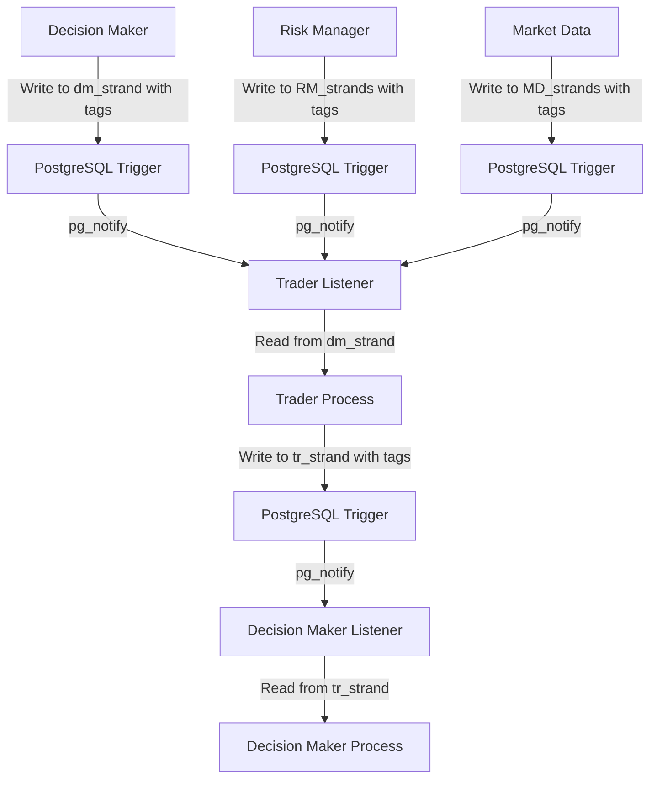

# Trader Module - Database Schema & Communication

*Complete database schema and direct table communication protocol for the Trader Module*

## Database Schema

### 1. Trader Module Strands (tr_strand)

```sql
-- Trader / Execution strands (following direct table communication)
CREATE TABLE tr_strand (
    id TEXT PRIMARY KEY,                    -- ULID
    lifecycle_id TEXT,                      -- Thread identifier
    parent_id TEXT,                         -- Linkage to parent strand
    module TEXT DEFAULT 'tr',               -- Module identifier
    kind TEXT,                              -- 'execution'|'fill'|'position'|'monitoring'|'braid'|'meta_braid'
    symbol TEXT,                            -- Trading symbol
    timeframe TEXT,                         -- '1m'|'5m'|'15m'|'1h'|'4h'|'1d'
    session_bucket TEXT,                    -- Session identifier
    regime TEXT,                            -- Market regime
    decision_id TEXT,                       -- Reference to dm_strand decision
    order_spec JSONB,                       -- Trading plan from Decision Maker
    route_hint TEXT,                        -- Execution route hint
    tr_predict JSONB,                       -- {fill_prob, slip_bps, latency_ms}
    fills JSONB,                            -- [{px,qty,ts,venue}, ...]
    exec_metrics JSONB,                     -- {slip_real_bps, latency_ms, fees}
    position_data JSONB,                    -- Current position state
    monitoring_state JSONB,                 -- Entry/exit condition monitoring
    lesson_metadata JSONB,                  -- Lesson feedback integration
    tags TEXT[],                            -- Communication tags
    created_at TIMESTAMPTZ DEFAULT now(),
    updated_at TIMESTAMPTZ DEFAULT now()
);

-- Indexes for fast queries
CREATE INDEX tr_strand_symbol_time ON tr_strand(symbol, created_at DESC);
CREATE INDEX tr_strand_lifecycle ON tr_strand(lifecycle_id);
CREATE INDEX tr_strand_decision ON tr_strand(decision_id);
CREATE INDEX tr_strand_venue ON tr_strand((exec_metrics->>'venue'));
CREATE INDEX tr_strand_kind ON tr_strand(kind);
CREATE INDEX tr_strand_status ON tr_strand((exec_metrics->>'status'));
CREATE INDEX tr_strand_lesson_metadata ON tr_strand USING GIN(lesson_metadata);
CREATE INDEX tr_strand_tags ON tr_strand USING GIN(tags);
```

### 2. Position Tracking

```sql
-- Real-time position tracking
CREATE TABLE tr_positions (
    id TEXT PRIMARY KEY,
    symbol TEXT NOT NULL,
    quantity DECIMAL(20,8) NOT NULL,
    avg_price DECIMAL(20,8) NOT NULL,
    unrealized_pnl DECIMAL(20,8) NOT NULL,
    realized_pnl DECIMAL(20,8) NOT NULL,
    created_at TIMESTAMPTZ DEFAULT now(),
    updated_at TIMESTAMPTZ DEFAULT now()
);

-- Execution performance tracking
CREATE TABLE tr_execution_performance (
    id TEXT PRIMARY KEY,
    execution_id TEXT NOT NULL,
    venue TEXT NOT NULL,
    symbol TEXT NOT NULL,
    execution_score DECIMAL(8,4) NOT NULL,
    slippage_bps DECIMAL(8,4) NOT NULL,
    latency_ms INTEGER NOT NULL,
    lesson_metadata JSONB,                  -- Lesson feedback integration
    created_at TIMESTAMPTZ DEFAULT now()
);
```

### 3. Curator Performance Tracking

```sql
-- Curator performance tracking
CREATE TABLE tr_curator_performance (
    id TEXT PRIMARY KEY,
    curator_type TEXT NOT NULL,             -- 'execution_curator'|'venue_curator'|'risk_curator'
    execution_id TEXT NOT NULL,
    contribution_score DECIMAL(8,4) NOT NULL,
    accuracy_score DECIMAL(8,4) NOT NULL,
    learning_metadata JSONB,                -- Lesson feedback integration
    created_at TIMESTAMPTZ DEFAULT now()
);

-- Curator weight tracking
CREATE TABLE tr_curator_weights (
    id TEXT PRIMARY KEY,
    curator_type TEXT NOT NULL,
    weight DECIMAL(8,4) NOT NULL,
    confidence DECIMAL(8,4) NOT NULL,
    lesson_adjustments JSONB,               -- Lesson-driven adjustments
    created_at TIMESTAMPTZ DEFAULT now(),
    updated_at TIMESTAMPTZ DEFAULT now()
);
```

## Direct Table Communication Protocol

### Communication Flow



### 1. Trader Communication Interface

```python
class TraderCommunicator:
    """Direct table communication for Trader"""
    
    def __init__(self, db_connection):
        self.db = db_connection
        self.module_name = 'tr'
        self.listener = ModuleListener('tr')
    
    def listen_for_decisions(self):
        """Listen for decisions from Decision Maker"""
        # Set up pg_notify listener for dm_strand
        self.listener.listen('dm_strand_notification', self._process_decision)
    
    def listen_for_risk_updates(self):
        """Listen for risk updates from Risk Manager"""
        # Set up pg_notify listener for RM_strands
        self.listener.listen('rm_strand_notification', self._process_risk_update)
    
    def listen_for_market_data(self):
        """Listen for market data updates"""
        # Set up pg_notify listener for MD_strands
        self.listener.listen('md_strand_notification', self._process_market_data)
    
    def send_execution_report_to_decision_maker(self, execution_data: Dict, tags: List[str]):
        """Send execution report to Decision Maker via tr_strand table"""
        
        # Write execution report to tr_strand table
        execution_strand = {
            'id': generate_ulid(),
            'lifecycle_id': execution_data.get('lifecycle_id'),
            'module': 'tr',
            'kind': 'execution',
            'symbol': execution_data.get('symbol'),
            'timeframe': execution_data.get('timeframe'),
            'decision_id': execution_data.get('decision_id'),
            'order_spec': execution_data.get('order_spec'),
            'fills': execution_data.get('fills'),
            'exec_metrics': execution_data.get('exec_metrics'),
            'lesson_metadata': execution_data.get('lesson_metadata', {}),
            'tags': tags  # ['dm:execution_report', 'priority:high']
        }
        
        # Insert into tr_strand table
        self.db.execute("""
            INSERT INTO tr_strand (
                id, lifecycle_id, module, kind, symbol, timeframe, decision_id,
                order_spec, fills, exec_metrics, lesson_metadata, tags
            ) VALUES (
                %(id)s, %(lifecycle_id)s, %(module)s, %(kind)s, %(symbol)s, %(timeframe)s, %(decision_id)s,
                %(order_spec)s, %(fills)s, %(exec_metrics)s, %(lesson_metadata)s, %(tags)s
            )
        """, execution_strand)
        
        # Trigger pg_notify for Decision Maker
        self.db.execute("""
            NOTIFY decision_maker_strand_notification, %s
        """, json.dumps({
            'strand_id': execution_strand['id'],
            'module': 'tr',
            'kind': 'execution',
            'tags': tags
        }))
    
    def _process_decision(self, notification_data):
        """Process decision from Decision Maker"""
        strand_id = notification_data['strand_id']
        
        # Read decision from dm_strand table
        decision = self.db.fetch_one("""
            SELECT * FROM dm_strand 
            WHERE id = %s AND tags @> %s
        """, strand_id, ['trader:execute'])
        
        if decision:
            # Process execution with lesson feedback
            execution_result = self._execute_decision_with_lessons(decision)
            
            if execution_result:
                # Send execution report to Decision Maker
                self.send_execution_report_to_decision_maker(execution_result, ['dm:execution_report'])
    
    def _execute_decision_with_lessons(self, decision: Dict) -> Optional[Dict]:
        """Execute decision with lesson-enhanced execution"""
        
        # 1. Prepare context for lesson application
        context = self._prepare_execution_context(decision)
        
        # 2. Apply lesson feedback to enhance context
        enhanced_context = self.lesson_feedback.apply_lessons_to_decisions(context)
        
        # 3. Apply lesson-enhanced curator evaluation
        curated_execution, approved, contributions = self.lesson_enhanced_curator.curate_signal_with_lessons(
            decision.get('signal_strength', 0.0), enhanced_context
        )
        
        # 4. Execute if approved
        if approved:
            execution_result = self._execute_order(decision, curated_execution, enhanced_context)
            
            # 5. Add lesson metadata to execution result
            execution_result['lesson_enhanced'] = True
            execution_result['lessons_applied'] = enhanced_context.get('lessons_applied', [])
            execution_result['confidence_boost'] = enhanced_context.get('confidence_boost', 1.0)
            
            return execution_result
            
        return None
```

### 2. PostgreSQL Triggers

```sql
-- Trigger for dm_strand notifications to Trader
CREATE OR REPLACE FUNCTION notify_trader_decisions()
RETURNS TRIGGER AS $$
BEGIN
    -- Check if tags contain trader:execute
    IF NEW.tags @> '["trader:execute"]'::jsonb THEN
        PERFORM pg_notify('trader_strand_notification', 
            json_build_object(
                'strand_id', NEW.id,
                'module', NEW.module,
                'kind', NEW.kind,
                'tags', NEW.tags
            )::text
        );
    END IF;
    RETURN NEW;
END;
$$ LANGUAGE plpgsql;

CREATE TRIGGER trader_decision_notify
    AFTER INSERT OR UPDATE ON dm_strand
    FOR EACH ROW
    EXECUTE FUNCTION notify_trader_decisions();

-- Trigger for tr_strand notifications
CREATE OR REPLACE FUNCTION notify_trader_strands()
RETURNS TRIGGER AS $$
BEGIN
    -- Check if tags contain dm:execution_report
    IF NEW.tags @> '["dm:execution_report"]'::jsonb THEN
        PERFORM pg_notify('decision_maker_strand_notification', 
            json_build_object(
                'strand_id', NEW.id,
                'module', NEW.module,
                'kind', NEW.kind,
                'tags', NEW.tags
            )::text
        );
    END IF;
    
    RETURN NEW;
END;
$$ LANGUAGE plpgsql;

CREATE TRIGGER trader_strand_notify
    AFTER INSERT OR UPDATE ON tr_strand
    FOR EACH ROW
    EXECUTE FUNCTION notify_trader_strands();
```

### 3. Tagging System

#### **Decision Maker → Trader**
- **Trader**: `['trader:execute']` - Send approved decisions for execution

#### **Trader → Decision Maker**
- **Decision Maker**: `['dm:execution_report']` - Send execution reports and feedback

#### **Pipeline Modules → Trader**
- **Risk Manager**: `['tr:risk_update']` - Send risk updates
- **Market Data**: `['tr:market_update']` - Send market data updates

### 4. Lesson Feedback Integration

```python
class LessonEnhancedTrader:
    """Trader with integrated lesson feedback"""
    
    def __init__(self, module_type: str):
        self.module_type = module_type
        self.lesson_feedback = LessonFeedbackSystem(module_type)
        self.base_trader = BaseTrader(module_type)
    
    def execute_decision(self, context: Dict) -> Dict:
        """Execute decision enhanced with learned lessons"""
        
        # 1. Apply lessons to enhance context
        enhanced_context = self.lesson_feedback.apply_lessons_to_decisions(context)
        
        # 2. Execute with enhanced context
        execution_result = self.base_trader.execute_decision(enhanced_context)
        
        # 3. Add lesson metadata to execution result
        execution_result['lesson_enhanced'] = True
        execution_result['lessons_applied'] = enhanced_context.get('lessons_applied', [])
        execution_result['confidence_boost'] = enhanced_context.get('confidence_boost', 1.0)
        
        return execution_result
```

## Integration Benefits

### **1. Simplified Architecture** ✅
- **No complex message bus** - Direct database communication
- **No lotus_ledger** - Module-specific tables only
- **PostgreSQL native** - Uses built-in triggers and notifications

### **2. Lesson Feedback Integration** ✅
- **Real-time lesson application** - Lessons enhance execution decisions immediately
- **Curator learning** - Lessons improve curator weights and thresholds
- **Performance tracking** - Outcomes create new learning strands

### **3. Scalable Communication** ✅
- **Module independence** - Each module owns its data
- **Clear tagging system** - Explicit communication patterns
- **Easy debugging** - All communication visible in database

### **4. Learning Integration** ✅
- **Strand-braid learning** - Hierarchical learning progression
- **LLM lesson generation** - Natural language insights
- **Cross-module learning** - Lessons can influence other modules

---

*This specification provides a complete direct table communication protocol for the Trader Module, ensuring perfect alignment with the enhanced design documents while maintaining the execution role of the Trader in the Trading Intelligence System.*