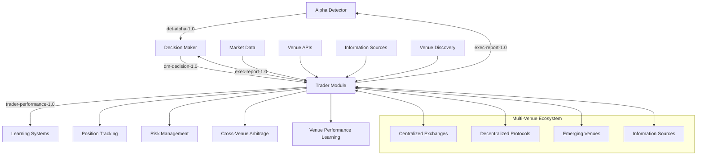

# Trader Module - Integration Specification

*Integration with Alpha Detector, Decision Maker, and communication protocols*

## Executive Summary

This document provides the integration specification for the Trader Module, detailing how it connects with the Alpha Detector, Decision Maker, and communication protocols using the mathematical foundations from the existing system. The integration operates across a multi-venue ecosystem, enabling the Trader Module to function as a self-contained "garden" that intelligently discovers, evaluates, and optimizes across centralized exchanges, decentralized protocols, and emerging venues.

## Integration Architecture

### 1. Module Communication Flow



### 2. Event Schema Integration

#### **Input Events (Consumed by Trader)**

```python
# Decision Maker Decision Event (dm-decision-1.0)
class DecisionMakerDecision:
    """Schema for decision maker decisions"""
    event_type: str = "dm-decision-1.0"
    schema_version: str = "1.0"
    
    # Core decision data
    decision_id: UUID
    signal_id: UUID
    decision_type: Literal["approve", "modify", "reject"]
    
    # Trading plan (if approved/modified)
    trading_plan: Optional[TradingPlan] = None
    
    # Decision metadata
    decision_reason: Optional[str] = None
    risk_assessment: Optional[RiskAssessment] = None
    budget_allocation: Optional[float] = None
    curator_decisions: Optional[Dict[str, CuratorDecision]] = None
    
    # Timestamps
    created_at: datetime
    valid_until: datetime

# Trading Plan Schema
class TradingPlan:
    """Complete trading plan from Alpha Detector"""
    # Core trading data
    signal_strength: float  # 0-1
    direction: Literal["long", "short", "neutral"]
    symbol: str
    position_size: float  # % of portfolio
    
    # Entry/exit conditions
    entry_conditions: Dict[str, Any]
    entry_price: Optional[float] = None
    stop_loss: Optional[float] = None
    take_profit: Optional[float] = None
    
    # Risk management
    risk_reward_ratio: Optional[float] = None
    confidence_score: float  # 0-1
    time_horizon: str  # "1m", "5m", "15m", "1h", "4h", "1d"
    
    # Intelligence validation
    microstructure_evidence: Optional[Dict[str, Any]] = None
    regime_context: Optional[Dict[str, Any]] = None
    module_intelligence: Optional[Dict[str, Any]] = None
    
    # Execution notes
    execution_notes: Optional[str] = None
    valid_until: datetime
```

#### **Output Events (Published by Trader)**

```python
# Execution Report Event (exec-report-1.0)
class ExecutionReport:
    """Schema for execution reports"""
    event_type: str = "exec-report-1.0"
    schema_version: str = "1.0"
    
    # Core execution data
    execution_id: UUID
    signal_id: UUID
    decision_id: UUID
    symbol: str
    
    # Execution results
    execution_status: Literal["filled", "partial", "rejected", "cancelled"]
    executed_quantity: float
    executed_price: float
    execution_cost: float
    
    # Performance metrics
    slippage: float
    latency_ms: int
    execution_score: float  # 0-1
    venue_performance: float  # 0-1
    
    # P&L data
    pnl: float
    unrealized_pnl: float
    realized_pnl: float
    
    # Execution metadata
    venue: str
    strategy_used: str
    execution_time: datetime
    fill_time: datetime
    
    # Performance attribution
    attribution_data: Optional[Dict[str, Any]] = None

# Trader Performance Event (trader-performance-1.0)
class TraderPerformance:
    """Schema for trader performance metrics"""
    event_type: str = "trader-performance-1.0"
    schema_version: str = "1.0"
    
    # Performance metrics
    total_pnl: float
    total_trades: int
    win_rate: float
    avg_pnl_per_trade: float
    
    # Execution quality
    avg_slippage: float
    avg_latency_ms: float
    avg_execution_score: float
    
    # Risk metrics
    volatility: float
    sharpe_ratio: float
    max_drawdown: float
    
    # Attribution data
    signal_attribution: Dict[str, Any]
    venue_attribution: Dict[str, Any]
    strategy_attribution: Dict[str, Any]
    
    # Timestamps
    measurement_period_start: datetime
    measurement_period_end: datetime
    created_at: datetime
```

## Integration Implementation

### 1. Multi-Venue Ecosystem Integration

```python
class VenueEcosystemIntegration:
    """Integration with multi-venue ecosystem"""
    
    def __init__(self, config):
        self.config = config
        self.venue_discovery = VenueDiscoveryEngine()
        self.information_sources = InformationSourcesIntelligence()
        self.venue_clients = {}
        self.venue_performance = {}
        self.arbitrage_detector = CrossVenueArbitrageIntelligence()
    
    def initialize_venue_ecosystem(self):
        """Initialize multi-venue ecosystem"""
        # Initialize CEX venues
        for cex_config in self.config.get('cex_venues', []):
            if cex_config['enabled']:
                client = self._create_cex_client(cex_config)
                self.venue_clients[cex_config['name']] = {
                    'client': client,
                    'type': 'cex',
                    'config': cex_config
                }
        
        # Initialize DEX venues
        for chain, dex_configs in self.config.get('dex_venues', {}).items():
            for dex_config in dex_configs.get('protocols', []):
                if dex_config['enabled']:
                    client = self._create_dex_client(dex_config, chain)
                    venue_key = f"{chain}_{dex_config['name']}"
                    self.venue_clients[venue_key] = {
                        'client': client,
                        'type': 'dex',
                        'chain': chain,
                        'config': dex_config
                    }
        
        # Initialize information sources
        self.information_sources.initialize_sources(
            self.config.get('information_sources', [])
        )
    
    def discover_emerging_venues(self, criteria):
        """Discover emerging venues based on criteria"""
        return self.venue_discovery.discover_emerging_venues(criteria)
    
    def gather_venue_information(self, symbol):
        """Gather comprehensive venue information for symbol"""
        return self.information_sources.gather_venue_information(
            'all', [symbol]
        )
    
    def detect_arbitrage_opportunities(self, symbol):
        """Detect cross-venue arbitrage opportunities"""
        venue_prices = {}
        
        # Get prices from all venues
        for venue_name, venue_data in self.venue_clients.items():
            try:
                price = venue_data['client'].get_price(symbol)
                venue_prices[venue_name] = price
            except Exception as e:
                logger.warning(f"Failed to get price from {venue_name}: {e}")
                continue
        
        # Detect arbitrage opportunities
        return self.arbitrage_detector.detect_arbitrage_opportunities(
            symbol, venue_prices
        )
    
    def execute_cross_venue_arbitrage(self, opportunity):
        """Execute cross-venue arbitrage opportunity"""
        return self.arbitrage_detector.execute_arbitrage(opportunity)
    
    def update_venue_performance(self, venue, execution_result):
        """Update venue performance based on execution result"""
        if venue not in self.venue_performance:
            self.venue_performance[venue] = {
                'total_trades': 0,
                'successful_trades': 0,
                'total_slippage': 0,
                'total_latency': 0,
                'total_pnl': 0
            }
        
        performance = self.venue_performance[venue]
        performance['total_trades'] += 1
        
        if execution_result['status'] == 'filled':
            performance['successful_trades'] += 1
        
        performance['total_slippage'] += execution_result.get('slippage', 0)
        performance['total_latency'] += execution_result.get('latency_ms', 0)
        performance['total_pnl'] += execution_result.get('pnl', 0)
        
        # Calculate performance metrics
        performance['success_rate'] = (
            performance['successful_trades'] / performance['total_trades']
        )
        performance['avg_slippage'] = (
            performance['total_slippage'] / performance['total_trades']
        )
        performance['avg_latency'] = (
            performance['total_latency'] / performance['total_trades']
        )
        performance['avg_pnl'] = (
            performance['total_pnl'] / performance['total_trades']
        )
    
    def get_venue_recommendations(self, symbol, order_size, side):
        """Get venue recommendations for specific order"""
        recommendations = []
        
        for venue_name, venue_data in self.venue_clients.items():
            try:
                # Calculate venue score
                score = self._calculate_venue_score(
                    venue_data, symbol, order_size, side
                )
                
                if score > 0.6:  # Minimum threshold
                    recommendations.append({
                        'venue': venue_name,
                        'venue_type': venue_data['type'],
                        'score': score,
                        'chain': venue_data.get('chain'),
                        'config': venue_data['config']
                    })
            except Exception as e:
                logger.warning(f"Failed to evaluate venue {venue_name}: {e}")
                continue
        
        # Sort by score
        recommendations.sort(key=lambda x: x['score'], reverse=True)
        
        return recommendations
    
    def _calculate_venue_score(self, venue_data, symbol, order_size, side):
        """Calculate venue score for specific order"""
        venue_type = venue_data['type']
        config = venue_data['config']
        
        # Base score from venue performance
        if venue_data['venue'] in self.venue_performance:
            performance = self.venue_performance[venue_data['venue']]
            base_score = performance.get('success_rate', 0.5)
        else:
            base_score = 0.5
        
        # Adjust for venue type
        if venue_type == 'cex':
            # CEX-specific adjustments
            liquidity_score = self._assess_cex_liquidity(venue_data, symbol, order_size, side)
            fee_score = 1.0 - config.get('fee_structure', {}).get('taker_fee', 0.001)
            latency_score = 1.0 - (config.get('latency_target_ms', 1000) / 5000)
            
            venue_score = (
                base_score * 0.4 +
                liquidity_score * 0.3 +
                fee_score * 0.2 +
                latency_score * 0.1
            )
        
        elif venue_type == 'dex':
            # DEX-specific adjustments
            liquidity_score = self._assess_dex_liquidity(venue_data, symbol, order_size, side)
            gas_efficiency = 1.0 - (config.get('gas_limit', 200000) / 1000000)
            chain_score = self._get_chain_score(venue_data.get('chain', 'unknown'))
            
            venue_score = (
                base_score * 0.4 +
                liquidity_score * 0.3 +
                gas_efficiency * 0.2 +
                chain_score * 0.1
            )
        
        else:
            venue_score = base_score
        
        return min(venue_score, 1.0)
```

### 2. Communication Adapter

```python
class TraderCommunicationAdapter:
    """Communication adapter for Trader Module"""
    
    def __init__(self, config):
        self.config = config
        self.event_bus = EventBus()
        self.message_queue = MessageQueue()
        self.schema_registry = SchemaRegistry()
        
        # Register event schemas
        self._register_event_schemas()
    
    def _register_event_schemas(self):
        """Register event schemas with schema registry"""
        # Register input schemas
        self.schema_registry.register_schema(
            "dm-decision-1.0", 
            DecisionMakerDecision.schema()
        )
        
        # Register output schemas
        self.schema_registry.register_schema(
            "exec-report-1.0", 
            ExecutionReport.schema()
        )
        self.schema_registry.register_schema(
            "trader-performance-1.0", 
            TraderPerformance.schema()
        )
    
    def consume_decision_events(self):
        """Consume decision events from Decision Maker"""
        while True:
            try:
                # Poll for decision events
                message = self.message_queue.poll("dm-decision-1.0")
                if message:
                    # Validate message schema
                    if self.schema_registry.validate_message(message):
                        # Process decision
                        self._process_decision(message)
                    else:
                        logger.warning(f"Invalid message schema: {message}")
                
                time.sleep(0.1)  # 100ms polling interval
                
            except Exception as e:
                logger.error(f"Error consuming decision events: {e}")
                time.sleep(1)
    
    def _process_decision(self, message):
        """Process decision from Decision Maker"""
        decision = DecisionMakerDecision(**message['payload'])
        
        if decision.decision_type == "approve":
            # Execute approved trading plan
            execution_result = self._execute_trading_plan(decision.trading_plan)
            self._publish_execution_report(execution_result)
            
        elif decision.decision_type == "modify":
            # Execute modified trading plan
            execution_result = self._execute_trading_plan(decision.trading_plan)
            self._publish_execution_report(execution_result)
            
        elif decision.decision_type == "reject":
            # Log rejection and publish rejection report
            self._log_decision_rejection(decision)
            self._publish_rejection_report(decision)
    
    def _execute_trading_plan(self, trading_plan):
        """Execute trading plan using Trader Module"""
        # This would call the main Trader Module execution logic
        # Implementation details in other build plan documents
        pass
    
    def _publish_execution_report(self, execution_result):
        """Publish execution report to event bus"""
        execution_report = ExecutionReport(
            execution_id=execution_result['execution_id'],
            signal_id=execution_result['signal_id'],
            decision_id=execution_result['decision_id'],
            symbol=execution_result['symbol'],
            execution_status=execution_result['status'],
            executed_quantity=execution_result['quantity'],
            executed_price=execution_result['price'],
            execution_cost=execution_result['cost'],
            slippage=execution_result['slippage'],
            latency_ms=execution_result['latency_ms'],
            execution_score=execution_result['execution_score'],
            venue_performance=execution_result['venue_performance'],
            pnl=execution_result['pnl'],
            unrealized_pnl=execution_result['unrealized_pnl'],
            realized_pnl=execution_result['realized_pnl'],
            venue=execution_result['venue'],
            strategy_used=execution_result['strategy'],
            execution_time=execution_result['execution_time'],
            fill_time=execution_result['fill_time'],
            attribution_data=execution_result.get('attribution_data')
        )
        
        # Publish to event bus
        self.event_bus.publish("exec-report-1.0", execution_report.dict())
    
    def _publish_rejection_report(self, decision):
        """Publish rejection report"""
        rejection_report = ExecutionReport(
            execution_id=uuid.uuid4(),
            signal_id=decision.signal_id,
            decision_id=decision.decision_id,
            symbol="",  # No symbol for rejected plans
            execution_status="rejected",
            executed_quantity=0,
            executed_price=0,
            execution_cost=0,
            slippage=0,
            latency_ms=0,
            execution_score=0,
            venue_performance=0,
            pnl=0,
            unrealized_pnl=0,
            realized_pnl=0,
            venue="",
            strategy_used="",
            execution_time=datetime.now(),
            fill_time=datetime.now()
        )
        
        # Publish to event bus
        self.event_bus.publish("exec-report-1.0", rejection_report.dict())
    
    def publish_performance_metrics(self, performance_data):
        """Publish performance metrics"""
        performance_report = TraderPerformance(
            total_pnl=performance_data['total_pnl'],
            total_trades=performance_data['total_trades'],
            win_rate=performance_data['win_rate'],
            avg_pnl_per_trade=performance_data['avg_pnl_per_trade'],
            avg_slippage=performance_data['avg_slippage'],
            avg_latency_ms=performance_data['avg_latency_ms'],
            avg_execution_score=performance_data['avg_execution_score'],
            volatility=performance_data['volatility'],
            sharpe_ratio=performance_data['sharpe_ratio'],
            max_drawdown=performance_data['max_drawdown'],
            signal_attribution=performance_data['signal_attribution'],
            venue_attribution=performance_data['venue_attribution'],
            strategy_attribution=performance_data['strategy_attribution'],
            measurement_period_start=performance_data['period_start'],
            measurement_period_end=performance_data['period_end'],
            created_at=datetime.now()
        )
        
        # Publish to event bus
        self.event_bus.publish("trader-performance-1.0", performance_report.dict())
```

### 2. Alpha Detector Integration

#### **Feedback Loop Implementation**

```python
class AlphaDetectorFeedback:
    """Feedback loop to Alpha Detector for learning"""
    
    def __init__(self, config):
        self.config = config
        self.feedback_queue = FeedbackQueue()
        self.learning_rate = config.get('learning_rate', 0.01)
    
    def process_execution_feedback(self, execution_result):
        """Process execution result for Alpha Detector feedback"""
        # Extract feedback data
        feedback_data = {
            'signal_id': execution_result['signal_id'],
            'execution_quality': execution_result['execution_score'],
            'slippage': execution_result['slippage'],
            'latency': execution_result['latency_ms'],
            'pnl': execution_result['pnl'],
            'venue_performance': execution_result['venue_performance'],
            'strategy_used': execution_result['strategy'],
            'execution_time': execution_result['execution_time']
        }
        
        # Calculate feedback score
        feedback_score = self._calculate_feedback_score(feedback_data)
        
        # Send feedback to Alpha Detector
        self._send_feedback_to_alpha_detector(feedback_data, feedback_score)
    
    def _calculate_feedback_score(self, feedback_data):
        """Calculate feedback score for Alpha Detector"""
        # Weighted combination of execution metrics
        weights = {
            'execution_quality': 0.3,
            'slippage': 0.2,
            'latency': 0.1,
            'pnl': 0.3,
            'venue_performance': 0.1
        }
        
        # Normalize metrics to 0-1 scale
        execution_quality = feedback_data['execution_quality']
        slippage_score = max(0, 1 - feedback_data['slippage'] / 0.01)  # 1% max slippage
        latency_score = max(0, 1 - feedback_data['latency'] / 1000)  # 1s max latency
        pnl_score = self._normalize_pnl(feedback_data['pnl'])
        venue_score = feedback_data['venue_performance']
        
        # Calculate weighted score
        feedback_score = (
            weights['execution_quality'] * execution_quality +
            weights['slippage'] * slippage_score +
            weights['latency'] * latency_score +
            weights['pnl'] * pnl_score +
            weights['venue_performance'] * venue_score
        )
        
        return feedback_score
    
    def _normalize_pnl(self, pnl):
        """Normalize P&L to 0-1 scale"""
        # Use sigmoid function to normalize P&L
        return 1 / (1 + np.exp(-pnl / 1000))  # Scale factor of 1000
    
    def _send_feedback_to_alpha_detector(self, feedback_data, feedback_score):
        """Send feedback to Alpha Detector"""
        feedback_message = {
            'event_type': 'trader-feedback-1.0',
            'source_module': 'trader',
            'target_modules': ['alpha_detector'],
            'payload': {
                'signal_id': feedback_data['signal_id'],
                'feedback_score': feedback_score,
                'execution_metrics': feedback_data,
                'timestamp': datetime.now()
            }
        }
        
        # Send to feedback queue
        self.feedback_queue.send(feedback_message)
```

### 3. Decision Maker Integration

#### **Decision Processing**

```python
class DecisionMakerIntegration:
    """Integration with Decision Maker module"""
    
    def __init__(self, config):
        self.config = config
        self.decision_processor = DecisionProcessor()
        self.risk_validator = RiskValidator()
    
    def process_decision(self, decision):
        """Process decision from Decision Maker"""
        if decision.decision_type == "approve":
            return self._process_approved_decision(decision)
        elif decision.decision_type == "modify":
            return self._process_modified_decision(decision)
        elif decision.decision_type == "reject":
            return self._process_rejected_decision(decision)
        else:
            raise ValueError(f"Unknown decision type: {decision.decision_type}")
    
    def _process_approved_decision(self, decision):
        """Process approved trading plan"""
        trading_plan = decision.trading_plan
        
        # Validate trading plan
        validation_result = self._validate_trading_plan(trading_plan)
        if not validation_result['valid']:
            return self._create_rejection_result(validation_result['reason'])
        
        # Execute trading plan
        execution_result = self._execute_trading_plan(trading_plan)
        
        return execution_result
    
    def _process_modified_decision(self, decision):
        """Process modified trading plan"""
        trading_plan = decision.trading_plan
        
        # Log modifications
        self._log_plan_modifications(decision)
        
        # Validate modified trading plan
        validation_result = self._validate_trading_plan(trading_plan)
        if not validation_result['valid']:
            return self._create_rejection_result(validation_result['reason'])
        
        # Execute modified trading plan
        execution_result = self._execute_trading_plan(trading_plan)
        
        return execution_result
    
    def _process_rejected_decision(self, decision):
        """Process rejected trading plan"""
        # Log rejection
        self._log_decision_rejection(decision)
        
        # Create rejection result
        rejection_result = {
            'status': 'rejected',
            'reason': decision.decision_reason,
            'signal_id': decision.signal_id,
            'decision_id': decision.decision_id,
            'timestamp': datetime.now()
        }
        
        return rejection_result
    
    def _validate_trading_plan(self, trading_plan):
        """Validate trading plan before execution"""
        validation_checks = {}
        
        # Check symbol validity
        validation_checks['symbol_valid'] = self._validate_symbol(trading_plan.symbol)
        
        # Check position size
        validation_checks['position_size_valid'] = self._validate_position_size(
            trading_plan.position_size
        )
        
        # Check risk parameters
        validation_checks['risk_valid'] = self._validate_risk_parameters(trading_plan)
        
        # Check execution constraints
        validation_checks['execution_valid'] = self._validate_execution_constraints(
            trading_plan
        )
        
        # Overall validation
        all_valid = all(validation_checks.values())
        
        return {
            'valid': all_valid,
            'checks': validation_checks,
            'reason': self._get_validation_reason(validation_checks) if not all_valid else None
        }
    
    def _validate_symbol(self, symbol):
        """Validate trading symbol"""
        # Check if symbol is supported
        supported_symbols = self.config.get('supported_symbols', [])
        return symbol in supported_symbols
    
    def _validate_position_size(self, position_size):
        """Validate position size"""
        min_size = self.config.get('min_position_size', 0.001)
        max_size = self.config.get('max_position_size', 0.1)  # 10% max
        
        return min_size <= position_size <= max_size
    
    def _validate_risk_parameters(self, trading_plan):
        """Validate risk parameters"""
        # Check stop loss
        if trading_plan.stop_loss:
            if trading_plan.direction == "long" and trading_plan.stop_loss >= trading_plan.entry_price:
                return False
            elif trading_plan.direction == "short" and trading_plan.stop_loss <= trading_plan.entry_price:
                return False
        
        # Check take profit
        if trading_plan.take_profit:
            if trading_plan.direction == "long" and trading_plan.take_profit <= trading_plan.entry_price:
                return False
            elif trading_plan.direction == "short" and trading_plan.take_profit >= trading_plan.entry_price:
                return False
        
        return True
    
    def _validate_execution_constraints(self, trading_plan):
        """Validate execution constraints"""
        # Check time horizon
        valid_horizons = ["1m", "5m", "15m", "1h", "4h", "1d"]
        return trading_plan.time_horizon in valid_horizons
```

## Configuration

### 1. Communication Configuration

```yaml
trader_communication:
  event_bus:
    type: "redis"
    host: "localhost"
    port: 6379
    db: 0
    
  message_queue:
    type: "rabbitmq"
    host: "localhost"
    port: 5672
    username: "trader"
    password: "password"
    vhost: "/trader"
    
  schema_registry:
    type: "confluent"
    url: "http://localhost:8081"
    auto_register: true
    
  polling:
    decision_events_interval_ms: 100
    performance_metrics_interval_s: 60
    feedback_interval_s: 30
```

### 2. Integration Configuration

```yaml
trader_integration:
  alpha_detector:
    feedback_enabled: true
    learning_rate: 0.01
    feedback_queue_size: 1000
    
  decision_maker:
    decision_timeout_s: 30
    validation_enabled: true
    risk_validation_enabled: true
    
  supported_symbols:
    - "BTCUSDT"
    - "ETHUSDT"
    - "ADAUSDT"
    - "SOLUSDT"
    
  execution_constraints:
    min_position_size: 0.001
    max_position_size: 0.1
    min_confidence_score: 0.6
    max_execution_time_s: 300
```

### 3. Event Schema Configuration

```yaml
event_schemas:
  input_events:
    dm-decision-1.0:
      schema_file: "schemas/dm_decision_v1.json"
      validation_enabled: true
      required_fields: ["decision_id", "signal_id", "decision_type"]
      
  output_events:
    exec-report-1.0:
      schema_file: "schemas/exec_report_v1.json"
      validation_enabled: true
      required_fields: ["execution_id", "signal_id", "execution_status"]
      
    trader-performance-1.0:
      schema_file: "schemas/trader_performance_v1.json"
      validation_enabled: true
      required_fields: ["total_pnl", "total_trades", "win_rate"]
```

## Testing Strategy

### 1. Integration Tests

```python
class TestTraderIntegration:
    """Integration tests for Trader Module"""
    
    def test_decision_processing(self):
        """Test decision processing from Decision Maker"""
        # Create mock decision
        decision = DecisionMakerDecision(
            decision_id=uuid.uuid4(),
            signal_id=uuid.uuid4(),
            decision_type="approve",
            trading_plan=TradingPlan(
                signal_strength=0.8,
                direction="long",
                symbol="BTCUSDT",
                position_size=0.05,
                confidence_score=0.9
            )
        )
        
        # Process decision
        result = self.trader_integration.process_decision(decision)
        
        # Assert execution result
        assert result['status'] == 'executed'
        assert result['symbol'] == 'BTCUSDT'
        assert result['quantity'] > 0
    
    def test_feedback_loop(self):
        """Test feedback loop to Alpha Detector"""
        # Create mock execution result
        execution_result = {
            'signal_id': uuid.uuid4(),
            'execution_score': 0.9,
            'slippage': 0.001,
            'latency_ms': 50,
            'pnl': 100.0
        }
        
        # Process feedback
        self.alpha_detector_feedback.process_execution_feedback(execution_result)
        
        # Assert feedback was sent
        assert len(self.feedback_queue.messages) > 0
        assert self.feedback_queue.messages[0]['event_type'] == 'trader-feedback-1.0'
    
    def test_event_schema_validation(self):
        """Test event schema validation"""
        # Test valid message
        valid_message = {
            'event_type': 'dm-decision-1.0',
            'payload': {
                'decision_id': str(uuid.uuid4()),
                'signal_id': str(uuid.uuid4()),
                'decision_type': 'approve'
            }
        }
        
        assert self.schema_registry.validate_message(valid_message)
        
        # Test invalid message
        invalid_message = {
            'event_type': 'dm-decision-1.0',
            'payload': {
                'decision_id': str(uuid.uuid4()),
                'signal_id': str(uuid.uuid4())
                # Missing required field 'decision_type'
            }
        }
        
        assert not self.schema_registry.validate_message(invalid_message)
```

### 2. Performance Tests

```python
class TestTraderPerformance:
    """Performance tests for Trader Module"""
    
    def test_decision_processing_latency(self):
        """Test decision processing latency"""
        start_time = time.time()
        
        # Process 100 decisions
        for i in range(100):
            decision = self.create_mock_decision()
            self.trader_integration.process_decision(decision)
        
        processing_time = time.time() - start_time
        avg_latency = processing_time / 100
        
        # Assert latency is within limits
        assert avg_latency < 0.1  # 100ms max per decision
    
    def test_event_throughput(self):
        """Test event processing throughput"""
        start_time = time.time()
        
        # Process 1000 events
        for i in range(1000):
            event = self.create_mock_event()
            self.trader_communication.process_event(event)
        
        processing_time = time.time() - start_time
        throughput = 1000 / processing_time
        
        # Assert throughput is within limits
        assert throughput > 100  # 100 events per second minimum
```

---

*This integration specification provides the complete integration framework for the Trader Module, ensuring seamless communication with the Alpha Detector and Decision Maker modules while maintaining the mathematical foundations and performance requirements.*
