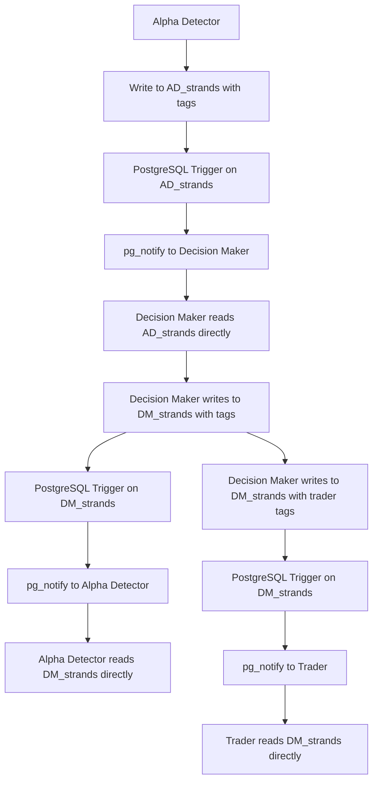

# Decision Maker Integration Specification

*Integration with Decision Maker Module via Direct Table Communication*

## Overview

This specification defines how the Trading Intelligence System (Alpha Detector) integrates with the Decision Maker Module using **direct table-to-table communication** with **tags** and **PostgreSQL triggers** for inter-module communication.

## Communication Architecture

### **Direct Table Communication System**
The Decision Maker Module uses **direct table writes** with **tags** for all inter-module communication:



### **Module Tables with Communication Tags**
Each module owns its data and communicates via tags:

#### **Alpha Detector Strands Table**
```sql
-- Alpha detector signal strands (our main output table)
CREATE TABLE AD_strands (
    id TEXT PRIMARY KEY,                     -- ULID
    lifecycle_id TEXT,                       -- Thread identifier
    parent_id TEXT,                          -- Linkage to parent strand
    module TEXT DEFAULT 'alpha',             -- Module identifier
    kind TEXT,                               -- 'signal'|'trading_plan'|'intelligence'
    symbol TEXT,                             -- Trading symbol
    timeframe TEXT,                          -- '1m'|'5m'|'15m'|'1h'|'4h'|'1d'
    session_bucket TEXT,                     -- Session identifier
    regime TEXT,                             -- Market regime
    
    -- Signal data
    sig_sigma FLOAT8,                        -- Signal strength (0-1)
    sig_confidence FLOAT8,                   -- Signal confidence (0-1)
    sig_direction TEXT,                      -- 'long'|'short'|'neutral'
    
    -- Trading plan data
    trading_plan JSONB,                      -- Complete trading plan
    signal_pack JSONB,                       -- Signal pack for LLM consumption
    
    -- Intelligence data
    dsi_evidence JSONB,                      -- DSI evidence
    regime_context JSONB,                    -- Regime context
    event_context JSONB,                     -- Event context
    
    -- Module intelligence
    module_intelligence JSONB,               -- Module-specific intelligence
    curator_feedback JSONB,                  -- Curator evaluation results
    
    -- Communication tags (REQUIRED)
    tags JSONB,                              -- Communication tags
    
    created_at TIMESTAMPTZ DEFAULT NOW(),
    updated_at TIMESTAMPTZ DEFAULT NOW()
);

-- Indexes for fast queries
CREATE INDEX idx_AD_strands_symbol_time ON AD_strands(symbol, created_at DESC);
CREATE INDEX idx_AD_strands_lifecycle ON AD_strands(lifecycle_id);
CREATE INDEX idx_AD_strands_kind ON AD_strands(kind);
CREATE INDEX idx_AD_strands_sigma ON AD_strands(sig_sigma);
CREATE INDEX idx_AD_strands_tags ON AD_strands USING GIN(tags);
```

#### **Decision Maker Strands Table**
```sql
-- Decision maker strands (Decision Maker's main table)
CREATE TABLE DM_strands (
    id TEXT PRIMARY KEY,                     -- ULID
    lifecycle_id TEXT,                       -- Thread identifier
    parent_id TEXT,                          -- Linkage to parent strand
    module TEXT DEFAULT 'dm',                -- Module identifier
    kind TEXT,                               -- 'decision'|'evaluation'|'feedback'
    symbol TEXT,                             -- Trading symbol
    timeframe TEXT,                          -- Timeframe
    session_bucket TEXT,                     -- Session identifier
    regime TEXT,                             -- Market regime
    
    -- Decision data
    dm_alpha JSONB,                          -- Alpha allocation
    dm_budget JSONB,                         -- Budget allocation
    dm_decision JSONB,                       -- Decision data
    risk_metrics JSONB,                      -- Risk assessment
    portfolio_impact JSONB,                  -- Portfolio impact
    asymmetries JSONB,                       -- Asymmetry analysis
    curator_decisions JSONB,                 -- Curator decisions
    
    -- Communication tags (REQUIRED)
    tags JSONB,                              -- Communication tags
    
    created_at TIMESTAMPTZ DEFAULT NOW(),
    updated_at TIMESTAMPTZ DEFAULT NOW()
);

-- Indexes for fast queries
CREATE INDEX idx_DM_strands_symbol_time ON DM_strands(symbol, created_at DESC);
CREATE INDEX idx_DM_strands_lifecycle ON DM_strands(lifecycle_id);
CREATE INDEX idx_DM_strands_kind ON DM_strands(kind);
CREATE INDEX idx_DM_strands_tags ON DM_strands USING GIN(tags);
```

## Communication Protocol

### **1. Sending Trading Plans to Decision Maker**

When our Alpha Detector generates a trading plan, we:

1. **Write to `AD_strands`** with complete trading plan data and tags
2. **PostgreSQL trigger** fires and notifies Decision Maker
3. **Decision Maker** reads `AD_strands` directly

```python
class AlphaDetectorCommunication:
    """Communication handler for Alpha Detector Module"""
    
    def __init__(self, db_connection):
        self.db = db_connection
        self.communicator = DirectTableCommunicator(db_connection, 'alpha')
    
    def publish_trading_plan(self, trading_plan, signal_pack, dsi_evidence, regime_context, event_context):
        """Publish trading plan to Decision Maker via direct table communication"""
        
        # Create signal strand with communication tags
        strand_data = {
            'id': f"AD_{uuid.uuid4().hex[:12]}",
            'module': 'alpha',
            'kind': 'trading_plan',
            'symbol': trading_plan['symbol'],
            'timeframe': trading_plan.get('timeframe', '1h'),
            'session_bucket': trading_plan.get('session_bucket', 'default'),
            'regime': trading_plan.get('regime', 'normal'),
            'sig_sigma': trading_plan['signal_strength'],
            'sig_confidence': trading_plan['confidence_score'],
            'sig_direction': trading_plan['direction'],
            'trading_plan': json.dumps(trading_plan),
            'signal_pack': json.dumps(signal_pack),
            'dsi_evidence': json.dumps(dsi_evidence),
            'regime_context': json.dumps(regime_context),
            'event_context': json.dumps(event_context),
            'created_at': datetime.now(timezone.utc)
        }
        
        # Write with tags to trigger Decision Maker
        strand_id = self.communicator.write_with_tags(
            'AD_strands', strand_data, ['dm:evaluate_plan']
        )
        
        return strand_id
```

### **2. Receiving Decision Feedback from Decision Maker**

When Decision Maker processes our trading plan, we:

1. **Receive notification** via PostgreSQL trigger
2. **Read `DM_strands`** directly to get decision data
3. **Update our learning** based on decision feedback

```python
class AlphaDetectorListener:
    """Listener for Alpha Detector Module"""
    
    def __init__(self, db_connection):
        self.db = db_connection
        self.communicator = DirectTableCommunicator(db_connection, 'alpha')
    
    def handle_decision_feedback(self, dm_strand_id):
        """Handle decision feedback from Decision Maker"""
        
        # Read decision data directly from DM_strands
        dm_data = self.communicator.read_from_other_module('dm', dm_strand_id)
        
        if dm_data:
            # Process decision feedback
            decision_data = json.loads(dm_data['dm_decision'])
            
            # Update learning based on decision
            self.update_learning_from_decision(decision_data)
            
            # Log decision feedback
            self.log_decision_feedback(dm_data)
    
    def update_learning_from_decision(self, decision_data):
        """Update learning based on decision feedback"""
        # Extract decision metrics
        decision_quality = decision_data.get('decision_quality', 0.5)
        risk_assessment = decision_data.get('risk_assessment', {})
        portfolio_impact = decision_data.get('portfolio_impact', {})
        
        # Update learning parameters
        self.update_curator_weights(decision_quality)
        self.update_signal_thresholds(risk_assessment)
        self.update_regime_analysis(portfolio_impact)
    
    def log_decision_feedback(self, dm_data):
        """Log decision feedback for analysis"""
        feedback_data = {
            'dm_strand_id': dm_data['id'],
            'decision_quality': json.loads(dm_data['dm_decision']).get('decision_quality'),
            'risk_metrics': json.loads(dm_data['risk_metrics']),
            'portfolio_impact': json.loads(dm_data['portfolio_impact']),
            'created_at': dm_data['created_at']
        }
        
        # Store feedback for learning
        self.store_feedback_data(feedback_data)
```

### **3. PostgreSQL Triggers for Communication**

#### **AD_strands Trigger**
```sql
-- Trigger on AD_strands table
CREATE OR REPLACE FUNCTION notify_from_ad_strands()
RETURNS TRIGGER AS $$
BEGIN
    IF NEW.tags @> '["dm:evaluate_plan"]' THEN
        PERFORM pg_notify('dm_evaluate_plan', NEW.id::text);
    END IF;
    
    IF NEW.tags @> '["trader:execute_plan"]' THEN
        PERFORM pg_notify('trader_execute_plan', NEW.id::text);
    END IF;
    
    RETURN NEW;
END;
$$ LANGUAGE plpgsql;

CREATE TRIGGER ad_strands_notify
    AFTER INSERT ON AD_strands
    FOR EACH ROW
    EXECUTE FUNCTION notify_from_ad_strands();
```

#### **DM_strands Trigger**
```sql
-- Trigger on DM_strands table
CREATE OR REPLACE FUNCTION notify_from_dm_strands()
RETURNS TRIGGER AS $$
BEGIN
    IF NEW.tags @> '["alpha:decision_feedback"]' THEN
        PERFORM pg_notify('alpha_decision_feedback', NEW.id::text);
    END IF;
    
    IF NEW.tags @> '["trader:execute_plan"]' THEN
        PERFORM pg_notify('trader_execute_plan', NEW.id::text);
    END IF;
    
    RETURN NEW;
END;
$$ LANGUAGE plpgsql;

CREATE TRIGGER dm_strands_notify
    AFTER INSERT ON DM_strands
    FOR EACH ROW
    EXECUTE FUNCTION notify_from_dm_strands();
```

## Communication Tags Reference

### **Alpha Detector → Decision Maker**
- `dm:evaluate_plan` - Send trading plan for evaluation
- `dm:risk_assessment` - Send risk assessment request
- `dm:portfolio_impact` - Send portfolio impact analysis

### **Decision Maker → Alpha Detector**
- `alpha:decision_feedback` - Send decision feedback
- `alpha:risk_feedback` - Send risk assessment feedback
- `alpha:portfolio_feedback` - Send portfolio impact feedback

### **Additional Tags**
- `priority:high` - High priority message
- `timeout:300` - Message timeout in seconds
- `original_strand:{strand_id}` - Reference to original strand
- `lifecycle:{lifecycle_id}` - Lifecycle thread identifier

## Integration Examples

### **Example 1: Complete Trading Plan Flow**
```python
# 1. Alpha Detector generates trading plan
trading_plan = {
    'symbol': 'BTCUSDT',
    'timeframe': '1h',
    'signal_strength': 0.85,
    'confidence_score': 0.92,
    'direction': 'long',
    'entry_price': 45000,
    'stop_loss': 44000,
    'take_profit': 47000
}

signal_pack = {
    'signal_type': 'breakout',
    'pattern_detected': 'ascending_triangle',
    'direction': 'long',
    'points_of_interest': ['support_at_44000', 'resistance_at_46000'],
    'confidence_score': 0.92
}

# 2. Publish to Decision Maker
strand_id = alpha_communication.publish_trading_plan(
    trading_plan, signal_pack, dsi_evidence, regime_context, event_context
)

# 3. Decision Maker processes and sends feedback
# (handled by Decision Maker module)

# 4. Alpha Detector receives feedback
alpha_listener.handle_decision_feedback(dm_strand_id)
```

### **Example 2: Risk Assessment Request**
```python
# 1. Alpha Detector requests risk assessment
risk_request = {
    'symbol': 'BTCUSDT',
    'position_size': 0.1,
    'current_portfolio': portfolio_data,
    'risk_tolerance': 0.05
}

strand_data = {
    'id': f"AD_{uuid.uuid4().hex[:12]}",
    'module': 'alpha',
    'kind': 'risk_request',
    'symbol': 'BTCUSDT',
    'risk_request': json.dumps(risk_request),
    'created_at': datetime.now(timezone.utc)
}

# 2. Send with risk assessment tag
strand_id = alpha_communication.write_with_tags(
    'AD_strands', strand_data, ['dm:risk_assessment']
)

# 3. Decision Maker processes risk request
# (handled by Decision Maker module)

# 4. Alpha Detector receives risk feedback
alpha_listener.handle_risk_feedback(dm_strand_id)
```

## Error Handling

### **Communication Errors**
```python
def handle_communication_error(self, error, strand_id):
    """Handle communication errors"""
    if "connection" in str(error).lower():
        # Retry connection
        self.reconnect()
    else:
        # Log error and mark strand as failed
        self.log_error(f"Communication failed for {strand_id}: {error}")
        
        # Update strand with error tag
        self.db.execute("""
            UPDATE AD_strands 
            SET tags = tags || %s, updated_at = NOW()
            WHERE id = %s
        """, (json.dumps(['error:communication_failed']), strand_id))
```

### **Decision Processing Errors**
```python
def handle_decision_error(self, error, dm_strand_id):
    """Handle decision processing errors"""
    # Log error
    self.log_error(f"Decision processing failed for {dm_strand_id}: {error}")
    
    # Update learning to avoid similar errors
    self.update_error_learning(error, dm_strand_id)
```

## Performance Optimization

### **Database Indexes**
```sql
-- Communication indexes
CREATE INDEX idx_AD_strands_tags ON AD_strands USING GIN(tags);
CREATE INDEX idx_DM_strands_tags ON DM_strands USING GIN(tags);

-- Query optimization indexes
CREATE INDEX idx_AD_strands_created_at ON AD_strands(created_at DESC);
CREATE INDEX idx_DM_strands_created_at ON DM_strands(created_at DESC);
```

### **Message Cleanup**
```python
def cleanup_old_messages(self, days=7):
    """Clean up old messages to prevent table bloat"""
    self.db.execute("""
        DELETE FROM AD_strands 
        WHERE created_at < NOW() - INTERVAL '%s days'
        AND kind IN ('trading_plan', 'risk_request')
    """, (days,))
```

## Monitoring and Debugging

### **Communication Monitoring**
```python
def monitor_communication(self):
    """Monitor communication health"""
    # Check recent message flow
    recent_messages = self.db.execute("""
        SELECT module, kind, COUNT(*) as count
        FROM AD_strands 
        WHERE created_at > NOW() - INTERVAL '1 hour'
        GROUP BY module, kind
    """).fetchall()
    
    # Check for failed communications
    failed_messages = self.db.execute("""
        SELECT id, tags, created_at
        FROM AD_strands 
        WHERE tags @> '["error:communication_failed"]'
        AND created_at > NOW() - INTERVAL '1 hour'
    """).fetchall()
    
    return {
        'recent_messages': recent_messages,
        'failed_messages': failed_messages
    }
```

### **Debug Communication Flow**
```python
def debug_communication_flow(self, strand_id):
    """Debug communication flow for a specific strand"""
    # Get original strand
    original_strand = self.communicator.read_by_id('AD_strands', strand_id)
    
    # Get related DM strands
    dm_strands = self.db.execute("""
        SELECT * FROM DM_strands 
        WHERE tags @> %s
        ORDER BY created_at DESC
    """, (json.dumps([f"original_strand:{strand_id}"]),)).fetchall()
    
    return {
        'original_strand': original_strand,
        'dm_strands': dm_strands,
        'communication_flow': self.trace_communication_flow(strand_id)
    }
```

---

*This specification provides complete integration details for Alpha Detector to Decision Maker communication using direct table-to-table communication.*