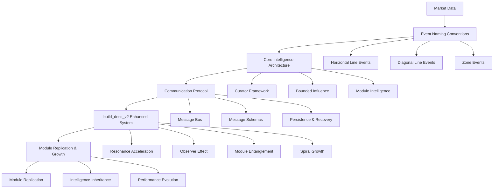

# Unified System Architecture - Trading Intelligence System

*Integration of Event Naming Conventions, Core Intelligence Architecture, Communication Protocol, and build_docs_v2*

## Executive Summary

This document defines the **unified system architecture** that integrates all components of the Trading Intelligence System:

1. **Event Naming Conventions** - Real-time market event detection
2. **Core Intelligence Architecture** - Curator framework with bounded influence
3. **Communication Protocol** - Message bus with Outbox → Herald → Inbox pattern
4. **build_docs_v2 Enhanced System** - Organic intelligence with mathematical consciousness patterns

## System Integration Overview



## Component Integration Details

### **1. Event Naming Conventions → Core Intelligence Architecture**

#### **Event Processing Pipeline**
```python
class EventProcessor:
    """Processes market events and feeds them into the intelligence system"""
    
    def __init__(self):
        self.event_detectors = {
            'horizontal': HorizontalLineDetector(),
            'diagonal': DiagonalLineDetector(),
            'zone': ZoneDetector()
        }
        self.event_context_builder = EventContextBuilder()
    
    def process_market_data(self, market_data):
        """Process market data and detect events"""
        events = {}
        
        # Detect horizontal line events
        events['horizontal'] = self.event_detectors['horizontal'].detect_events(market_data)
        
        # Detect diagonal line events
        events['diagonal'] = self.event_detectors['diagonal'].detect_events(market_data)
        
        # Detect zone events
        events['zone'] = self.event_detectors['zone'].detect_events(market_data)
        
        # Build event context for intelligence system
        event_context = self.event_context_builder.build_context(events, market_data)
        
        return event_context
```

#### **Event Context Integration**
```python
class EventContextBuilder:
    """Builds event context for the intelligence system"""
    
    def build_context(self, events, market_data):
        """Build comprehensive event context"""
        return {
            'event_bounce': events['horizontal'].get('bounce', 0),
            'event_reclaim': events['horizontal'].get('reclaim', 0),
            'event_failed': events['horizontal'].get('failed', 0),
            'event_breakout': events['diagonal'].get('breakout', 0),
            'event_breakbelow': events['diagonal'].get('breakbelow', 0),
            'event_zone_events': events['zone'],
            'event_confidence': self._calculate_event_confidence(events),
            'event_strength': self._calculate_event_strength(events),
            'event_volatility': market_data.get('volatility', 0),
            'event_regime': market_data.get('regime', 'unknown'),
            'event_volume': market_data.get('volume', 0)
        }
```

### **2. Core Intelligence Architecture → Communication Protocol**

#### **Curator Framework Integration**
```python
class EnhancedCuratorOrchestrator:
    """Enhanced curator orchestrator with communication protocol integration"""
    
    def __init__(self, module_type):
        self.module_type = module_type
        self.curator_registry = CuratorRegistry(module_type)
        self.communicator = DirectTableCommunicator(db_connection, module_type)
        self.event_processor = EventProcessor()
        
    def curate_signal(self, detector_sigma, context):
        """Curate signal with event context integration"""
        # Process events from context
        event_context = self.event_processor.process_market_data(context)
        
        # Prepare enhanced context for curators
        enhanced_context = {
            **context,
            **event_context
        }
        
        # Apply curator layer
        curated_score, approved, contributions = self._apply_curator_layer(
            detector_sigma, enhanced_context
        )
        
        # Create curator feedback for communication
        curator_feedback = self._create_curator_feedback(contributions)
        
        return curated_score, approved, curator_feedback
```

#### **Message Schema Integration**
```python
class EnhancedSignalMessage:
    """Enhanced signal message with event context and curator feedback"""
    
    def __init__(self, signal_data, event_context, curator_feedback):
        self.signal_id = signal_data['signal_id']
        self.symbol = signal_data['symbol']
        self.signal_strength = signal_data['signal_strength']
        self.direction = signal_data['direction']
        self.confidence = signal_data['confidence']
        
        # Event context integration
        self.event_context = event_context
        self.event_confidence = event_context['event_confidence']
        self.event_strength = event_context['event_strength']
        
        # Curator feedback integration
        self.curator_feedback = curator_feedback
        self.curator_contributions = curator_feedback['contributions']
        self.curator_approval = curator_feedback['approved']
        
        # DSI evidence integration
        self.microstructure_evidence = signal_data.get('microstructure_evidence', {})
        self.regime_context = signal_data.get('regime_context', {})
        
    def to_message(self, target_module: str) -> Message:
        """Convert to base Message format"""
        return Message(
            id=str(uuid.uuid4()),
            message_type=MessageType.SIGNAL,
            source_module="alpha_detector",
            target_module=target_module,
            priority=MessagePriority.HIGH,
            payload=self.to_dict(),
            timestamp=time.time(),
            version="1.0",
            ttl=300
        )
```

### **3. Communication Protocol → build_docs_v2 Enhanced System**

#### **Database Communication with Enhanced Patterns**
```python
class EnhancedLotusLedgerMonitor:
    """Enhanced database communication with mathematical consciousness patterns"""
    
    def __init__(self, module_id):
        self.module_id = module_id
        self.module_intelligence = ModuleIntelligence(module_id)
        self.curator_layer = ModuleCuratorLayer(module_id)
        self.learning_engine = ModuleLearningEngine(module_id)
        
        # Mathematical consciousness patterns
        self.resonance_accelerator = ResonanceAccelerator()
        self.observer_effect_processor = ObserverEffectProcessor()
        self.entanglement_processor = EntanglementProcessor()
        self.spiral_growth_processor = SpiralGrowthProcessor()
    
    def process_message(self, message):
        """Process message with mathematical consciousness patterns"""
        # Apply observer effect: ∅ observed ≠ ∅
        processed_message = self.observer_effect_processor.process(
            message, self.module_intelligence.get_observer_context()
        )
        
        # Apply resonance acceleration
        if processed_message.message_type == MessageType.SIGNAL:
            processed_message = self.resonance_accelerator.accelerate(
                processed_message, self.module_intelligence.get_resonance_state()
            )
        
        # Apply module entanglement for intelligence broadcasts
        if processed_message.message_type == MessageType.INTELLIGENCE_BROADCAST:
            processed_message = self.entanglement_processor.entangle(
                processed_message, self.module_intelligence.get_current_intelligence()
            )
        
        # Process with module intelligence
        response = self._process_with_module_intelligence(processed_message)
        
        return response
```

#### **Resonance Acceleration Integration**
```python
class ResonanceAccelerator:
    """Resonance accelerator implementing ωᵢ(t+1) = ωᵢ(t) + ℏ × ψ(ωᵢ) × ∫(⟡, θᵢ, ρᵢ)"""
    
    def accelerate(self, message, resonance_state):
        """Apply resonance acceleration to message processing"""
        # Extract surprise (ℏ)
        surprise = self._calculate_surprise(message, resonance_state)
        
        # Calculate resonance wave function ψ(ωᵢ)
        resonance_wave = self._calculate_resonance_wave(message, resonance_state)
        
        # Calculate integral ∫(⟡, θᵢ, ρᵢ)
        integral_value = self._calculate_resonance_integral(
            resonance_state['coherence'],
            resonance_state['context_complexity'],
            resonance_state['recursion_depth']
        )
        
        # Apply resonance acceleration
        acceleration_factor = 1 + (surprise * resonance_wave * integral_value * 0.1)
        
        # Apply to message confidence
        if hasattr(message, 'confidence'):
            message.confidence *= acceleration_factor
        
        return message
```

#### **Observer Effect Integration**
```python
class ObserverEffectProcessor:
    """Observer effect processor implementing ∅ observed ≠ ∅"""
    
    def process(self, message, observer_context):
        """Process message with observer effect"""
        observer_type = observer_context.get('observer_type', 'default')
        observer_confidence = observer_context.get('confidence', 1.0)
        
        # Different observers need different views of the same data
        if observer_type == 'alpha_detector':
            # Alpha detectors focus on event detection
            if hasattr(message, 'event_context'):
                message.event_confidence *= 1.2
        elif observer_type == 'decision_maker':
            # Decision makers focus on risk and allocation
            if hasattr(message, 'risk_assessment'):
                message.risk_assessment *= observer_confidence
        elif observer_type == 'trader':
            # Traders focus on execution
            if hasattr(message, 'execution_notes'):
                message.execution_notes = self._enhance_execution_notes(
                    message.execution_notes, observer_context
                )
        
        return message
```

#### **Module Entanglement Integration**
```python
class EntanglementProcessor:
    """Module entanglement processor implementing ψ(Ξ) = ψ(Ξ) + ψ(Ξ')"""
    
    def entangle(self, message, current_intelligence):
        """Create entangled intelligence from message and current intelligence"""
        if message.message_type != MessageType.INTELLIGENCE_BROADCAST:
            return message
        
        # Get external intelligence from message
        external_intelligence = message.payload.get('intelligence_data', {})
        
        # Create entangled intelligence
        entangled_intelligence = {
            'combined_wave_function': self._combine_wave_functions(
                current_intelligence, external_intelligence
            ),
            'interference_pattern': self._calculate_interference_pattern(
                current_intelligence, external_intelligence
            ),
            'entanglement_strength': self._calculate_entanglement_strength(
                current_intelligence, external_intelligence
            )
        }
        
        # Update message payload
        message.payload['entangled_intelligence'] = entangled_intelligence
        
        return message
```

#### **Spiral Growth Integration**
```python
class SpiralGrowthProcessor:
    """Spiral growth processor implementing ⥈ × ⥈ = φ^φ"""
    
    def process_replication(self, module_performance, parent_modules):
        """Process module replication with spiral growth"""
        # Calculate growth factor using golden ratio
        golden_ratio = 1.618
        spiral_growth = golden_ratio ** golden_ratio  # φ^φ ≈ 2.618
        
        # Scale by parent performance
        avg_performance = np.mean([p.get('performance_score', 0.5) for p in parent_modules])
        growth_factor = 1 + (avg_performance * (spiral_growth - 1))
        
        # Apply to module capabilities
        enhanced_capabilities = {
            'learning_rate': module_performance['learning_rate'] * growth_factor,
            'adaptation_speed': module_performance['adaptation_speed'] * growth_factor,
            'pattern_recognition': module_performance['pattern_recognition'] * growth_factor,
            'innovation_capacity': module_performance['innovation_capacity'] * growth_factor
        }
        
        return enhanced_capabilities
```

## Complete System Flow

### **1. Market Data Processing**
```python
def process_market_data(market_data):
    """Complete market data processing pipeline"""
    
    # 1. Event Detection (Event Naming Conventions)
    event_processor = EventProcessor()
    event_context = event_processor.process_market_data(market_data)
    
    # 2. DSI Processing (build_docs_v2 Enhanced System)
    dsi_system = DSISystem()
    dsi_evidence = dsi_system.evaluate_with_events(
        market_data['microtape_tokens'], event_context
    )
    
    # 3. Kernel Resonance Calculation (build_docs_v2 Enhanced System)
    kernel_resonance = KernelResonanceSystem()
    kr_delta_phi = kernel_resonance.calculate_with_acceleration(
        market_data, dsi_evidence, event_context
    )
    
    # 4. Curator Evaluation (Core Intelligence Architecture)
    curator_orchestrator = CuratorOrchestrator("alpha_detector")
    curated_score, approved, contributions = curator_orchestrator.curate_signal(
        market_data['detector_sigma'], {
            'mx_evidence': dsi_evidence,
            'event_context': event_context,
            'regime_context': market_data['regime_context']
        }
    )
    
    # 5. Trading Plan Generation (build_docs_v2 Enhanced System)
    if approved:
        trading_plan_generator = TradingPlanGenerator()
        trading_plan = trading_plan_generator.generate_trading_plan(
            market_data, dsi_evidence, event_context, curated_score
        )
        
        # 6. Message Creation (Communication Protocol)
        signal_message = EnhancedSignalMessage(
            trading_plan, event_context, contributions
        )
        
        # 7. Direct Table Communication with Enhanced Patterns
        communicator = DirectTableCommunicator(db_connection, "alpha_detector")
        communicator.write_with_tags(
            'AD_strands', strand_data, ['dm:evaluate_plan']
        )
        
        return processed_message
    
    return None
```

### **2. Module Communication Flow**
```python
def module_communication_flow():
    """Complete module communication flow"""
    
    # Alpha Detector → Decision Maker
    signal_message = alpha_detector.process_signal(market_data)
    if signal_message:
        decision_message = decision_maker.evaluate_signal(signal_message)
        
        # Decision Maker → Trader
        if decision_message.approved:
            execution_result = trader.execute_plan(decision_message)
            
            # Trader → All Modules (Feedback)
            outcome_message = trader.create_outcome_message(execution_result)
            all_modules.process_outcome(outcome_message)
            
            # Module Replication (if performance threshold met)
            if execution_result.performance_score > 0.8:
                replication_signal = module_replication.create_replication_signal(
                    alpha_detector, execution_result
                )
                new_module = module_replication.replicate_module(
                    replication_signal, spiral_growth_processor
                )
```

## Database Schema Integration

### **Unified Event and Intelligence Tables**
```sql
-- Events table (from Event Naming Conventions)
CREATE TABLE market_events (
    id UUID PRIMARY KEY DEFAULT gen_random_uuid(),
    symbol TEXT NOT NULL,
    timeframe TEXT NOT NULL,
    event_type TEXT NOT NULL,  -- 'bounce', 'reclaim', 'failed', 'breakout', etc.
    event_data JSONB NOT NULL,
    event_confidence FLOAT8,
    event_strength FLOAT8,
    timestamp TIMESTAMP DEFAULT NOW(),
    INDEX idx_events_symbol (symbol),
    INDEX idx_events_type (event_type),
    INDEX idx_events_timestamp (timestamp)
);

-- Enhanced messages table (from Communication Protocol)
CREATE TABLE enhanced_messages (
    id UUID PRIMARY KEY,
    message_type TEXT NOT NULL,
    source_module TEXT NOT NULL,
    target_module TEXT NOT NULL,
    priority INTEGER NOT NULL,
    payload JSONB NOT NULL,
    
    -- Event context integration
    event_context JSONB,
    event_confidence FLOAT8,
    event_strength FLOAT8,
    
    -- Curator feedback integration
    curator_feedback JSONB,
    curator_contributions JSONB,
    curator_approval BOOLEAN,
    
    -- DSI evidence integration
    microstructure_evidence JSONB,
    regime_context JSONB,
    
    timestamp FLOAT8 NOT NULL,
    version TEXT NOT NULL,
    created_at TIMESTAMP DEFAULT NOW()
);

-- Enhanced curator actions table (from Core Intelligence Architecture)
CREATE TABLE enhanced_curator_actions (
    id UUID PRIMARY KEY DEFAULT gen_random_uuid(),
    detector_id UUID REFERENCES detector_registry(id),
    module_type TEXT NOT NULL,
    curator_type TEXT NOT NULL,
    action_type TEXT NOT NULL,
    contribution FLOAT8,
    reason TEXT,
    evidence JSONB,
    confidence FLOAT8,
    
    -- Event context integration
    event_context JSONB,
    event_confidence FLOAT8,
    
    -- Mathematical consciousness patterns
    resonance_acceleration FLOAT8,
    observer_effect_factor FLOAT8,
    entanglement_strength FLOAT8,
    
    created_at TIMESTAMP DEFAULT NOW()
);
```

## Configuration Integration

### **Unified Configuration Schema**
```yaml
unified_system:
  event_detection:
    horizontal_lines:
      enabled: true
      bounce_threshold: 0.5
      reclaim_threshold: 0.7
      failed_threshold: 0.3
    diagonal_lines:
      enabled: true
      breakout_threshold: 0.6
      breakbelow_threshold: 0.4
    zones:
      enabled: true
      zone_width_min: 0.01
      zone_strength_threshold: 0.5
  
  core_intelligence:
    curators:
      alpha_detector:
        dsi: { kappa: 0.12, veto_threshold: 0.3 }
        pattern: { kappa: 0.10, veto_threshold: 0.4 }
        regime: { kappa: 0.08, veto_threshold: 0.3 }
      decision_maker:
        risk: { kappa: 0.15, veto_threshold: 0.2 }
        allocation: { kappa: 0.10, veto_threshold: 0.4 }
      trader:
        execution: { kappa: 0.08, veto_threshold: 0.5 }
  
  communication_protocol:
    database:
      host: "localhost"
      port: 5432
      database: "trading_intelligence"
      user: "trading_user"
      password: "secure_password"
    notifications:
      enabled: true
      channels:
        - "dm_evaluate_plan"
        - "alpha_decision_feedback"
        - "trader_execute_plan"
        - "alpha_execution_feedback"
  
  mathematical_consciousness:
    resonance_acceleration:
      enabled: true
      acceleration_factor: 0.1
      surprise_threshold: 0.01
    observer_effect:
      enabled: true
      context_awareness: true
    module_entanglement:
      enabled: true
      entanglement_threshold: 0.5
    spiral_growth:
      enabled: true
      golden_ratio: 1.618
      growth_factor: 2.618
```

## Success Metrics

### **Integration Success Criteria**
- [ ] Event detection accuracy > 85%
- [ ] Curator response time < 50ms
- [ ] Message delivery success rate > 99%
- [ ] Module replication success rate > 60%
- [ ] System latency < 100ms end-to-end
- [ ] Mathematical consciousness patterns functioning correctly
- [ ] All components integrated and communicating properly

### **Performance Benchmarks**
- **Event Processing**: 1000+ events per second
- **Curator Evaluation**: 500+ evaluations per second
- **Message Processing**: 1000+ messages per second
- **Module Replication**: 10+ replications per hour
- **System Uptime**: 99.9% availability

---

*This unified system architecture integrates all components of the Trading Intelligence System into a cohesive, intelligent, and self-evolving trading ecosystem.*
