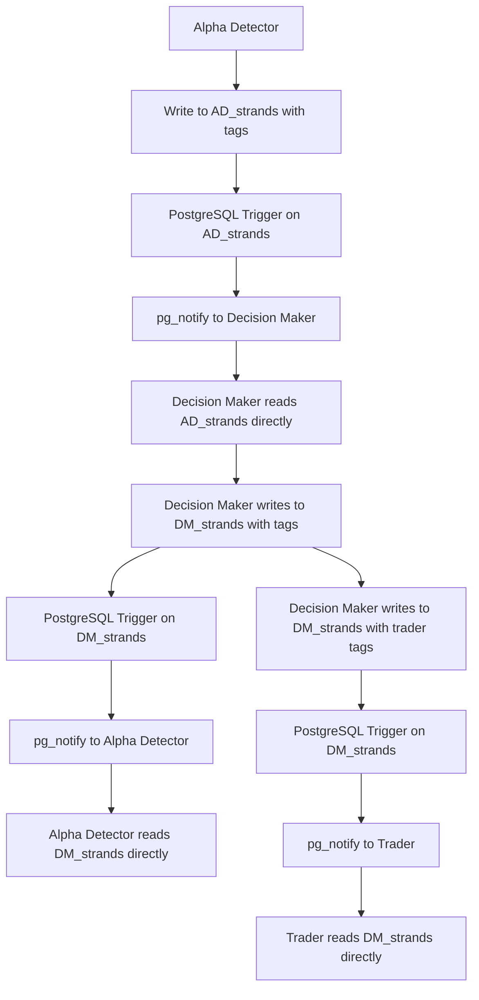

# Module Communication Specification

*Direct table-to-table communication using PostgreSQL triggers and tags*

## Overview

This specification defines the communication protocol between modules in the Trading Intelligence System. Communication is achieved through **direct table writes** with **tags** and **PostgreSQL triggers** - no central tables needed.

## Communication Architecture

### **Core Principle: Direct Table Communication**
- **No central tables** - Each module owns its data
- **No lotus_ledger** - Direct table-to-table communication
- **Tags trigger notifications** - PostgreSQL triggers on source tables
- **Simple and reliable** - Database ACID properties

### **Communication Flow**


## Database Communication Protocol

### **1. Module Tables with Tags**
```sql
-- Alpha Detector strands table
CREATE TABLE AD_strands (
    id TEXT PRIMARY KEY,
    module TEXT DEFAULT 'alpha',
    kind TEXT,
    symbol TEXT,
    timeframe TEXT,
    session_bucket TEXT,
    regime TEXT,
    sig_sigma FLOAT8,
    sig_confidence FLOAT8,
    sig_direction TEXT,
    trading_plan JSONB,
    signal_pack JSONB,
    dsi_evidence JSONB,
    regime_context JSONB,
    event_context JSONB,
    module_intelligence JSONB,
    curator_feedback JSONB,
    tags JSONB,                    -- Communication tags
    created_at TIMESTAMPTZ DEFAULT NOW(),
    updated_at TIMESTAMPTZ DEFAULT NOW()
);

-- Decision Maker strands table
CREATE TABLE DM_strands (
    id TEXT PRIMARY KEY,
    module TEXT DEFAULT 'dm',
    kind TEXT,
    symbol TEXT,
    timeframe TEXT,
    session_bucket TEXT,
    regime TEXT,
    dm_alpha JSONB,
    dm_budget JSONB,
    dm_decision JSONB,
    risk_metrics JSONB,
    portfolio_impact JSONB,
    asymmetries JSONB,
    curator_decisions JSONB,
    tags JSONB,                    -- Communication tags
    created_at TIMESTAMPTZ DEFAULT NOW(),
    updated_at TIMESTAMPTZ DEFAULT NOW()
);

-- Trader strands table
CREATE TABLE TR_strands (
    id TEXT PRIMARY KEY,
    module TEXT DEFAULT 'trader',
    kind TEXT,
    symbol TEXT,
    timeframe TEXT,
    session_bucket TEXT,
    regime TEXT,
    tr_execution JSONB,
    tr_outcome JSONB,
    tr_venue_performance JSONB,
    tr_slippage JSONB,
    tr_latency JSONB,
    tr_fills JSONB,
    tags JSONB,                    -- Communication tags
    created_at TIMESTAMPTZ DEFAULT NOW(),
    updated_at TIMESTAMPTZ DEFAULT NOW()
);
```

### **2. PostgreSQL Triggers on Each Table**
```sql
-- Trigger on AD_strands table
CREATE OR REPLACE FUNCTION notify_from_ad_strands()
RETURNS TRIGGER AS $$
BEGIN
    -- Alpha Detector ONLY tags Decision Maker
    IF NEW.tags @> '["dm:evaluate_plan"]' THEN
        PERFORM pg_notify('dm_evaluate_plan', NEW.id::text);
    END IF;
    
    -- Alpha Detector does NOT tag Trader directly
    -- Decision Maker handles all execution communication
    
    RETURN NEW;
END;
$$ LANGUAGE plpgsql;

CREATE TRIGGER ad_strands_notify
    AFTER INSERT ON AD_strands
    FOR EACH ROW
    EXECUTE FUNCTION notify_from_ad_strands();

-- Trigger on DM_strands table
CREATE OR REPLACE FUNCTION notify_from_dm_strands()
RETURNS TRIGGER AS $$
BEGIN
    IF NEW.tags @> '["alpha:decision_feedback"]' THEN
        PERFORM pg_notify('alpha_decision_feedback', NEW.id::text);
    END IF;
    
    IF NEW.tags @> '["trader:execute_plan"]' THEN
        PERFORM pg_notify('trader_execute_plan', NEW.id::text);
    END IF;
    
    RETURN NEW;
END;
$$ LANGUAGE plpgsql;

CREATE TRIGGER dm_strands_notify
    AFTER INSERT ON DM_strands
    FOR EACH ROW
    EXECUTE FUNCTION notify_from_dm_strands();

-- Trigger on TR_strands table
CREATE OR REPLACE FUNCTION notify_from_tr_strands()
RETURNS TRIGGER AS $$
BEGIN
    IF NEW.tags @> '["alpha:execution_feedback"]' THEN
        PERFORM pg_notify('alpha_execution_feedback', NEW.id::text);
    END IF;
    
    IF NEW.tags @> '["dm:execution_feedback"]' THEN
        PERFORM pg_notify('dm_execution_feedback', NEW.id::text);
    END IF;
    
    RETURN NEW;
END;
$$ LANGUAGE plpgsql;

CREATE TRIGGER tr_strands_notify
    AFTER INSERT ON TR_strands
    FOR EACH ROW
    EXECUTE FUNCTION notify_from_tr_strands();
```

## Module Communication Classes

### **1. Direct Table Communicator**
```python
class DirectTableCommunicator:
    """Direct table-to-table communication"""
    
    def __init__(self, db_connection, module_type):
        self.db = db_connection
        self.module_type = module_type
        self.table_mapping = {
            'alpha': 'AD_strands',
            'dm': 'DM_strands',
            'trader': 'TR_strands'
        }
    
    def write_with_tags(self, table_name, data, tags):
        """Write data to table with communication tags"""
        # Add tags to data
        data['tags'] = json.dumps(tags)
        
        # Build INSERT query dynamically
        columns = list(data.keys())
        values = list(data.values())
        placeholders = ', '.join(['%s'] * len(values))
        
        query = f"""
            INSERT INTO {table_name} ({', '.join(columns)})
            VALUES ({placeholders})
        """
        
        self.db.execute(query, values)
        return data.get('id')
    
    def read_by_id(self, table_name, record_id):
        """Read data from table by ID"""
        return self.db.execute(f"""
            SELECT * FROM {table_name} WHERE id = %s
        """, (record_id,)).fetchone()
    
    def read_recent_by_tags(self, table_name, tags, limit=10):
        """Read recent records by tags"""
        return self.db.execute(f"""
            SELECT * FROM {table_name} 
            WHERE tags @> %s 
            ORDER BY created_at DESC 
            LIMIT %s
        """, (json.dumps(tags), limit)).fetchall()
```

### **2. Module Listener**
```python
class ModuleListener:
    """Listen for database notifications from other modules"""
    
    def __init__(self, db_connection, module_type):
        self.db = db_connection
        self.module_type = module_type
        self.communicator = DirectTableCommunicator(db_connection, module_type)
        
        # Define what this module listens for
        self.listeners = {
            'alpha': ['alpha:decision_feedback', 'alpha:execution_feedback']
            # Alpha Detector does NOT listen for dm:evaluate_plan (that's for Decision Maker)
            # Alpha Detector does NOT listen for trader:execute_plan (that's for Trader)
        }
    
    def start_listening(self):
        """Start listening for database notifications"""
        import psycopg2
        from psycopg2.extensions import ISOLATION_LEVEL_AUTOCOMMIT
        
        conn = psycopg2.connect(self.db.get_dsn())
        conn.set_isolation_level(ISOLATION_LEVEL_AUTOCOMMIT)
        cursor = conn.cursor()
        
        # Listen for module-specific notifications
        for tag in self.listeners.get(self.module_type, []):
            channel = tag.replace(':', '_')
            cursor.execute(f"LISTEN {channel}")
            print(f"Listening for {channel}")
        
        # Process notifications
        while True:
            if conn.poll():
                notification = conn.notifies.pop(0)
                self.process_notification(notification)
    
    def process_notification(self, notification):
        """Process incoming notification"""
        record_id = notification.payload
        channel = notification.channel
        
        # Determine source table based on channel
        if channel == 'dm_evaluate_plan':
            self.handle_trading_plan(record_id)
        elif channel == 'alpha_decision_feedback':
            self.handle_decision_feedback(record_id)
        elif channel == 'trader_execute_plan':
            self.handle_execution_plan(record_id)
        elif channel == 'alpha_execution_feedback':
            self.handle_execution_feedback(record_id)
    
    def handle_trading_plan(self, strand_id):
        """Handle trading plan from Alpha Detector"""
        # Read directly from AD_strands
        trading_plan = self.communicator.read_by_id('AD_strands', strand_id)
        
        if trading_plan:
            # Process trading plan
            decision = self.evaluate_trading_plan(trading_plan)
            
            # Write decision to DM_strands with tags
            dm_data = {
                'id': f"DM_{uuid.uuid4().hex[:12]}",
                'module': 'dm',
                'kind': 'decision',
                'symbol': trading_plan['symbol'],
                'timeframe': trading_plan['timeframe'],
                'dm_decision': json.dumps(decision),
                'created_at': datetime.now(timezone.utc)
            }
            
            self.communicator.write_with_tags(
                'DM_strands', dm_data, ['alpha:decision_feedback']
            )
    
    def handle_decision_feedback(self, dm_strand_id):
        """Handle decision feedback from Decision Maker"""
        # Read directly from DM_strands
        decision_data = self.communicator.read_by_id('DM_strands', dm_strand_id)
        
        if decision_data:
            # Process decision feedback
            self.update_learning_from_feedback(decision_data)
    
    def handle_execution_feedback(self, tr_strand_id):
        """Handle execution feedback from Trader"""
        # Read directly from TR_strands
        execution_data = self.communicator.read_by_id('TR_strands', tr_strand_id)
        
        if execution_data:
            # Process execution feedback
            self.update_learning_from_execution(execution_data)
```

## Communication Patterns

### **1. Alpha Detector → Decision Maker**
```python
# Alpha Detector publishes trading plan
def publish_trading_plan(self, trading_plan, signal_pack):
    # Write to AD_strands with tags
    strand_data = {
        'id': f"AD_{uuid.uuid4().hex[:12]}",
        'module': 'alpha',
        'kind': 'signal',
        'symbol': trading_plan.symbol,
        'timeframe': trading_plan.timeframe,
        'sig_sigma': trading_plan.signal_strength,
        'sig_confidence': trading_plan.confidence,
        'sig_direction': trading_plan.direction,
        'trading_plan': json.dumps(trading_plan.to_dict()),
        'signal_pack': json.dumps(signal_pack.to_dict()),
        'created_at': datetime.now(timezone.utc)
    }
    
    # Write with tags to trigger Decision Maker
    self.communicator.write_with_tags(
        'AD_strands', strand_data, ['dm:evaluate_plan']
    )
```

### **2. Decision Maker → Alpha Detector**
```python
# Decision Maker sends feedback
def send_decision_feedback(self, decision_data, original_strand_id):
    # Write to DM_strands with tags
    dm_data = {
        'id': f"DM_{uuid.uuid4().hex[:12]}",
        'module': 'dm',
        'kind': 'decision',
        'dm_decision': json.dumps(decision_data),
        'created_at': datetime.now(timezone.utc)
    }
    
    # Write with tags to trigger Alpha Detector
    self.communicator.write_with_tags(
        'DM_strands', dm_data, ['alpha:decision_feedback']
    )
```

### **3. Decision Maker → Trader**
```python
# Decision Maker sends execution plan
def send_execution_plan(self, execution_plan, dm_strand_id):
    # Update DM_strands with execution plan
    self.db.execute("""
        UPDATE DM_strands 
        SET dm_decision = %s, tags = %s, updated_at = NOW()
        WHERE id = %s
    """, (
        json.dumps(execution_plan),
        json.dumps(['trader:execute_plan']),
        dm_strand_id
    ))
```

### **4. Trader → Alpha Detector**
```python
# Trader sends execution feedback
def send_execution_feedback(self, execution_result, original_strand_id):
    # Write to TR_strands with tags
    tr_data = {
        'id': f"TR_{uuid.uuid4().hex[:12]}",
        'module': 'trader',
        'kind': 'execution',
        'tr_execution': json.dumps(execution_result),
        'created_at': datetime.now(timezone.utc)
    }
    
    # Write with tags to trigger Alpha Detector
    self.communicator.write_with_tags(
        'TR_strands', tr_data, ['alpha:execution_feedback']
    )
```

## Message Tags Reference

### **Communication Tags**
- `dm:evaluate_plan` - Alpha Detector → Decision Maker
- `alpha:decision_feedback` - Decision Maker → Alpha Detector
- `trader:execute_plan` - Decision Maker → Trader
- `alpha:execution_feedback` - Trader → Alpha Detector

### **Additional Tags**
- `priority:high` - High priority message
- `timeout:300` - Message timeout in seconds
- `original_strand:{strand_id}` - Reference to original strand

## Error Handling

### **Database Connection Errors**
```python
def handle_db_error(self, error):
    """Handle database connection errors"""
    if "connection" in str(error).lower():
        # Retry connection
        self.reconnect()
    else:
        # Log error and continue
        self.log_error(error)
```

### **Message Processing Errors**
```python
def handle_message_error(self, record_id, error):
    """Handle message processing errors"""
    # Log error with record context
    self.log_error(f"Message processing failed for {record_id}: {error}")
    
    # Mark record as failed by updating tags
    self.db.execute("""
        UPDATE AD_strands 
        SET tags = tags || %s, updated_at = NOW()
        WHERE id = %s
    """, (json.dumps(['error:processing_failed']), record_id))
```

## Performance Considerations

### **Database Indexes**
```sql
-- Indexes for fast queries
CREATE INDEX idx_AD_strands_tags ON AD_strands USING GIN(tags);
CREATE INDEX idx_AD_strands_created_at ON AD_strands(created_at DESC);
CREATE INDEX idx_DM_strands_tags ON DM_strands USING GIN(tags);
CREATE INDEX idx_DM_strands_created_at ON DM_strands(created_at DESC);
CREATE INDEX idx_TR_strands_tags ON TR_strands USING GIN(tags);
CREATE INDEX idx_TR_strands_created_at ON TR_strands(created_at DESC);
```

### **Message Cleanup**
```python
def cleanup_old_messages(self, table_name, days=7):
    """Clean up old messages to prevent table bloat"""
    self.db.execute(f"""
        DELETE FROM {table_name} 
        WHERE created_at < NOW() - INTERVAL '%s days'
    """, (days,))
```

## Configuration

### **Module Communication Config**
```yaml
module_communication:
  database:
    host: "localhost"
    port: 5432
    database: "trading_intelligence"
    user: "trading_user"
    password: "secure_password"
  
  notifications:
    enabled: true
    channels:
      - "dm_evaluate_plan"
      - "alpha_decision_feedback"
      - "trader_execute_plan"
      - "alpha_execution_feedback"
  
  cleanup:
    enabled: true
    retention_days: 7
    cleanup_interval_hours: 24
```

---

*This specification provides a simple, direct table-to-table communication protocol for the Trading Intelligence System modules.*